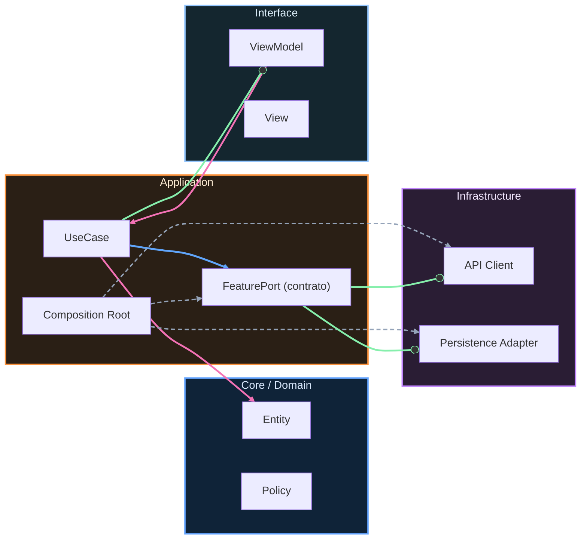

# Core Mobile Architecture

## Qué es este Core y por qué existe

Este Core es la base compartida entre las rutas de iOS y Android. No reemplaza ninguna lección de plataforma. Su función es dar un marco único para tomar decisiones de arquitectura móvil con criterio consistente en ambos ecosistemas.

Existe por una razón práctica: cuando iOS y Android evolucionan con marcos distintos, aparecen incoherencias en seguridad, contratos API, observabilidad, releases y gobernanza. Este Core reduce esa variabilidad y define una forma común de decidir, validar, operar y evolucionar.

## Cómo usar este Core junto a iOS/Android

Usa este bloque como capa de decisión transversal.

Si estás en iOS, estúdialo en paralelo con Fundamentos, Integración, Evolución, Arquitecto y Maestría.

Si estás en Android, estúdialo en paralelo con Nivel 0, Junior, Mid, Senior y Maestría.

Regla operativa: cada vez que en tu track aparezca una decisión crítica (arquitectura, API, release, seguridad, operación), vuelve al Core y aplica las checklists/templates antes de implementar.

## Principios del Core: decide, validate, operate, evolve

### Decide

No se decide por preferencia personal. Se decide por contexto, restricciones y trade-offs explícitos.

### Validate

No basta “suena bien”. Toda decisión debe tener evidencia verificable: tests, métricas, señales operativas.

### Operate

Lo que no se puede observar ni recuperar en incidente no está listo para producción.

### Evolve

La arquitectura no es foto estática. Debe soportar cambios incrementales sin caos ni reescrituras de alto riesgo.

<!-- auto-gapfix:layered-mermaid -->
## Diagrama de arquitectura por capas

La lectura del diagrama sigue esta semantica:
1. `-->` dependencia directa en runtime.
2. `-.->` wiring o configuracion.
3. `==>` contrato o abstraccion.
4. `--o` salida o propagacion de resultado.
