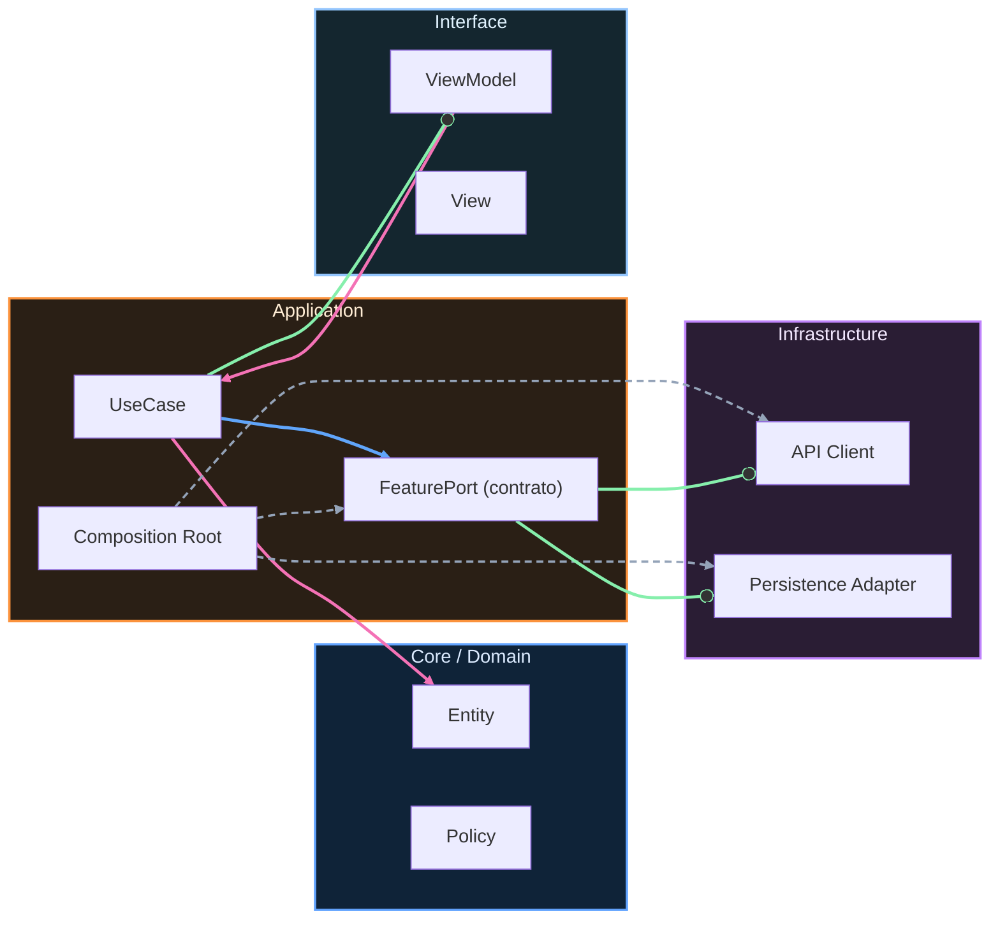

# Marco de decisiones arquitectónicas

## Flujo de decisión

Una decisión técnica buena no empieza con una solución. Empieza con fuerzas en conflicto.

Primero define restricciones duras. Son las que no puedes negociar, por ejemplo cumplimiento legal, presupuesto de latencia, límites de plataforma o requisitos de seguridad. Luego define restricciones blandas, que sí se pueden negociar, como preferencia de librería, estilo de equipo o velocidad de adopción.

Con esas fuerzas claras, lista alternativas reales. Para cada alternativa, registra beneficios, coste de implementación, coste de operación, riesgo de reversión y coste de oportunidad. Después explicita el trade-off principal, toma decisión y define evidencia de validación.

## Checklist 1 página: Architecture Decision Loop

- [ ] Problema formulado en una frase verificable.
- [ ] Restricciones duras identificadas y validadas.
- [ ] Restricciones blandas registradas.
- [ ] Mínimo 2 alternativas viables comparadas.
- [ ] Trade-off principal explicado sin ambigüedad.
- [ ] Decisión tomada con alcance y fecha.
- [ ] Consecuencias esperadas (positivas y negativas).
- [ ] Plan de reversión definido.
- [ ] Evidencia de éxito/fallo definida antes de implementar.
- [ ] Fecha de revisión pactada.

## Mini ejemplo opcional (plataforma)

Plataforma iOS/Android: migrar navegación de acoplamiento directo a coordinador/eventos. Restricción dura: no romper deep links existentes. Evidencia: tasa de rutas fallidas, cobertura de navegación y tiempo de onboarding de nueva feature.

<!-- auto-gapfix:layered-mermaid -->
## Diagrama de arquitectura por capas

La lectura del diagrama sigue esta semantica:
1. `-->` dependencia directa en runtime.
2. `-.->` wiring o configuracion.
3. `==>` contrato o abstraccion.
4. `--o` salida o propagacion de resultado.
