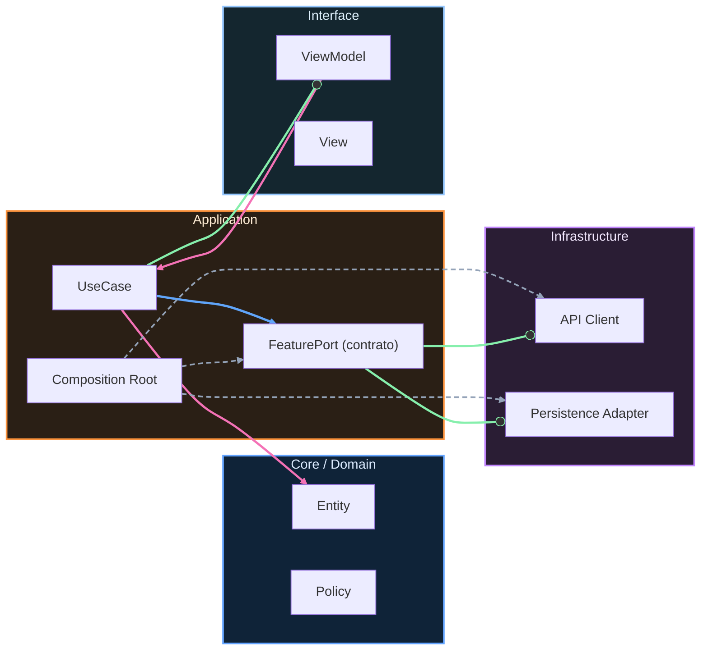

# Invariantes y contratos

## Invariantes (must-never-happen)

Un invariante es una verdad del sistema que no debe romperse nunca. No es documentación bonita; es una condición de seguridad de negocio o de integridad técnica.

Ejemplos: un token expirado nunca se usa para llamar API, una orden pagada no vuelve a estado pendiente, un evento crítico no se pierde silenciosamente.

Codifica invariantes en tres capas: modelo de dominio, contratos de entrada/salida y pruebas. Si el invariante solo vive en una wiki, no existe.

## Contratos clave

Contrato de dominio define límites entre agregados y reglas de negocio.

Contrato de feature define qué expone cada módulo y qué no puede importar.

Contrato API define request/response, errores esperables, idempotencia y versionado.

Contrato de test define qué comportamiento es obligatorio proteger ante regresión.

## Contract tests vs integration tests vs E2E

Los contract tests validan que productor y consumidor cumplen un acuerdo explícito, con bajo coste y alta señal de ruptura de contrato.

Los integration tests verifican colaboración real entre componentes internos y detectan errores de wiring, mapping o persistencia.

Los E2E validan recorrido completo y experiencia de usuario; son más caros y deben reservarse para flujos críticos de negocio.

Guía pragmática: protege reglas con unit/contract, wiring con integration y valor de negocio crítico con E2E.

<!-- auto-gapfix:layered-mermaid -->
## Diagrama de arquitectura por capas

La lectura del diagrama sigue esta semantica:
1. `-->` dependencia directa en runtime.
2. `-.->` wiring o configuracion.
3. `==>` contrato o abstraccion.
4. `--o` salida o propagacion de resultado.
