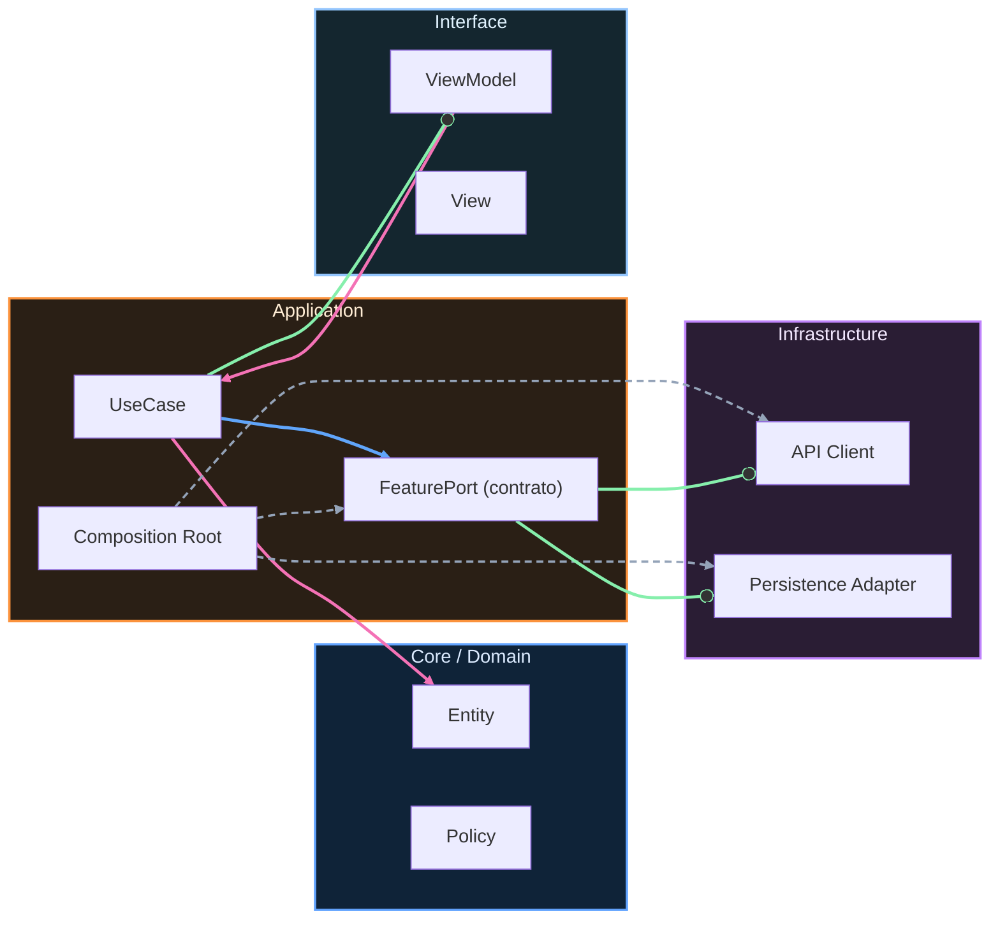

# Variabilidad y evolución sin caos

## Diseñar para cambio

No todo cambia al mismo ritmo. Clasifica explícitamente:

Cambio semanal: copy, reglas UI, feature flags, thresholds de experimentación.

Cambio mensual: contratos de integración, políticas de cache, métricas de negocio.

Cambio anual: dominios, límites de módulo, estrategia de plataforma.

Separar ritmos evita sobre-ingeniería en zonas estables y deuda técnica en zonas volátiles.

## Estrategias de migración

Prefiere migraciones incrementales con dual-run, fallback y criterios de corte claros.

Usa refactors por slices: aislar frontera, mover comportamiento, mantener compatibilidad, eliminar legado cuando la evidencia confirme estabilidad.

Aplica Strangler Pattern cuando el bloque legado es grande y crítico: enruta gradualmente tráfico al nuevo componente, mide, y retira por etapas.

Evita reescrituras big-bang salvo sistemas pequeños con riesgo controlado y ventana de parada asumida.

## Checklist: evolve without chaos

- [ ] Mapa de zonas de alta variabilidad actualizado.
- [ ] Plan incremental con hitos reversibles.
- [ ] Compatibilidad temporal definida (old/new).
- [ ] Métricas de migración definidas antes de mover código.
- [ ] Fallback técnico probado.
- [ ] Fecha de retiro del legado acordada.
- [ ] Riesgos de operación revisados con equipo.

<!-- auto-gapfix:layered-mermaid -->
## Diagrama de arquitectura por capas

La lectura del diagrama sigue esta semantica:
1. `-->` dependencia directa en runtime.
2. `-.->` wiring o configuracion.
3. `==>` contrato o abstraccion.
4. `--o` salida o propagacion de resultado.
