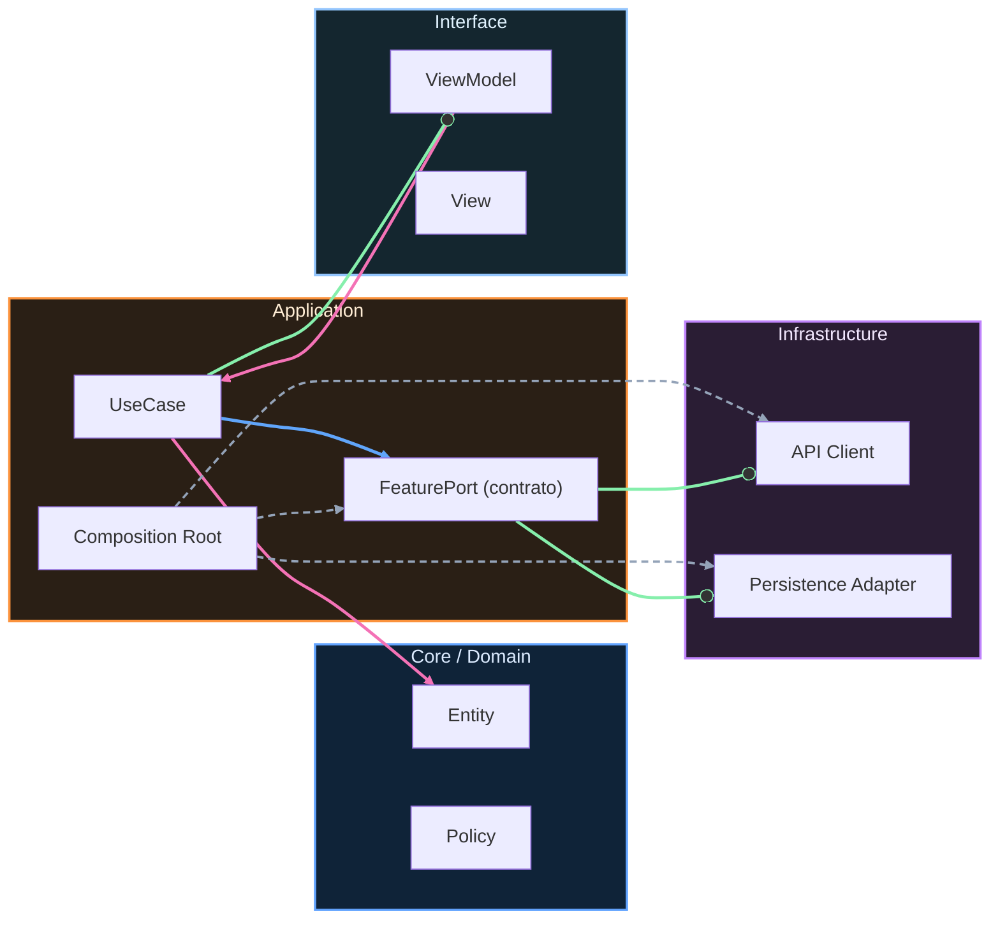

# Calidad PR-ready

## Production readiness a nivel Pull Request

Una PR está lista cuando su evidencia supera opinión personal. Eso exige build estable, pruebas relevantes, observabilidad mínima y seguridad básica revisada.

## Checklist de PR-ready

- [ ] Problema y alcance definidos en la PR.
- [ ] Cambios limitados y trazables.
- [ ] Build local y CI en verde.
- [ ] Tests unitarios/integración/contrato según impacto.
- [ ] Casos borde y fallos esperables cubiertos.
- [ ] Logs/métricas para diagnóstico del cambio.
- [ ] Seguridad/privacidad revisadas (PII, secretos, permisos).
- [ ] Plan de rollback o mitigación documentado.

## Definition of Done template

Estado funcional esperado:

Evidencia técnica adjunta:

Riesgos conocidos:

Mitigación en release:

## Matriz de estrategia de testing

| Tipo | Objetivo | Cuándo usar | Evidencia mínima |
|---|---|---|---|
| Unit | Reglas y lógica | Siempre | Suite rápida estable |
| Integration | Wiring real | Cambios entre capas | Tests de colaboración |
| Contract | Acuerdos entre módulos/API | Cambios de contrato | Validación productor/consumidor |
| E2E | Flujos críticos de negocio | Caminos top | Casos críticos automatizados |
| Performance | Regresión de latencia/startup/memoria | Cambios sensibles | Baseline + comparación |
| Accessibility | Uso con ayudas y semántica | UI relevante | Checklist + tests donde aplique |

Regla central: evidence over opinion.

<!-- auto-gapfix:layered-mermaid -->
## Diagrama de arquitectura por capas

La lectura del diagrama sigue esta semantica:
1. `-->` dependencia directa en runtime.
2. `-.->` wiring o configuracion.
3. `==>` contrato o abstraccion.
4. `--o` salida o propagacion de resultado.
