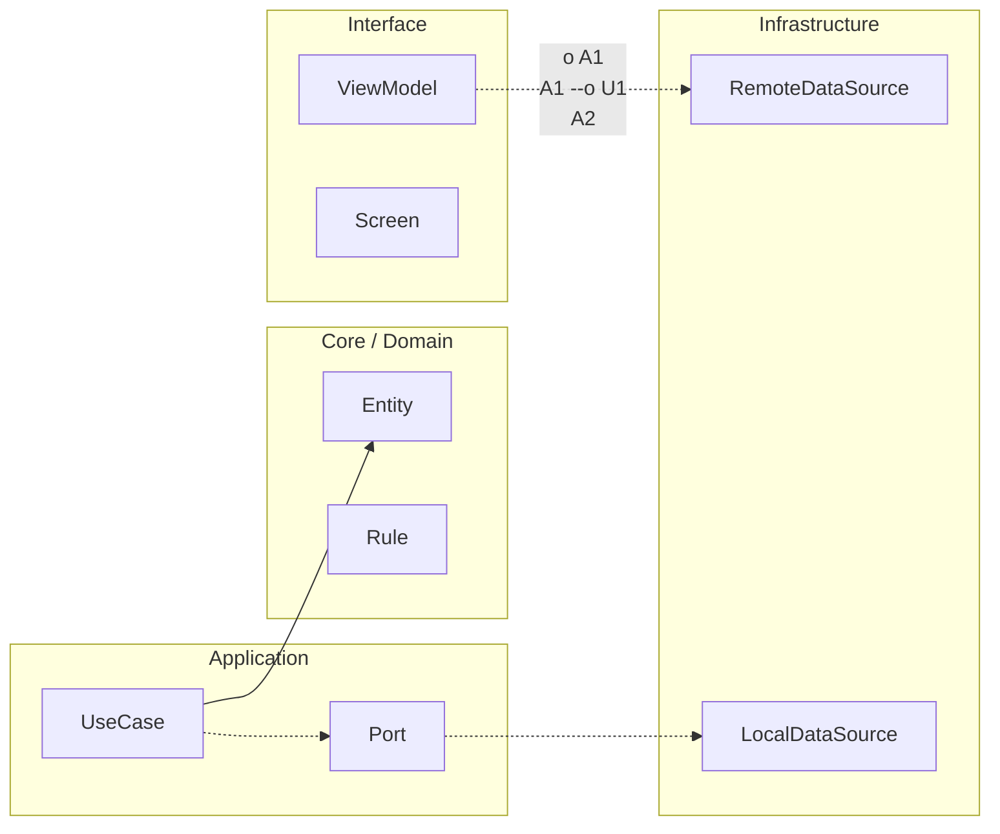

# Observabilidad y operación

## Logging

Usa logs estructurados con campos estables (evento, feature, resultado, error_code, correlation_id). Evita texto libre como única señal.

Nunca loguees PII sin política de redacción. Define redaction por defecto para email, teléfono, token, identificadores sensibles. Aplica sampling en eventos ruidosos para controlar coste.

## Metrics

Mide golden signals adaptadas a mobile: éxito/fracaso de flujos críticos, latencia percibida, crash-free sessions, ANR (Android), cold start, consumo de memoria y tasa de retry.

No midas todo. Mide lo que activa decisión.

## Tracing

En mobile el tracing extremo puede ser caro. Úsalo en caminos de alto valor (login, checkout, sync) y con correlación hacia backend mediante correlation IDs.

## SLO y error budget

Define SLO por capacidad de usuario, no por componente interno aislado. Ejemplo: sync exitosa de tareas > 99.0% en 28 días.

El error budget convierte fiabilidad en presupuesto gestionable. Si se consume rápido, prioriza estabilidad sobre nueva feature.

## Alert hygiene

Una alerta vale si dispara acción concreta. Elimina alertas sin playbook, con falsos positivos recurrentes o sin dueño.

## Template: Minimal Observability Spec

Nombre del flujo:

Eventos obligatorios:

Métricas obligatorias:

Campos sensibles y redacción:

Umbrales de alerta:

Dashboard de referencia:

Owner operativo:

## Template: Incident Runbook Skeleton

Tipo de incidente:

Señal de detección:

Impacto esperado:

Primera mitigación:

Condición de rollback:

Validación post-mitigación:

Comunicación interna/externa:

Acciones preventivas posteriores:


<!-- auto-gapfix:layered-mermaid -->
## Diagrama de arquitectura por capas



La lectura del diagrama sigue esta semantica:
1. `-->` dependencia directa en runtime.
2. `-.->` contrato o abstraccion.
3. `-.o` wiring o composicion.
4. `--o` salida o propagacion de resultado.

<!-- auto-gapfix:layered-snippet -->
## Snippet de referencia por capas

```kotlin
interface FeaturePort {
    suspend fun fetch(): List<String>
}

class FeatureUseCase(
    private val port: FeaturePort
) {
    suspend operator fun invoke(): List<String> = port.fetch()
}

class FeatureViewModel(
    private val useCase: FeatureUseCase
) : ViewModel() {

    private val _items = MutableStateFlow<List<String>>(emptyList())
    val items: StateFlow<List<String>> = _items

    fun load() {
        viewModelScope.launch {
            _items.value = runCatching { useCase() }.getOrDefault(emptyList())
        }
    }
}
```
