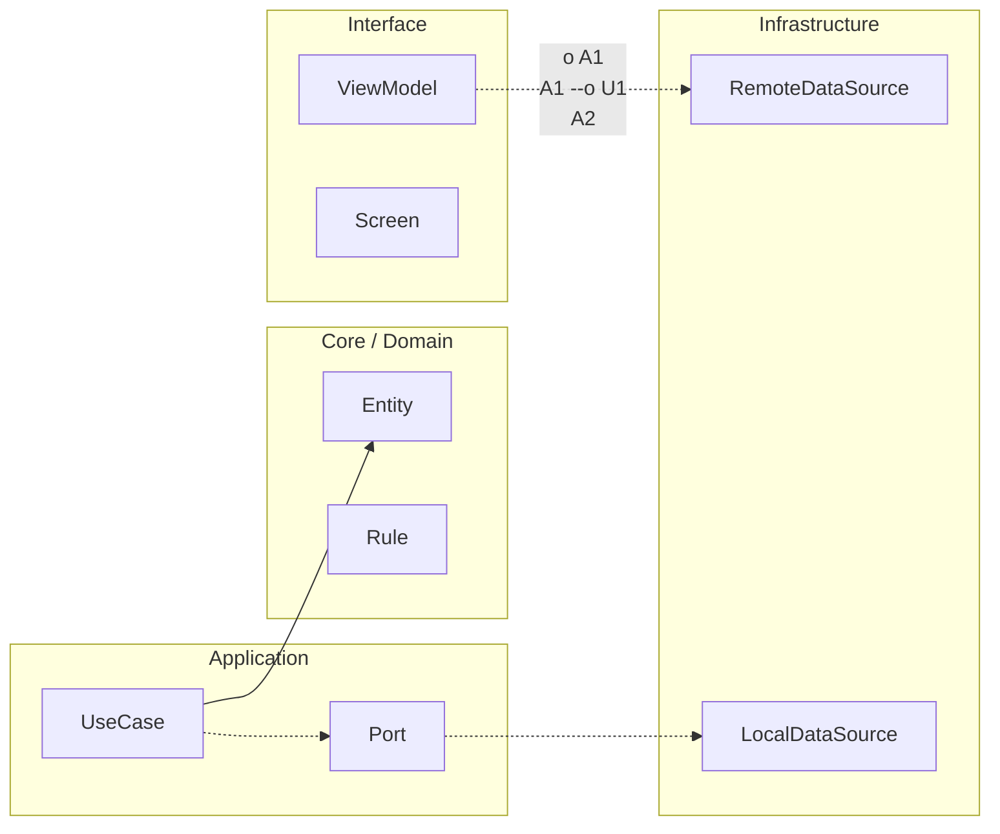

# Release, rollback y feature flags

## Estrategias de release

Prioriza despliegues graduales: staged rollout, canary o phased rollout según plataforma/canal. El objetivo es reducir blast radius y aprender pronto.

## Rollback en mobile

El rollback de app tiene limitaciones por adopción de versiones y stores. Por eso debes diseñar mitigaciones server-side y flags para desactivar rutas de riesgo sin esperar a que toda la base actualice.

## Feature flags

Un flag es deuda temporal con fecha de caducidad. Cada flag debe tener owner, propósito, criterio de retiro y kill-switch asociado para incidentes graves.

Evita flags permanentes sin gobierno, porque añaden complejidad oculta.

## Kill-switch

Diseña kill-switch para desactivar funciones críticas con seguridad, auditabilidad y latencia de propagación conocida.

## Release readiness checklist

- [ ] Scope de release cerrado y trazable.
- [ ] Riesgos críticos identificados.
- [ ] Plan de rollback y mitigación server-side.
- [ ] Flags nuevas con owner y fecha de expiración.
- [ ] Kill-switch validado en entorno controlado.
- [ ] Monitoreo reforzado para ventana de lanzamiento.
- [ ] Comunicación de release preparada.


<!-- auto-gapfix:layered-mermaid -->
## Diagrama de arquitectura por capas



La lectura del diagrama sigue esta semantica:
1. `-->` dependencia directa en runtime.
2. `-.->` contrato o abstraccion.
3. `-.o` wiring o composicion.
4. `--o` salida o propagacion de resultado.

<!-- auto-gapfix:layered-snippet -->
## Snippet de referencia por capas

```kotlin
interface FeaturePort {
    suspend fun fetch(): List<String>
}

class FeatureUseCase(
    private val port: FeaturePort
) {
    suspend operator fun invoke(): List<String> = port.fetch()
}

class FeatureViewModel(
    private val useCase: FeatureUseCase
) : ViewModel() {

    private val _items = MutableStateFlow<List<String>>(emptyList())
    val items: StateFlow<List<String>> = _items

    fun load() {
        viewModelScope.launch {
            _items.value = runCatching { useCase() }.getOrDefault(emptyList())
        }
    }
}
```
