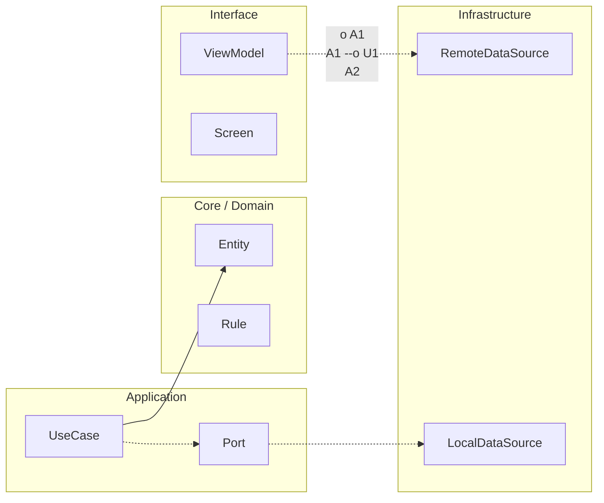

# APIs, contratos y versionado

## Disciplina de contrato API

Define contratos explícitos: shape de datos, códigos de estado, errores de negocio vs técnicos, idempotencia y semántica de reintento.

Evita respuestas ambiguas. Un cliente móvil necesita saber si debe reintentar, pedir reautenticación, invalidar cache o mostrar error final.

## Error Taxonomy starter

| Categoría | Ejemplo | Acción cliente |
|---|---|---|
| AUTH_EXPIRED | token vencido | refresh token + retry único |
| AUTH_INVALID | credenciales inválidas | cerrar sesión / relogin |
| RATE_LIMITED | 429 | backoff exponencial |
| TRANSIENT_NETWORK | timeout/reset | retry acotado |
| VALIDATION_ERROR | payload inválido | no retry, corregir request |
| BUSINESS_RULE | regla de dominio | no retry, feedback usuario |
| SERVER_FAILURE | 5xx | retry acotado + degradación |

## Auth móvil (OAuth2/JWT) bases

Gestiona refresh token con almacenamiento seguro y rotación. Nunca hardcodees secretos en cliente. Minimiza alcance de tokens y protege ciclo de vida de sesión.

## Retries/backoff

Retry solo en fallos transitorios idempotentes. Usa backoff exponencial con jitter para evitar tormentas.

No retries en errores de validación, reglas de negocio o auth inválida sin refresh válido.

## Versionado

Diferencia cambios backward-compatible (campos opcionales nuevos, endpoints nuevos) de breaking changes (campo requerido nuevo, semántica alterada, eliminación de endpoint).

Establece política de deprecación con ventana temporal y comunicación anticipada.

## API Contract Checklist

- [ ] Contrato request/response versionado.
- [ ] Taxonomía de errores documentada.
- [ ] Idempotencia declarada por endpoint.
- [ ] Política de retry por categoría de error.
- [ ] Compatibilidad backward evaluada.
- [ ] Plan de deprecación y fecha límite.


<!-- auto-gapfix:layered-mermaid -->
## Diagrama de arquitectura por capas



La lectura del diagrama sigue esta semantica:
1. `-->` dependencia directa en runtime.
2. `-.->` contrato o abstraccion.
3. `-.o` wiring o composicion.
4. `--o` salida o propagacion de resultado.

<!-- auto-gapfix:layered-snippet -->
## Snippet de referencia por capas

```kotlin
interface FeaturePort {
    suspend fun fetch(): List<String>
}

class FeatureUseCase(
    private val port: FeaturePort
) {
    suspend operator fun invoke(): List<String> = port.fetch()
}

class FeatureViewModel(
    private val useCase: FeatureUseCase
) : ViewModel() {

    private val _items = MutableStateFlow<List<String>>(emptyList())
    val items: StateFlow<List<String>> = _items

    fun load() {
        viewModelScope.launch {
            _items.value = runCatching { useCase() }.getOrDefault(emptyList())
        }
    }
}
```
