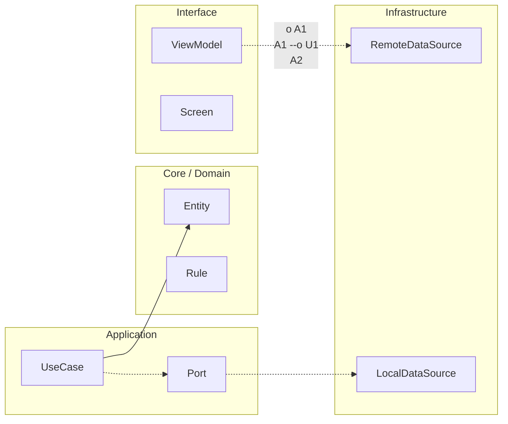

# Seguridad, privacidad y threat modeling

## Threat modeling móvil (alto nivel)

Modela amenazas desde activos, actores y superficie de ataque.

Activos: tokens, PII, datos de negocio, telemetría sensible.

Actores: usuario legítimo, atacante oportunista, atacante con dispositivo comprometido.

Superficie: almacenamiento local, red, APIs, logging, analítica, integraciones SDK.

## Clasificación de datos

Clasifica datos en PII, secretos, telemetría operacional y datos públicos. La clasificación define retención, cifrado, redacción y acceso.

## Secure storage principles

No hardcodear secretos. Proteger tokens en almacenamiento seguro de plataforma. Limitar exposición en memoria y logs. Rotar y revocar credenciales cuando aplique.

## Transport security

TLS obligatorio en tránsito. Pinning solo cuando hay capacidad real de operación, rotación de certificados y plan de recuperación; si no, puede introducir más riesgo operativo que beneficio.

## Privacidad

Diseña analítica con minimización de datos, consentimiento explícito cuando aplique y trazabilidad de propósito. Piensa con mentalidad GDPR: necesidad, proporcionalidad y control del usuario.

## Template: Mobile Threat Model Lite

Sistema/flujo evaluado:

Activos críticos:

Actores potenciales:

Superficie de ataque:

Amenazas priorizadas:

Controles existentes:

Controles faltantes:

Riesgo residual aceptado:

Fecha de revisión:


<!-- auto-gapfix:layered-mermaid -->
## Diagrama de arquitectura por capas



La lectura del diagrama sigue esta semantica:
1. `-->` dependencia directa en runtime.
2. `-.->` contrato o abstraccion.
3. `-.o` wiring o composicion.
4. `--o` salida o propagacion de resultado.

<!-- auto-gapfix:layered-snippet -->
## Snippet de referencia por capas

```kotlin
interface FeaturePort {
    suspend fun fetch(): List<String>
}

class FeatureUseCase(
    private val port: FeaturePort
) {
    suspend operator fun invoke(): List<String> = port.fetch()
}

class FeatureViewModel(
    private val useCase: FeatureUseCase
) : ViewModel() {

    private val _items = MutableStateFlow<List<String>>(emptyList())
    val items: StateFlow<List<String>> = _items

    fun load() {
        viewModelScope.launch {
            _items.value = runCatching { useCase() }.getOrDefault(emptyList())
        }
    }
}
```
