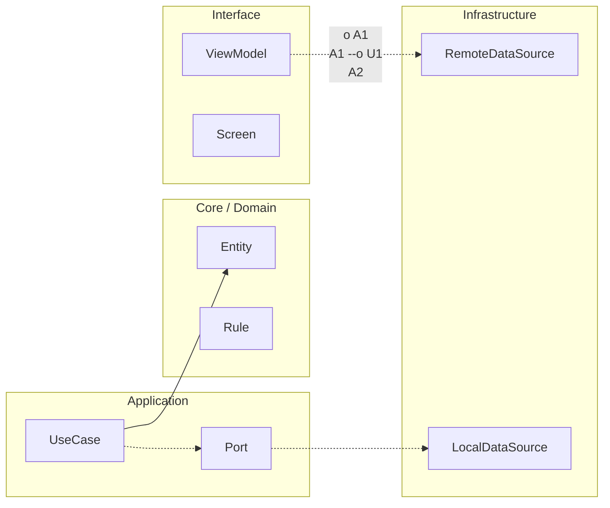

# Dependency governance y supply chain

## Reglas de dependencia modular

Define direcciones permitidas y prohibidas entre módulos. Las reglas deben ser ejecutables (lint/build checks) para evitar que la arquitectura dependa de disciplina manual.

## Política de upgrades

Establece cadencia de actualización (por ejemplo mensual/trimestral), criterios de priorización por riesgo y gates de validación (build, tests, perf, seguridad).

Cada upgrade relevante debe incluir plan de rollback.

## Supply chain basics

Usa lockfiles, verifica checksums cuando la herramienta lo permita y minimiza permisos/capacidades de dependencias.

Evita introducir SDKs sin justificar valor, riesgo y estrategia de salida.

## Dependency Governance Rules checklist

- [ ] Mapa de módulos y direcciones permitidas actualizado.
- [ ] Imports prohibidos definidos y chequeados.
- [ ] Política de versiones/upgrade publicada.
- [ ] Gates de upgrade definidos (test/perf/security).
- [ ] Plan de rollback por dependencia crítica.
- [ ] Inventario de dependencias con owner.
- [ ] Revisión periódica de dependencias huérfanas.


<!-- auto-gapfix:layered-mermaid -->
## Diagrama de arquitectura por capas



La lectura del diagrama sigue esta semantica:
1. `-->` dependencia directa en runtime.
2. `-.->` contrato o abstraccion.
3. `-.o` wiring o composicion.
4. `--o` salida o propagacion de resultado.

<!-- auto-gapfix:layered-snippet -->
## Snippet de referencia por capas

```kotlin
interface FeaturePort {
    suspend fun fetch(): List<String>
}

class FeatureUseCase(
    private val port: FeaturePort
) {
    suspend operator fun invoke(): List<String> = port.fetch()
}

class FeatureViewModel(
    private val useCase: FeatureUseCase
) : ViewModel() {

    private val _items = MutableStateFlow<List<String>>(emptyList())
    val items: StateFlow<List<String>> = _items

    fun load() {
        viewModelScope.launch {
            _items.value = runCatching { useCase() }.getOrDefault(emptyList())
        }
    }
}
```
