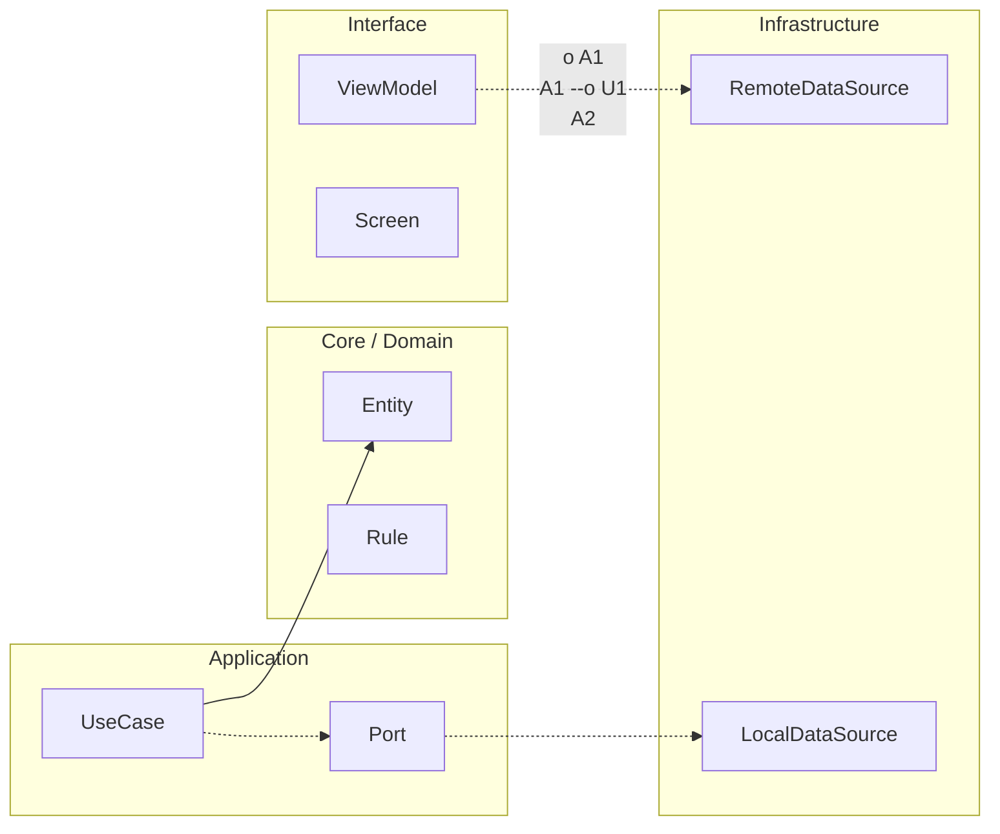

# Plantillas operativas (copy/paste)

## ADR template

Contexto:

Decisión:

Trade-offs:

Consecuencias:

Métricas:

## RFC template

Problema:

Opciones:

Recomendación:

Rollout:

## PR Review checklist

- [ ] Arquitectura: límites y dependencias correctos.
- [ ] Tests: cobertura suficiente del impacto.
- [ ] Edge cases: fallos previsibles cubiertos.
- [ ] Observabilidad: logs/métricas para diagnóstico.
- [ ] Seguridad/privacidad: PII/secretos revisados.

## DoD template

Build:

Tests:

Quality gates:

## Metrics before/after table template

| Métrica | Before | After | Delta | Evidencia |
|---|---:|---:|---:|---|
| | | | | |
| | | | | |


<!-- auto-gapfix:layered-mermaid -->
## Diagrama de arquitectura por capas



La lectura del diagrama sigue esta semantica:
1. `-->` dependencia directa en runtime.
2. `-.->` contrato o abstraccion.
3. `-.o` wiring o composicion.
4. `--o` salida o propagacion de resultado.

<!-- auto-gapfix:layered-snippet -->
## Snippet de referencia por capas

```kotlin
interface FeaturePort {
    suspend fun fetch(): List<String>
}

class FeatureUseCase(
    private val port: FeaturePort
) {
    suspend operator fun invoke(): List<String> = port.fetch()
}

class FeatureViewModel(
    private val useCase: FeatureUseCase
) : ViewModel() {

    private val _items = MutableStateFlow<List<String>>(emptyList())
    val items: StateFlow<List<String>> = _items

    fun load() {
        viewModelScope.launch {
            _items.value = runCatching { useCase() }.getOrDefault(emptyList())
        }
    }
}
```
