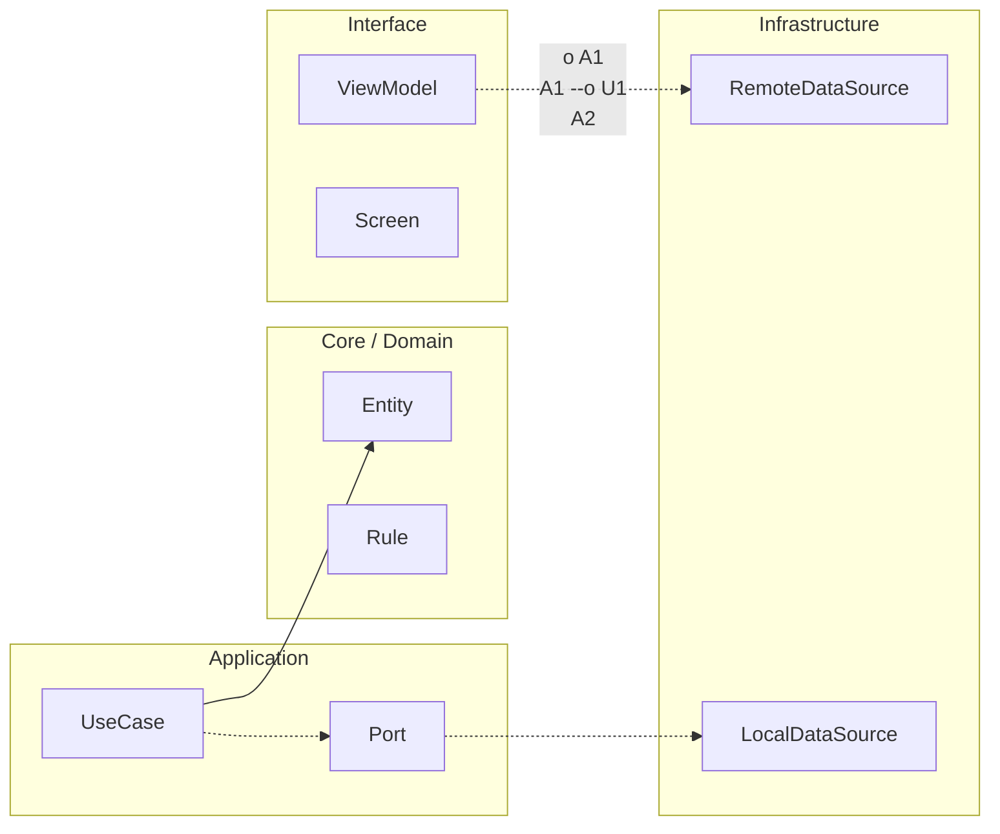

# Crosswalk iOS ↔ Android

## Equivalencia de tracks por responsabilidad

Android Nivel 0 / iOS Fundamentos: build.

Android Junior / iOS Integración: integrate.

Android Mid / iOS Evolución: operate.

Android Senior / iOS Arquitecto: govern.

Android Maestría / iOS Maestría: optimize under constraints.

## Equivalencia funcional

La equivalencia no se mide por nombres de carpetas. Se mide por responsabilidad demostrable:

build → integrate → operate → govern → optimize under constraints


<!-- auto-gapfix:layered-mermaid -->
## Diagrama de arquitectura por capas



La lectura del diagrama sigue esta semantica:
1. `-->` dependencia directa en runtime.
2. `-.->` contrato o abstraccion.
3. `-.o` wiring o composicion.
4. `--o` salida o propagacion de resultado.

<!-- auto-gapfix:layered-snippet -->
## Snippet de referencia por capas

```kotlin
interface FeaturePort {
    suspend fun fetch(): List<String>
}

class FeatureUseCase(
    private val port: FeaturePort
) {
    suspend operator fun invoke(): List<String> = port.fetch()
}

class FeatureViewModel(
    private val useCase: FeatureUseCase
) : ViewModel() {

    private val _items = MutableStateFlow<List<String>>(emptyList())
    val items: StateFlow<List<String>> = _items

    fun load() {
        viewModelScope.launch {
            _items.value = runCatching { useCase() }.getOrDefault(emptyList())
        }
    }
}
```
