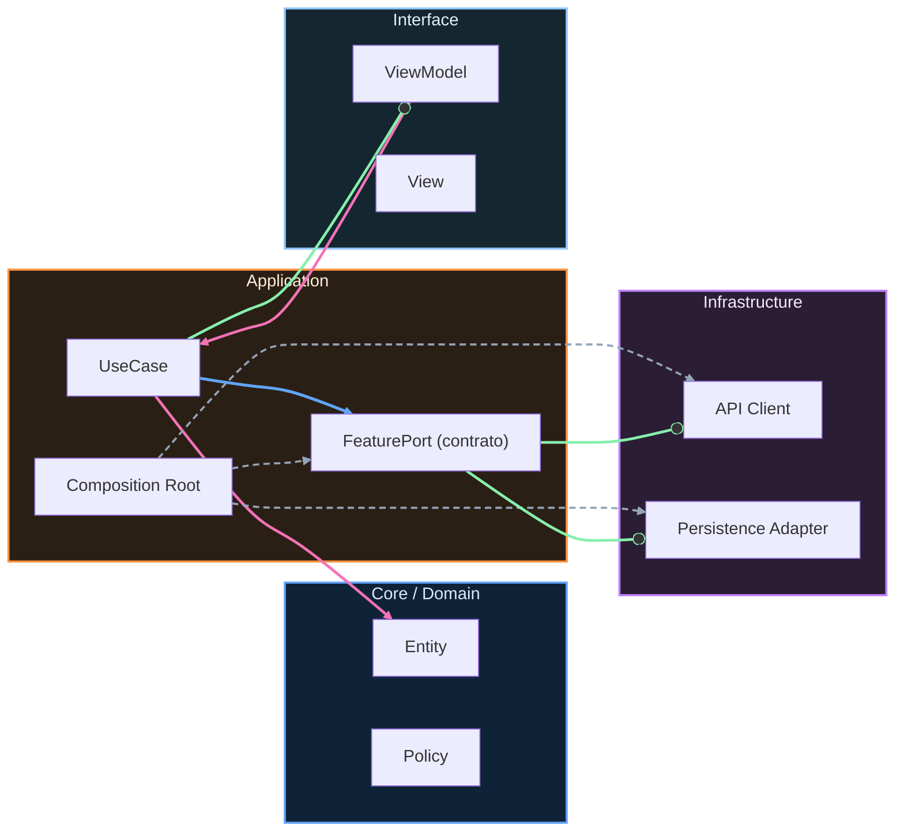

# Crosswalk iOS ↔ Android

## Equivalencia de tracks por responsabilidad

Android Nivel 0 / iOS Fundamentos: build.

Android Junior / iOS Integración: integrate.

Android Mid / iOS Evolución: operate.

Android Senior / iOS Arquitecto: govern.

Android Maestría / iOS Maestría: optimize under constraints.

## Equivalencia funcional

La equivalencia no se mide por nombres de carpetas. Se mide por responsabilidad demostrable:

build → integrate → operate → govern → optimize under constraints

<!-- auto-gapfix:layered-mermaid -->
## Diagrama de arquitectura por capas

La lectura del diagrama sigue esta semantica:
1. `-->` dependencia directa en runtime.
2. `-.->` wiring o configuracion.
3. `==>` contrato o abstraccion.
4. `--o` salida o propagacion de resultado.
