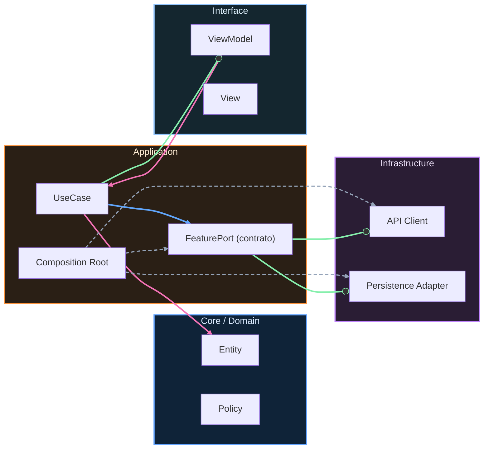

# Nivel Cero · Setup

En esta lección vas a preparar tu entorno para poder crear apps Android sin bloqueos técnicos. La meta de hoy no es programar mucho, sino dejar todo listo para que programar mañana sea fácil. Cuando una persona empieza desde cero, lo más frustrante suele ser que “todo falle” por configuración. Por eso vamos a hacerlo con calma y en orden.

Lo primero que tienes que entender es qué significa entorno de desarrollo. Un entorno de desarrollo es el conjunto de herramientas que necesitas para crear software. En nuestro caso, ese conjunto tiene tres piezas principales. La primera pieza es Android Studio, que es el programa donde escribirás código. La segunda pieza es el SDK de Android, que contiene componentes para compilar y ejecutar apps en distintas versiones de Android. La tercera pieza es el JDK, que aporta herramientas necesarias para que el sistema de compilación pueda funcionar.

Antes de instalar nada, asegúrate de tener espacio libre suficiente en disco y una conexión estable. Si el equipo se queda sin espacio durante la instalación, aparecerán errores difíciles de entender al principio. Si la conexión falla en mitad de la descarga, algunos componentes del SDK pueden quedar incompletos.

Ahora vamos con el primer paso real. Abre el navegador y entra en la web oficial de Android Studio. Descarga la versión estable y ejecuta el instalador. Durante la instalación, elige la configuración estándar recomendada. Cuando termine, abre Android Studio y comprueba que la aplicación inicia sin cerrarse sola. Si no abre, reinicia el equipo y vuelve a intentarlo. Si sigue fallando, revisa espacio de disco y permisos del sistema.

Con Android Studio abierto, vamos a preparar el SDK correcto. Abre el gestor de SDK desde la configuración de Android Studio y localiza la plataforma de Android 16, que corresponde al nivel de API 36. Instala esa plataforma y sus componentes recomendados. Cuando la instalación finalice, vuelve a entrar al gestor y verifica que API 36 aparece como instalada. Esta verificación es importante porque evita errores de compilación cuando creemos el proyecto.

El siguiente paso es confirmar el JDK 17. El JDK es un conjunto de herramientas que Gradle necesita para construir el proyecto. Abre una terminal y ejecuta el comando `java -version`. El resultado esperado debe indicar versión 17. Si aparece otra versión, instala JDK 17 y configura Android Studio para usarlo en la sección de Gradle JDK. Después sincroniza el proyecto para que el cambio se aplique correctamente.

Cuando SDK y JDK estén listos, vamos a hacer la prueba definitiva: crear un proyecto vacío y ejecutarlo. Dentro de Android Studio crea un proyecto nuevo con plantilla base de Compose. No cambies configuraciones avanzadas todavía. Pulsa ejecutar y abre la app en emulador o dispositivo real. Si todo está bien, verás una pantalla inicial sin errores críticos.

Si en este punto falla la compilación, no significa que “no valgas para programar”. Significa que hay una pieza técnica que ajustar. Lo más habitual es que falle la sincronización de Gradle por una versión incorrecta de JDK o por un SDK incompleto. En ese caso, vuelve a revisar esos dos puntos en ese orden.

Si falla el emulador, crea uno más ligero. Algunos equipos sufren con emuladores pesados y eso no tiene que ver con tu capacidad, sino con recursos del sistema. Puedes usar una imagen de sistema más simple y repetir la ejecución.

Vamos a cerrar con una comprobación de entorno listo. Debes poder abrir Android Studio, tener instalado SDK 36, confirmar JDK 17, sincronizar Gradle sin errores y ejecutar un proyecto de prueba. Cuando esas cinco condiciones se cumplen, tu entorno está preparado para continuar el curso sin bloqueos de base.

Como evidencia de progreso de esta lección, guarda una captura del proyecto ejecutándose y un registro corto con la salida de `java -version`. Esa evidencia te servirá para detectar rápido cualquier cambio accidental en tu entorno más adelante.

<!-- auto-gapfix:layered-mermaid -->
## Diagrama de arquitectura por capas

La lectura del diagrama sigue esta semantica:
1. `-->` dependencia directa en runtime.
2. `-.->` wiring o configuracion.
3. `==>` contrato o abstraccion.
4. `--o` salida o propagacion de resultado.
