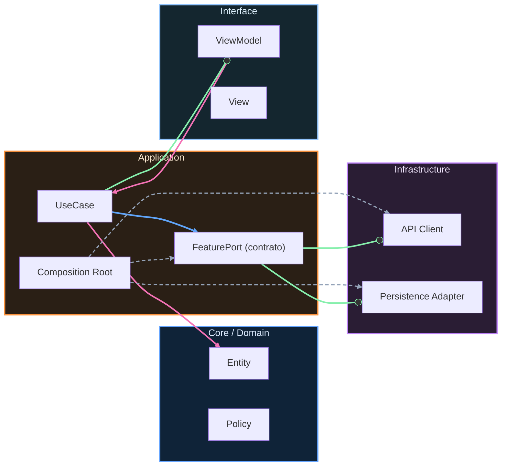

# Nivel Cero · 01 · Qué es software

Hoy vamos a construir una idea que parece pequeña, pero que te va a servir durante todo el curso. Esa idea es entender qué significa la palabra software. Mucha gente empieza programación intentando memorizar código antes de entender esta base. Aquí vamos a hacerlo al revés, porque cuando entiendes la base, el código deja de dar miedo.

Lo primero que necesitas saber es que un móvil tiene dos partes que trabajan juntas. La parte física se llama hardware. El hardware es lo que puedes tocar con la mano: la pantalla, los botones, la batería, la cámara. La segunda parte se llama software. El software no se toca. El software son instrucciones. Dicho de forma muy simple, el software es el conjunto de órdenes que le dicen al hardware qué hacer y cuándo hacerlo.

Piensa en una bicicleta eléctrica. La bicicleta es hardware. Pero para que te ayude con el pedaleo en el momento correcto, necesita reglas internas. Esas reglas son software. Con un móvil pasa lo mismo. Si tocas un botón en una app, no ocurre magia. Ocurre una cadena de instrucciones. La app recibe tu toque, decide qué significa, busca la información que necesita y actualiza la pantalla.

Aquí aparece una duda típica de principiante, y es muy buena duda. Muchas personas preguntan si una app y software son exactamente lo mismo. La respuesta correcta es que una app es software, pero no todo el software es una app. El sistema operativo Android también es software. Los servicios internos del sistema también son software. Las apps son una parte del mundo del software.

Ahora vamos a conectar esto con tu vida diaria para que no se quede en teoría. Imagina que abres una app de música. Primero tocas el icono de la app. Después eliges una canción. Luego pulsas reproducir. En ese instante, el software interpreta tu acción, localiza el archivo de audio, prepara la salida de sonido y empieza la reproducción. Si una de esas instrucciones falla, la app no funciona como esperas. Por eso estudiar software no es estudiar “palabras raras”, es aprender a diseñar instrucciones claras para que un resultado ocurra de forma fiable.

Vamos a hacer una práctica muy sencilla. En tu cuaderno, divide la hoja en dos zonas. En la primera zona escribe cosas físicas del móvil. En la segunda zona escribe cosas que son instrucciones o comportamientos del móvil. Cuando termines, revisa cada elemento y pregúntate si puedes tocarlo. Si puedes tocarlo, probablemente es hardware. Si no puedes tocarlo y describe una acción o regla, probablemente es software. Este pequeño ejercicio entrena tu forma de pensar como desarrollador.

Te adelanto otro error muy frecuente. Al principio, algunas personas creen que programar es “escribir líneas rápidas para que salgan cosas”. En realidad, programar empieza mucho antes de escribir código. Programar empieza cuando defines con claridad qué debe pasar y en qué orden. Si ese orden es confuso, el programa será confuso. Si ese orden es preciso, el programa tendrá más posibilidades de funcionar bien.

Ahora comprobamos comprensión. Si tuvieras que explicárselo a un amigo en menos de un minuto, podrías decir que hardware es el cuerpo del dispositivo y software es su conjunto de instrucciones. También podrías explicar que una app de mensajes funciona porque tiene reglas para enviar, recibir, guardar y mostrar textos. Si puedes decir eso con tus palabras, estás entendiendo muy bien.

Vamos a cerrar con un mini reto. Elige un objeto de casa que tenga botones, por ejemplo un microondas o una consola. Describe qué parte sería hardware y qué parte sería software. Después narra una secuencia de cuatro pasos de uso normal. No necesitas código todavía. Necesitas claridad de pensamiento. Ese es el verdadero objetivo de hoy.

Si te sirve una referencia, en un microondas el hardware sería la puerta, el plato giratorio y los botones. El software sería la lógica que decide cuánto tiempo calienta, cuándo gira el plato y cuándo suena el pitido final. Cuando cierras la puerta y eliges dos minutos, no estás “convenciendo al metal”. Estás activando instrucciones. Ese es el puente exacto entre el mundo real y la programación.

Como evidencia de progreso, guarda tu explicación escrita con tres partes. En la primera parte define software con tus palabras. En la segunda parte diferencia hardware y software en un objeto real. En la tercera parte redacta los cuatro pasos del mini reto. Si puedes completar esas tres partes sin copiar texto literal, has superado esta lección de forma sólida.

<!-- auto-gapfix:layered-mermaid -->
## Diagrama de arquitectura por capas

La lectura del diagrama sigue esta semantica:
1. `-->` dependencia directa en runtime.
2. `-.->` wiring o configuracion.
3. `==>` contrato o abstraccion.
4. `--o` salida o propagacion de resultado.
