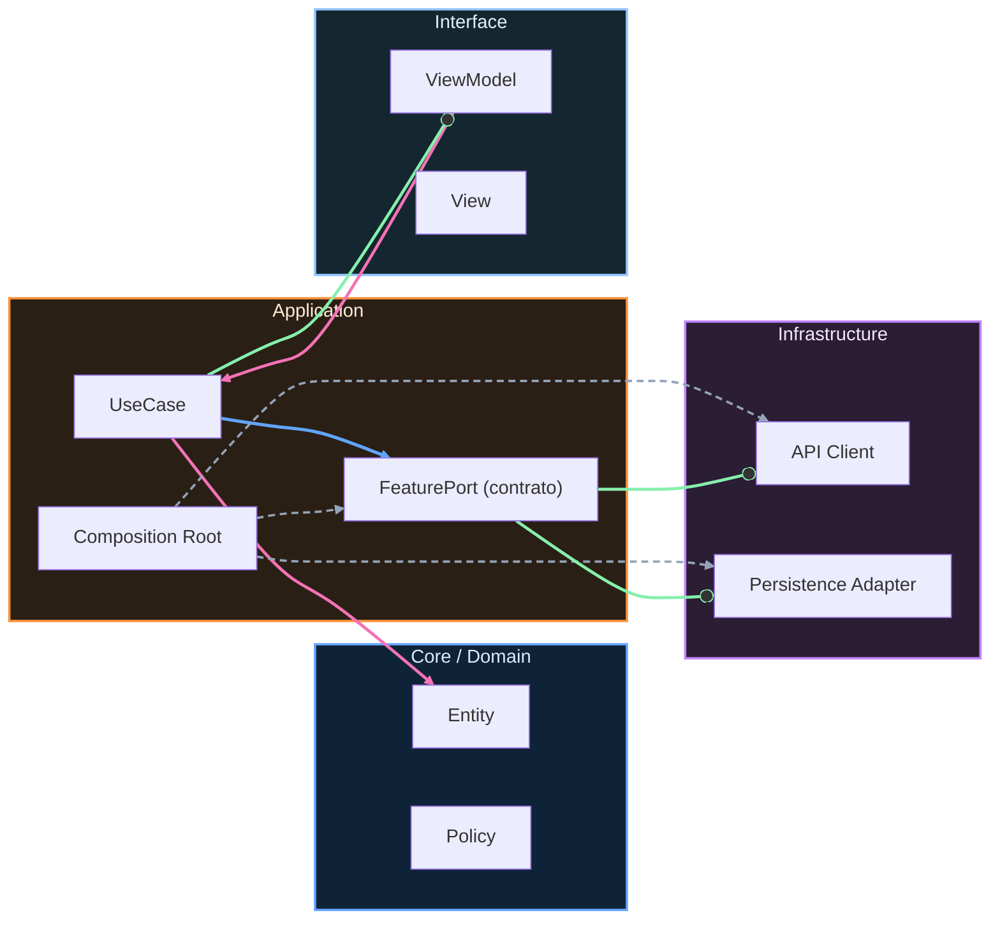

# Nivel Cero · 02 · Lógica básica

En la lección anterior entendiste qué es software. Hoy vamos a dar el siguiente paso natural. Si el software es un conjunto de instrucciones, entonces necesitamos aprender a pensar esas instrucciones con orden. A eso le llamamos lógica básica. Este nombre puede sonar técnico, pero en realidad es algo que ya haces todos los días sin darte cuenta.

Imagina que te preparas para ir al instituto. Primero te levantas, luego te vistes, después preparas la mochila y finalmente sales de casa. Si cambias el orden y sales antes de vestirte, el resultado no tiene sentido. Esa idea tan simple es la base de la lógica en programación. La lógica no es un truco de genios. La lógica es organizar acciones para conseguir un resultado correcto.

Ahora vamos a introducir tres piezas que aparecen en casi cualquier programa. La primera pieza es la secuencia. Secuencia significa que hay pasos que deben seguir un orden. La segunda pieza es la decisión. Decisión significa que el programa elige entre dos caminos según una condición. La tercera pieza es la repetición. Repetición significa que una acción se vuelve a ejecutar varias veces hasta cumplir una meta.

Vamos despacio con cada pieza. Cuando hablo de condición, me refiero a una pregunta que se puede responder con sí o no. Por ejemplo, “¿está lloviendo?”. Si la respuesta es sí, coges paraguas. Si la respuesta es no, no lo coges. En programación, ese tipo de pregunta guía decisiones de forma constante.

Cuando hablo de repetición, piensa en algo tan cotidiano como ordenar una estantería. No haces un solo movimiento y terminas. Repites una acción parecida con cada libro hasta completar todos. En programación ocurre igual. Repetimos acciones para no escribir lo mismo muchas veces.

Ahora te presento una forma intermedia entre lenguaje natural y código real. Se llama pseudocódigo. El pseudocódigo sirve para entrenar la mente antes de aprender sintaxis exacta. Mira este ejemplo y no te preocupes por memorizarlo. Solo léelo como si fuera una receta clara.

```text
INICIO
  mirar si hoy hay clase
  SI hay clase
    preparar mochila completa
  SI NO
    preparar mochila ligera

  repetir 3 veces
    revisar que llevas cuaderno, estuche y agua
FIN
```

Te explico este bloque línea por línea en lenguaje normal. La palabra INICIO marca dónde empieza el plan. Después aparece una revisión del contexto, que en este caso es saber si hay clase. Luego llega la decisión con dos caminos. Si hay clase, preparas la mochila completa. Si no hay clase, preparas una versión más ligera. Más abajo aparece la repetición. El plan dice que revisarás tres veces elementos importantes para evitar olvidos. La palabra FIN marca el cierre del proceso.

Si ahora te preguntas para qué sirve practicar esto antes del código real, la respuesta es que te evita errores desde la raíz. Mucha gente comienza escribiendo sintaxis sin tener claro el flujo mental. Cuando eso pasa, se atasca rápido. Si primero entrenas la lógica, luego Kotlin te resultará mucho más natural.

Vamos a practicar con una situación real de estudio. Vas a diseñar una rutina de treinta minutos. Empiezas definiendo una condición simple. Si hay ruido en casa, usarás auriculares. Si no hay ruido, estudiarás sin ellos. Después crearás una repetición con bloques de diez minutos hasta completar treinta. Aquí el objetivo no es escribir bonito. El objetivo es que tus pasos sean claros, en orden y sin ambigüedades.

Te anticipo una duda frecuente. Algunas personas escriben pasos demasiado vagos, por ejemplo “estudiar un poco”. Ese tipo de frase no ayuda a un programa, porque no dice cuánto ni cómo. Una versión clara sería “leer dos páginas y subrayar tres ideas”. Cuanto más concreta sea tu instrucción, más fácil será convertirla en código después.

Para comprobar que esta lección quedó clara, intenta responder con tus palabras qué diferencia hay entre una acción normal y una decisión condicional. Después explica para qué sirve repetir pasos en vez de escribirlos una y otra vez. Si puedes responder sin copiar, vas por muy buen camino.

Terminamos con un mini reto. Diseña la lógica de una alarma inteligente para días de clase y fines de semana. Primero define la condición del tipo de día. Luego define la hora según esa condición. Después añade una repetición para que la alarma vuelva a sonar cada cinco minutos hasta que se apague. Cuando lo tengas, compáralo con esta solución guía y revisa si tu secuencia también es clara.

```text
INICIO
  mirar tipo de día
  SI día de clase
    fijar alarma 07:00
  SI NO
    fijar alarma 09:00

  MIENTRAS alarma no apagada
    sonar
    esperar 5 minutos
FIN
```

En esta solución, la decisión selecciona la hora correcta y la repetición mantiene la alarma activa hasta que la persona interviene. Esa combinación de secuencia, decisión y repetición es exactamente la base lógica que usarás en todo el curso Android.


<!-- auto-gapfix:layered-mermaid -->
## Diagrama de arquitectura por capas



La lectura del diagrama sigue esta semantica:
1. `-->` dependencia directa en runtime.
2. `-.->` wiring o configuracion.
3. `==>` contrato o abstraccion.
4. `--o` salida o propagacion de resultado.
