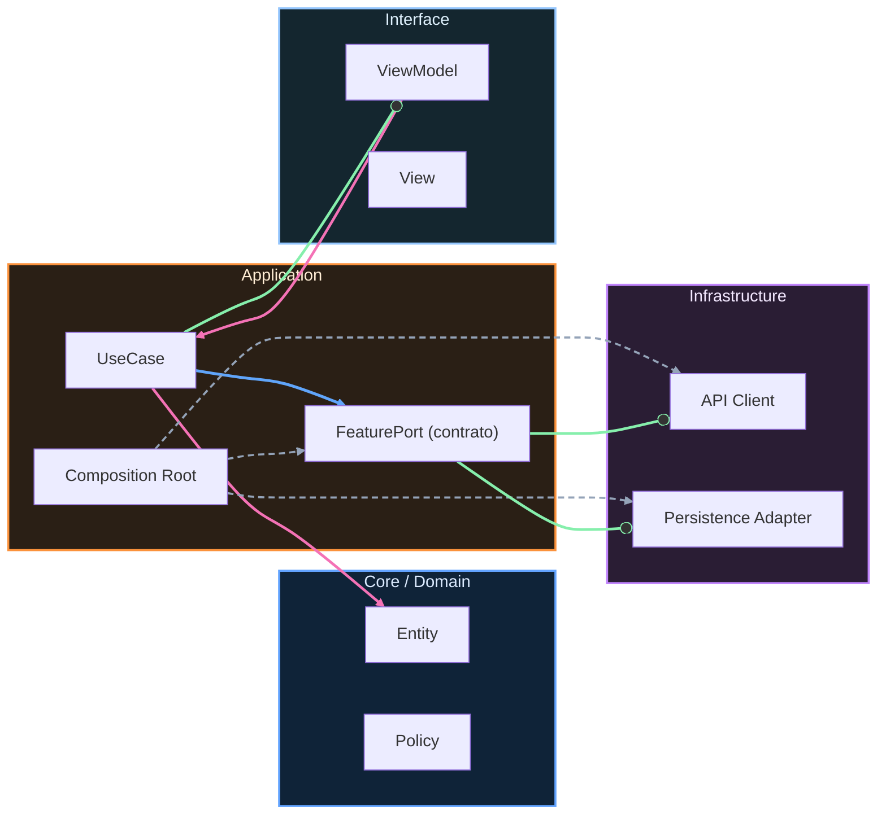

# Nivel Cero · 03 · Primer Kotlin

En esta lección vas a entrar por primera vez en el lenguaje Kotlin, que es el lenguaje principal que usaremos para crear apps Android modernas. Quiero que lo veas como si fuera un idioma nuevo. Cuando aprendes un idioma, primero entiendes palabras básicas, luego entiendes frases simples y, poco a poco, construyes mensajes más completos. Con Kotlin haremos exactamente lo mismo.

Antes de escribir nada, necesitamos responder una pregunta importante. ¿Para qué sirve Kotlin? Kotlin sirve para escribir instrucciones que Android pueda ejecutar. Si tú quieres que una app muestre un mensaje, guarde un dato o reaccione cuando tocas un botón, necesitas escribir esas instrucciones en un lenguaje que Android entienda. Ese lenguaje será Kotlin.

Ahora vamos a mirar tu primer bloque de código. Primero te lo explico en lenguaje normal, línea por línea, y después lo vemos escrito. La primera línea declara una función principal. Una función es un bloque de instrucciones con nombre. La función principal se llama `main` y marca el punto de inicio del programa en este ejemplo didáctico. La segunda línea crea un dato llamado `nombre` y le asigna un texto. La tercera línea muestra en pantalla un saludo que usa ese dato.

Este es el código completo:

```kotlin
fun main() {
    val nombre = "Alex"
    println("Hola, " + nombre)
}
```

Ahora volvemos a recorrer el código con calma. En la línea `fun main() {` la palabra `fun` significa “voy a definir una función”. El nombre `main` indica que esta función será el inicio de ejecución del ejemplo. La llave de apertura `{` dice dónde empieza el bloque.

En la línea `val nombre = "Alex"`, la palabra `val` crea un dato de solo lectura. Eso quiere decir que, después de asignarlo, no lo vamos a cambiar en este ejemplo. El identificador `nombre` es la etiqueta de ese dato. El texto `"Alex"` está entre comillas porque es un texto literal.

En la línea `println("Hola, " + nombre)`, la función `println` significa “imprimir una línea en pantalla”. Dentro del paréntesis, unimos dos partes: un texto fijo `"Hola, "` y el contenido de la variable `nombre`. El símbolo `+` aquí está concatenando texto, es decir, pegando dos fragmentos para formar una sola frase.

La llave de cierre `}` marca el final de la función principal. Cuando este programa se ejecuta, el resultado esperado es una línea en consola que dice `Hola, Alex`.

Ahora vamos a reforzar la idea con un ejemplo cercano a tu vida diaria. Imagina que quieres mostrar una tarjeta de presentación sencilla. Primero guardas tu nombre en una variable. Después guardas tu curso escolar. Luego imprimes ambos datos. Esto no es una app completa todavía, pero sí es la base exacta de cómo una app manipula información.

Mira el segundo ejemplo y, antes de leerlo, intenta predecir qué salida mostrará:

```kotlin
fun main() {
    val nombre = "Lucía"
    val curso = "2º ESO"

    println("Nombre: " + nombre)
    println("Curso: " + curso)
}
```

Vamos línea por línea de nuevo. La estructura de inicio con `fun main()` es la misma. Después creamos dos datos con `val`: uno para `nombre` y otro para `curso`. Más abajo, cada `println` imprime una frase completa uniendo un texto fijo con el valor almacenado en cada variable. El resultado esperado son dos líneas. La primera línea mostrará el nombre y la segunda mostrará el curso.

En este punto suele aparecer una duda muy común. Muchas personas preguntan por qué unas cosas llevan comillas y otras no. La respuesta es que las comillas se usan para texto literal. Si escribes una palabra sin comillas, Kotlin intentará interpretarla como nombre de variable o palabra del lenguaje. Si esa variable no existe, dará error.

También aparece otro error típico. A veces se escribe una variable con un nombre y luego se intenta usar otro nombre distinto por despiste. Por ejemplo, crear `val nombre = "Alex"` y luego escribir `println(nomre)`. Ese pequeño cambio de letras produce error. Por eso conviene leer despacio y revisar nombres con atención.

Ahora hacemos una práctica guiada. Vas a crear un programa que muestre un saludo, tu edad y tu objetivo en este curso. Primero declara tres variables de texto o número según corresponda. Después imprime tres líneas con `println`. Cuando termine, revisa si la salida realmente coincide con lo que querías comunicar.

Te dejo una solución de referencia para que compares tu resultado. Primero léela, intenta explicarla con tus palabras y luego compárala con tu versión:

```kotlin
fun main() {
    val saludo = "Hola"
    val edad = 14
    val objetivo = "Aprender a crear apps Android"

    println(saludo)
    println("Edad: " + edad)
    println("Objetivo: " + objetivo)
}
```

La primera línea útil crea el saludo. La segunda crea una edad numérica. La tercera guarda un objetivo como texto. Después imprimimos cada dato. En la segunda impresión, Kotlin convierte el número a texto para mostrarlo junto al prefijo `Edad:`. El resultado esperado son tres líneas claras y legibles.

Si has llegado hasta aquí y puedes explicar con tus palabras qué hacen `fun`, `val` y `println`, vas exactamente por el camino correcto. Lo importante hoy no es memorizar todo, sino entender el flujo básico: definir datos y mostrarlos con intención.


<!-- auto-gapfix:layered-mermaid -->
## Diagrama de arquitectura por capas



La lectura del diagrama sigue esta semantica:
1. `-->` dependencia directa en runtime.
2. `-.->` wiring o configuracion.
3. `==>` contrato o abstraccion.
4. `--o` salida o propagacion de resultado.
