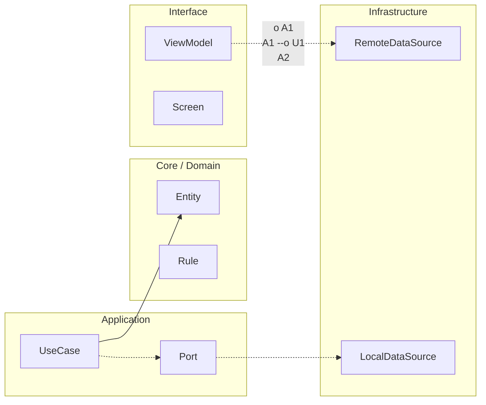

# Nivel Cero · 04 · Variables y tipos

En la lección anterior viste tu primer programa en Kotlin. Hoy vamos a fortalecer una pieza clave para que no te pierdas cuando el código empiece a crecer. Esa pieza es entender qué son las variables y qué son los tipos de dato. Si esta base queda clara ahora, más adelante te resultará mucho más fácil trabajar con pantallas, formularios y lógica de una app.

Empieza con esta imagen mental. Una variable es una caja con etiqueta. Dentro de la caja guardas un dato. La etiqueta permite encontrar ese dato cuando lo necesites. Si no pones etiqueta, no sabes dónde está. Si pones una etiqueta confusa, te equivocas fácilmente. Por eso nombrar bien una variable es parte de programar bien.

Ahora aparece una segunda idea importante. No todas las cajas guardan el mismo tipo de contenido. Algunas cajas guardan números enteros, otras guardan texto, otras guardan números con decimales y otras guardan valores de verdadero o falso. A esa “clase de contenido” la llamamos tipo de dato.

En Kotlin, los tipos básicos que usaremos al inicio son cuatro. `Int` se usa para números enteros, como 14. `Double` se usa para números con decimales, como 1.68. `String` se usa para texto, como "Hola". `Boolean` se usa para verdadero o falso, por ejemplo `true` o `false`.

Antes de ver el código, vamos a introducir otra diferencia que te ayudará mucho. Kotlin tiene `val` y `var`. `val` crea una variable de solo lectura, lo que significa que el valor no se cambia después de asignarlo. `var` crea una variable mutable, lo que significa que sí puede cambiar. Como regla para principiantes, usa `val` por defecto y pasa a `var` solo cuando necesites cambiar el valor.

Ahora sí, veamos un ejemplo. Primero te lo explico línea por línea y luego lo interpretamos completo. La primera línea crea una variable de texto para el nombre. La segunda crea una variable numérica entera para la edad. La tercera crea una variable decimal para altura. La cuarta crea una variable booleana para indicar una condición. En conjunto, estas líneas muestran cómo representamos información distinta con tipos distintos.

```kotlin
val nombre: String = "Alex"
val edad: Int = 14
val altura: Double = 1.68
val leGustaProgramar: Boolean = true
```

Vamos con el detalle. En `val nombre: String = "Alex"`, la palabra `val` indica que el dato no cambiará, `nombre` es la etiqueta de la caja, `String` define que guarda texto y `"Alex"` es el valor inicial. En `val edad: Int = 14`, mantenemos la misma estructura pero el tipo ahora es `Int`, porque 14 es un entero. En `val altura: Double = 1.68`, el tipo cambia a `Double` porque hay parte decimal. En `val leGustaProgramar: Boolean = true`, usamos `Boolean` porque solo hay dos opciones posibles: verdadero o falso.

Si te preguntas por qué esto importa tanto, la respuesta es que los tipos evitan errores. Si dices que una variable guarda un número, Kotlin no aceptará texto en esa variable. Eso protege tu programa de comportamientos raros.

Vamos a ver un error clásico de principiante. Observa este ejemplo y trata de detectar qué está mal antes de leer la explicación.

```kotlin
val edad: Int = "14"
```

Aquí el problema es que `Int` espera un número entero sin comillas, pero `"14"` es texto. La corrección es simple: quitar comillas para que sea un número real.

```kotlin
val edad: Int = 14
```

Ahora vamos a introducir `var` con un caso real. Imagina el nivel de un jugador. El nivel puede subir, por eso necesitamos una variable mutable. Primero lo declaramos y luego lo actualizamos.

```kotlin
var nivel: Int = 7
nivel = nivel + 1
```

La primera línea crea el nivel inicial. La segunda línea toma el valor actual, le suma uno y guarda el resultado en la misma variable. Esto es una actualización de estado muy común en apps y juegos.

Vamos a cerrar con una práctica guiada completa. Vas a crear un mini perfil con nombre, edad, precisión y estado de conexión. Primero declara cada dato con el tipo correcto. Después imprime los datos. Luego actualiza un dato mutable, por ejemplo el nivel o los puntos, y vuelve a imprimir para comprobar que cambió.

Te dejo una solución de referencia y después la explicamos.

```kotlin
fun main() {
    val nombre: String = "Alex"
    var nivel: Int = 7
    val precision: Double = 82.5
    val estaConectado: Boolean = true

    println("Jugador: " + nombre)
    println("Nivel inicial: " + nivel)
    println("Precisión: " + precision)
    println("Conectado: " + estaConectado)

    nivel = nivel + 1
    println("Nivel después de jugar: " + nivel)
}
```

Ahora línea por línea. La función `main` marca el inicio. Luego definimos cuatro variables con tipos distintos para representar datos de un mismo perfil. Después usamos `println` para mostrar cada dato en pantalla con etiquetas legibles. Más abajo, actualizamos `nivel` sumando uno. La última impresión confirma que el cambio sí ocurrió.

El resultado esperado en consola es que primero aparece el nivel inicial y, al final, aparece un nivel mayor en una unidad. Esa diferencia visible es la evidencia de que entendiste cuándo usar `var`.

Si al terminar todavía dudas entre `val` y `var`, usa esta pregunta guía. “¿Este dato debe cambiar en el tiempo?” Si la respuesta es no, usa `val`. Si la respuesta es sí, usa `var`. Con esa regla simple ya puedes tomar buenas decisiones al empezar.


<!-- auto-gapfix:layered-mermaid -->
## Diagrama de arquitectura por capas



La lectura del diagrama sigue esta semantica:
1. `-->` dependencia directa en runtime.
2. `-.->` contrato o abstraccion.
3. `-.o` wiring o composicion.
4. `--o` salida o propagacion de resultado.
