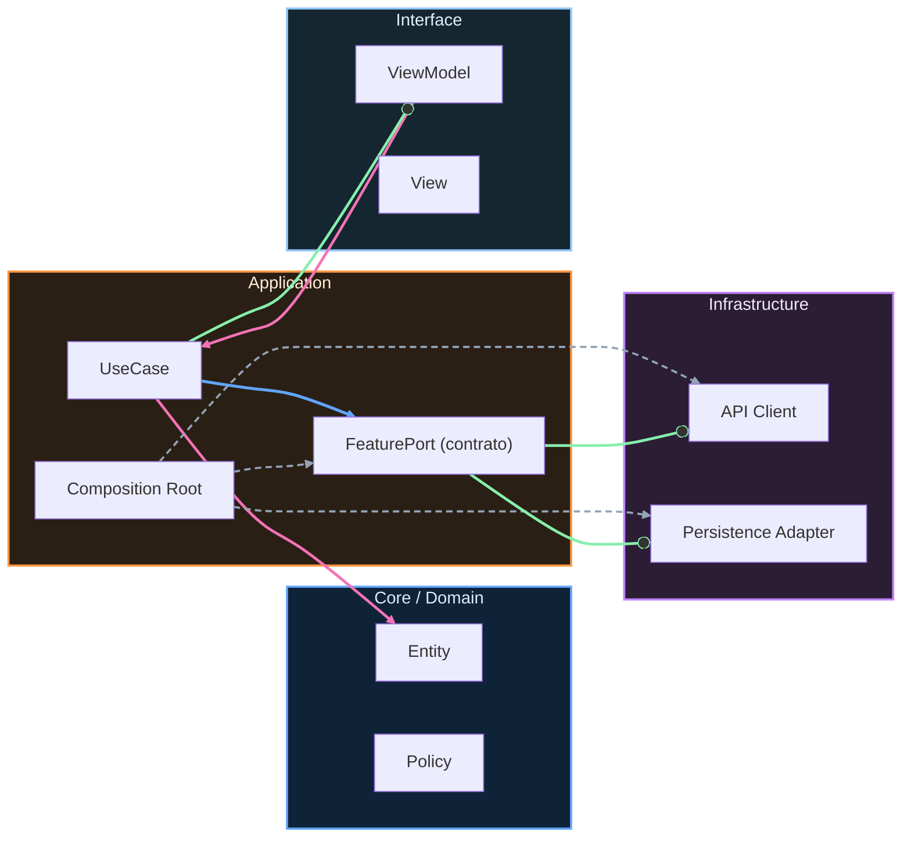

# Nivel Cero · 05 · Condicionales y bucles

En esta lección vas a aprender dos herramientas mentales que aparecen en casi todos los programas del mundo. La primera herramienta te ayuda a tomar decisiones. La segunda herramienta te ayuda a repetir acciones sin escribir lo mismo muchas veces. Si entiendes bien estas dos ideas, dejas de ver el código como algo misterioso y empiezas a verlo como una forma ordenada de pensar.

Vamos a empezar por la decisión. En programación, una decisión se construye con una condición. Una condición es una pregunta que solo puede tener dos respuestas: sí o no. Por ejemplo, “¿la batería está por debajo de 20?”. Si la respuesta es sí, el sistema activa ahorro de energía. Si la respuesta es no, sigue normal. Esa bifurcación es un condicional.

Ahora te presento el primer bloque en Kotlin. Antes de verlo, quédate con esta idea. El programa no “adivina”. El programa compara un valor y, según el resultado, entra por un camino o por otro.

```kotlin
fun main() {
    val bateria = 15

    if (bateria < 20) {
        println("Activa modo ahorro")
    } else {
        println("Puedes usar modo normal")
    }
}
```

Vamos línea por línea. La línea `fun main() {` abre el punto de inicio del ejemplo. La línea `val bateria = 15` guarda un número entero que representa porcentaje de batería. Después llega `if (bateria < 20) {`. Aquí el programa evalúa una condición. Si `bateria` es menor que 20, esa condición es verdadera. En ese caso se ejecuta `println("Activa modo ahorro")`. Si la condición no se cumple, el programa salta al bloque `else` y ejecuta `println("Puedes usar modo normal")`. La llave final cierra la función.

El resultado esperado con batería 15 es que se imprima “Activa modo ahorro”. Si cambias batería a 80, el resultado esperado cambia y se imprime “Puedes usar modo normal”. Con ese pequeño experimento entiendes que el programa responde a datos, no a magia.

Ahora vamos con la repetición. Un bucle sirve para repetir una acción varias veces. Imagina que quieres mostrar un mensaje cinco veces. Sin bucle tendrías que copiar la misma línea cinco veces. Con bucle lo expresas de forma más limpia.

```kotlin
fun main() {
    for (i in 1..5) {
        println("Repetición número: " + i)
    }
}
```

Te explico este bloque paso a paso. `for (i in 1..5)` significa “recorre desde 1 hasta 5”. En cada vuelta, la variable `i` toma uno de esos valores. Dentro del bloque, `println` muestra texto y también el valor actual de `i`. Por eso verás cinco líneas numeradas del 1 al 5. El bucle te ahorra trabajo y reduce errores por copia.

Una duda típica aquí es por qué usar bucles si podríamos copiar y pegar. La respuesta es que copiar y pegar se rompe cuando cambian requisitos. Si mañana te piden 100 repeticiones en vez de 5, con bucle cambias un número. Sin bucle, tienes que tocar muchas líneas y aumentan los fallos.

Vamos a unir decisión y repetición en un ejemplo útil. Supón que quieres revisar una lista de tareas y marcar las difíciles. En pseudolenguaje, sería algo así como “para cada tarea, si es difícil, mostrar aviso”. En Kotlin podemos aproximarlo con una lista y un recorrido simple.

```kotlin
fun main() {
    val tareas = listOf("mates", "lectura", "proyecto")

    for (tarea in tareas) {
        if (tarea == "proyecto") {
            println(tarea + ": requiere más tiempo")
        } else {
            println(tarea + ": tarea normal")
        }
    }
}
```

Línea por línea, primero creamos la lista `tareas`. Luego el bucle `for` recorre cada elemento de esa lista. Dentro del bucle, el `if` compara si la tarea actual es “proyecto”. Si lo es, imprime que requiere más tiempo. Si no lo es, imprime que es normal. El resultado final son tres líneas, una por tarea, con su clasificación.

Tu mini reto de esta lección consiste en simular un sistema de notas. Vas a tener una variable `nota`. Si la nota es mayor o igual que 5, imprime “Aprobado”. Si no, imprime “Necesitas repasar”. Después crea un bucle que muestre del 1 al 3 los días de estudio planificados. Cuando lo resuelvas, compáralo con la solución esperada y revisa si entiendes por qué sale ese resultado.


<!-- auto-gapfix:layered-mermaid -->
## Diagrama de arquitectura por capas



La lectura del diagrama sigue esta semantica:
1. `-->` dependencia directa en runtime.
2. `-.->` wiring o configuracion.
3. `==>` contrato o abstraccion.
4. `--o` salida o propagacion de resultado.
