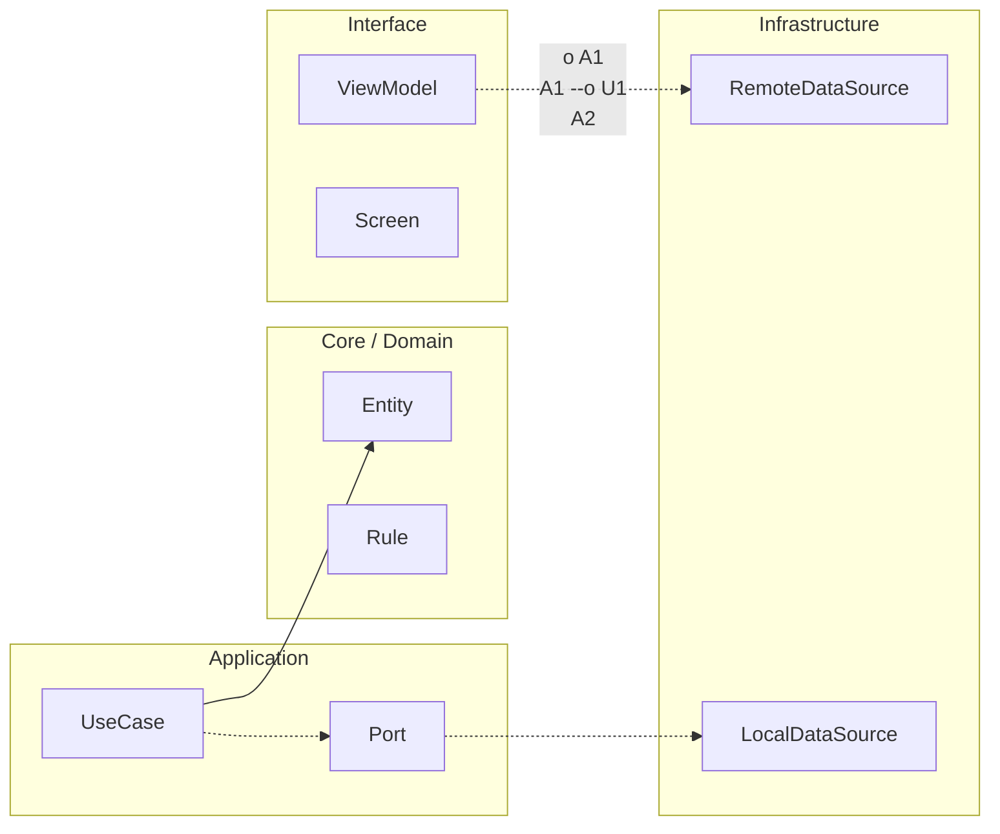

# Nivel Cero · 06 · Funciones

Hasta ahora has escrito código en bloques pequeños dentro de `main`. Eso está bien para empezar, pero cuando un programa crece aparece un problema. Repetimos lógica, el código se vuelve largo y se hace difícil de mantener. Para resolver eso usamos funciones.

Una función es una porción de código con nombre que cumple una tarea concreta. Imagina una cocina con estaciones. Una estación corta verduras, otra cocina pasta y otra prepara salsa. Cada estación tiene una responsabilidad clara. En programación, una función hace ese papel. Divide el problema en piezas pequeñas y comprensibles.

Vamos a ver un ejemplo corto. Antes de mirar el código, piensa en esto. Queremos saludar a una persona varias veces con diferentes nombres sin copiar la misma lógica una y otra vez. Para eso creamos una función `saludar` que recibe un nombre y muestra un mensaje.

```kotlin
fun saludar(nombre: String) {
    println("Hola, " + nombre)
}

fun main() {
    saludar("Ana")
    saludar("Leo")
}
```

Te explico línea por línea. La línea `fun saludar(nombre: String) {` crea una función llamada `saludar`. Dentro del paréntesis aparece `nombre: String`, que es un parámetro. Un parámetro es un dato de entrada que la función necesita para trabajar. En este caso, necesita un nombre de tipo texto. La siguiente línea imprime un saludo usando ese parámetro. La llave de cierre termina la función.

Después aparece `fun main() {`, que en este ejemplo es el punto de inicio. Dentro de `main` llamamos a `saludar("Ana")` y luego a `saludar("Leo")`. Eso significa que reutilizamos la misma función con datos distintos. El resultado esperado son dos líneas, una saludando a Ana y otra saludando a Leo.

Ahora vamos a introducir una segunda idea. Hay funciones que no solo hacen una acción, sino que también devuelven un resultado. A ese resultado lo llamamos retorno. Imagina una calculadora. Le das dos números, eliges suma y te devuelve un total. Ese “devolver” es retorno.

Mira este ejemplo y luego lo desglosamos.

```kotlin
fun sumar(a: Int, b: Int): Int {
    return a + b
}

fun main() {
    val resultado = sumar(4, 6)
    println("Resultado: " + resultado)
}
```

La línea `fun sumar(a: Int, b: Int): Int {` define una función con dos parámetros enteros y añade `: Int` para indicar que devolverá un entero. La línea `return a + b` calcula y devuelve la suma. En `main`, la variable `resultado` guarda lo que devuelve `sumar(4, 6)`. Después `println` muestra ese valor. El resultado esperado es “Resultado: 10”.

Una duda típica aquí es cuándo crear una función nueva. Una regla muy útil para empezar es esta. Si notas que repites un bloque de código más de una vez, o si una parte del código tiene una responsabilidad clara, conviértela en función. Esto mejora lectura, reduce errores y facilita cambios futuros.

También hay errores comunes. El primero es crear funciones demasiado largas que hacen muchas cosas a la vez. El segundo es usar nombres confusos como `hacerCosa()`. El tercero es olvidar el tipo de retorno cuando la función debe devolver un valor. Cuando esto pasa, el código funciona peor y cuesta más entenderlo.

Tu mini reto de hoy será crear una función llamada `mostrarPerfil` que reciba un nombre y una edad, y que imprima una frase con ambos datos. Después crea otra función llamada `duplicar` que reciba un número y devuelva su doble. En `main`, llama a las dos funciones y muestra los resultados.

Cuando termines, revisa esta solución de referencia y compárala con la tuya.

```kotlin
fun mostrarPerfil(nombre: String, edad: Int) {
    println("Perfil: " + nombre + ", " + edad + " años")
}

fun duplicar(numero: Int): Int {
    return numero * 2
}

fun main() {
    mostrarPerfil("Marta", 14)
    val doble = duplicar(7)
    println("Doble: " + doble)
}
```

La primera función organiza la impresión del perfil. La segunda devuelve un valor calculado. En `main` ves ambos usos: ejecutar una acción y recoger un resultado. Esa diferencia entre “hacer” y “devolver” es clave para avanzar en programación con buena base.


<!-- auto-gapfix:layered-mermaid -->
## Diagrama de arquitectura por capas



La lectura del diagrama sigue esta semantica:
1. `-->` dependencia directa en runtime.
2. `-.->` contrato o abstraccion.
3. `-.o` wiring o composicion.
4. `--o` salida o propagacion de resultado.
