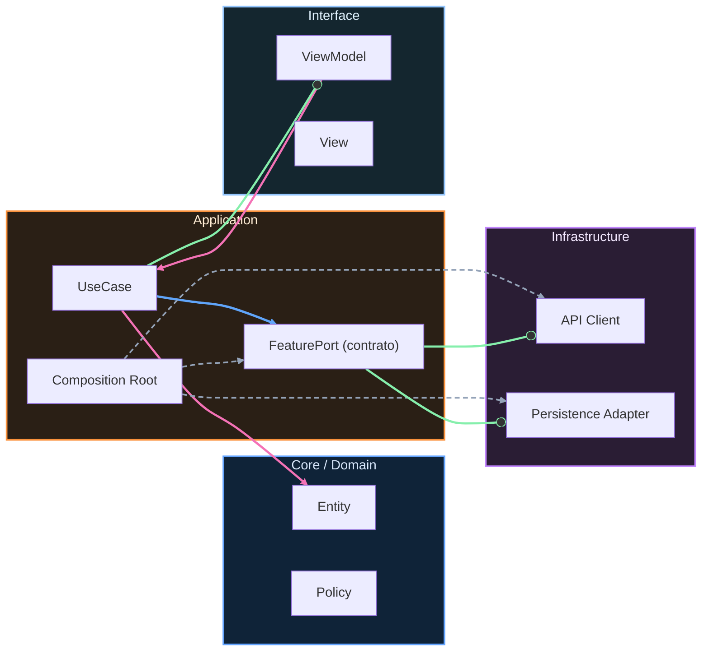

# Nivel Cero · 07 · Errores frecuentes

En esta lección vamos a trabajar algo que todo programador vive, incluso los más expertos. Vamos a trabajar los errores. Si hoy te equivocas al escribir código, eso no significa que vayas mal. Significa que estás haciendo el trabajo real de programar. La diferencia entre una persona que avanza y otra que se atasca no es “no cometer errores”, sino aprender a detectar, entender y corregir errores con método.

Primero vamos a separar dos tipos de error que te vas a encontrar. El primer tipo aparece antes de ejecutar el programa. Se llama error de compilación. En este caso, el compilador detecta que hay algo mal escrito o incoherente y no te deja construir la app. El segundo tipo aparece cuando el programa ya se está ejecutando. Se llama error en ejecución. Aquí el programa puede cerrarse o comportarse de forma incorrecta en tiempo real.

Imagina que escribes una frase y te falta una comilla. En Kotlin, eso suele causar error de compilación. El programa ni siquiera arranca porque la sintaxis está incompleta. Ahora imagina que el código arranca, pero luego intenta usar un dato que no existe y se cierra. Eso es un error en ejecución.

Vamos a ver un ejemplo de error de compilación muy típico. Observa este bloque.

```kotlin
fun main() {
    val nombre = "Ana
    println(nombre)
}
```

El error está en la línea del nombre. Falta la comilla de cierre. El compilador no puede saber dónde termina el texto y por eso detiene todo. La corrección es cerrar correctamente la cadena.

```kotlin
fun main() {
    val nombre = "Ana"
    println(nombre)
}
```

Ahora veamos un error lógico, que es otro tipo común. El programa compila, pero el resultado no es el que tú esperabas. Mira este ejemplo.

```kotlin
fun main() {
    val precio = 10
    val cantidad = 2
    val total = precio + cantidad
    println(total)
}
```

Aquí quizá querías calcular un total de compra. Si el precio es 10 y la cantidad es 2, el total correcto sería 20, no 12. El programa no se queja porque sumar dos enteros es válido, pero la lógica del problema está mal. La corrección sería usar multiplicación.

```kotlin
fun main() {
    val precio = 10
    val cantidad = 2
    val total = precio * cantidad
    println(total)
}
```

Este ejemplo te enseña algo importante. No todos los errores salen en rojo. Algunos errores se esconden en la idea y solo los detectas revisando el resultado esperado.

Ahora te voy a dar un método de depuración para principiantes que funciona muy bien. Primero, lee el mensaje de error completo sin correr. Segundo, identifica la línea donde ocurre. Tercero, verifica sintaxis y nombres de variables en esa zona. Cuarto, comprueba tipos de dato. Quinto, ejecuta de nuevo y revisa si el comportamiento coincide con lo esperado. Este proceso te ahorra tiempo y evita cambiar código “a ciegas”.

Vamos a practicar con una duda típica. Muchas personas escriben `nomre` cuando querían escribir `nombre`. El compilador dirá que `nomre` no existe. En vez de asustarte, solo tienes que revisar consistencia de nombres. Programar también es ser ordenado con los detalles.

El mini reto de hoy es intencionalmente distinto. Vas a recibir un código con tres errores y tu objetivo no es correr rápido, sino diagnosticar con calma. El primer error será de comillas. El segundo será de nombre de variable. El tercero será de lógica de cálculo. Tu tarea es corregir los tres y explicar por escrito por qué cada corrección era necesaria.

Cuando termines, comprueba que puedes responder esta pregunta: “¿Cómo sé si un error es de compilación, de ejecución o de lógica?”. Si sabes responderla con un ejemplo de cada uno, has dado un salto muy importante como estudiante.


<!-- auto-gapfix:layered-mermaid -->
## Diagrama de arquitectura por capas



La lectura del diagrama sigue esta semantica:
1. `-->` dependencia directa en runtime.
2. `-.->` wiring o configuracion.
3. `==>` contrato o abstraccion.
4. `--o` salida o propagacion de resultado.
