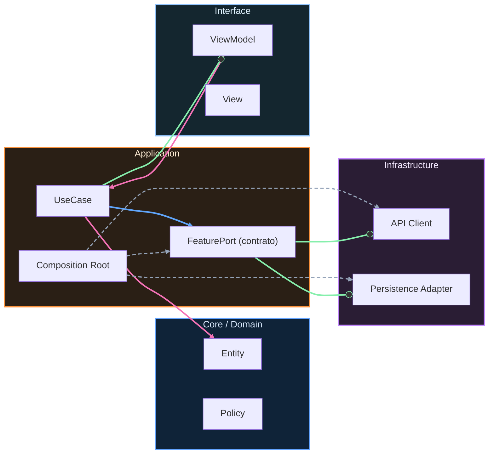

# Nivel Cero · 08 · Android Studio desde cero

Hoy vas a conocer Android Studio como herramienta de trabajo real. Ya hiciste setup técnico en una lección anterior. Ahora vamos a transformar esa instalación en hábito de uso. La idea no es tocar botones sin entender, sino saber para qué sirve cada parte y cómo se conecta con tu flujo de aprendizaje.

Cuando abres Android Studio por primera vez, puedes sentir que hay demasiados paneles. Eso es normal. Vamos a reducir ese ruido con una regla simple. En esta etapa solo necesitas dominar tres zonas. Necesitas el explorador de archivos del proyecto para saber dónde está cada cosa. Necesitas el editor de código para escribir Kotlin. Necesitas la consola y el panel de ejecución para ver errores y resultados.

Primero entra al proyecto y localiza la estructura principal. Verás carpetas y archivos. Cada archivo tiene un propósito. Algunos contienen configuración, otros contienen código y otros contienen recursos visuales. No hace falta memorizar todo hoy. Lo importante es que entiendas que el proyecto está organizado por responsabilidades.

Ahora vamos a crear un archivo Kotlin muy simple dentro del proyecto de prueba. Antes de escribir código, piensa qué resultado quieres obtener. Vamos a mostrar un mensaje en consola para confirmar que el flujo de edición y ejecución funciona. Escribe una función principal básica y un `println` como ya practicaste. Ejecuta el archivo y comprueba que el resultado aparece donde esperas.

Si no aparece resultado, no entres en pánico. Revisa primero si ejecutaste el archivo correcto. Después revisa si hay errores de compilación en rojo. Luego mira la consola para identificar el mensaje exacto. Este orden evita perder tiempo. Muchos bloqueos de principiante no son graves, solo son errores de flujo o de selección de archivo.

Vamos a introducir una rutina de trabajo que usarás todo el curso. Empieza leyendo el objetivo de la lección. Después abre solo los archivos necesarios para no saturarte. Escribe cambios pequeños y ejecuta con frecuencia. Si algo falla, corrige una cosa cada vez. Este método reduce frustración y mejora comprensión.

Ahora quiero que entiendas la importancia del panel de errores. Cuando Android Studio marca una línea, no lo hace para “castigarte”, lo hace para ayudarte a localizar un problema exacto. Si aprendes a leer esos mensajes, avanzas más rápido que alguien que solo prueba cambios al azar.

Un error típico de esta etapa es cambiar muchas cosas antes de volver a ejecutar. Eso complica saber qué causó el problema. Otra confusión frecuente es no diferenciar advertencia de error. Una advertencia sugiere mejora. Un error bloquea la ejecución. Distinguir eso te da control.

Vamos al mini reto de esta lección. Tu objetivo es abrir Android Studio, crear o editar un archivo simple, ejecutar un ejemplo y guardar evidencia de que entendiste el flujo. Para completar el reto, debes escribir un texto corto explicando con tus palabras qué panel usaste para editar, qué botón usaste para ejecutar y dónde viste el resultado.

Si haces ese reto bien, has conseguido algo más importante de lo que parece. Has dejado de ver Android Studio como “un programa enorme” y has empezado a usarlo como herramienta a tu favor. Ese cambio mental es clave para todo lo que viene en Junior.

<!-- auto-gapfix:layered-mermaid -->
## Diagrama de arquitectura por capas

La lectura del diagrama sigue esta semantica:
1. `-->` dependencia directa en runtime.
2. `-.->` wiring o configuracion.
3. `==>` contrato o abstraccion.
4. `--o` salida o propagacion de resultado.
