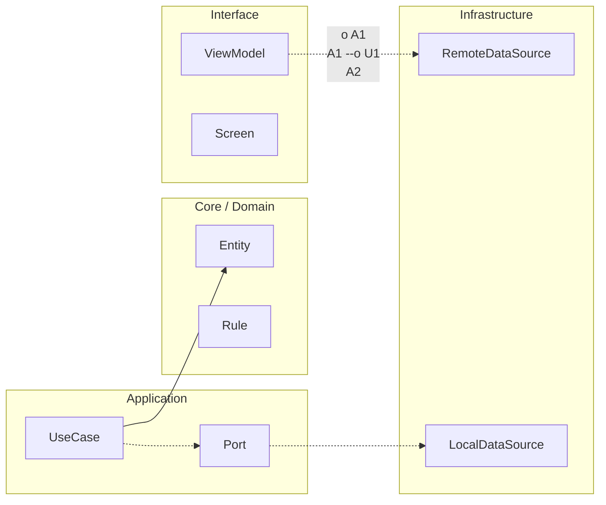

# Nivel Cero · 09 · Primera app con Compose

En esta lección vas a vivir un momento importante del curso: vas a construir tu primera pantalla real con Jetpack Compose. Hasta ahora has aprendido lógica, variables, decisiones y funciones. Todo eso no se queda en teoría. Hoy lo vamos a usar para que el móvil muestre una interfaz creada por ti.

Antes de tocar código, quiero que te quedes con una idea clave. Una interfaz de usuario es la parte de la app que la persona ve y toca. En Android moderno, una forma oficial de construir esa interfaz es Compose. Compose funciona con funciones especiales llamadas composables. Dicho fácil, un composable es una función que dibuja parte de la pantalla.

Vamos a empezar por un objetivo mínimo y realista. Queremos abrir una app que muestre un título, un texto explicativo y un botón. No necesitamos más para entender la base. Cuando esa base esté clara, podremos crecer sin miedo.

Ahora te voy a mostrar un ejemplo completo. Léelo primero sin prisa. Después lo desglosamos línea por línea.

```kotlin
import android.os.Bundle
import androidx.activity.ComponentActivity
import androidx.activity.compose.setContent
import androidx.compose.foundation.layout.Arrangement
import androidx.compose.foundation.layout.Column
import androidx.compose.foundation.layout.fillMaxSize
import androidx.compose.material3.Button
import androidx.compose.material3.MaterialTheme
import androidx.compose.material3.Text
import androidx.compose.runtime.Composable
import androidx.compose.ui.Alignment
import androidx.compose.ui.Modifier

class MainActivity : ComponentActivity() {
    override fun onCreate(savedInstanceState: Bundle?) {
        super.onCreate(savedInstanceState)
        setContent {
            PantallaBienvenida()
        }
    }
}

@Composable
fun PantallaBienvenida() {
    Column(
        modifier = Modifier.fillMaxSize(),
        verticalArrangement = Arrangement.Center,
        horizontalAlignment = Alignment.CenterHorizontally
    ) {
        Text(
            text = "Mi primera app Android",
            style = MaterialTheme.typography.headlineSmall
        )
        Text(text = "Estoy aprendiendo Compose paso a paso")
        Button(onClick = { }) {
            Text(text = "Continuar")
        }
    }
}
```

Vamos a entender este bloque de forma guiada. La parte de `import` trae piezas del sistema que necesitamos para construir la pantalla. Puedes verlo como cuando preparas una mesa de trabajo y colocas las herramientas encima antes de empezar.

Después aparece `class MainActivity : ComponentActivity()`. Esta clase es la puerta de entrada de la app en este ejemplo. Dentro está `onCreate`, que es un método que Android llama cuando la pantalla principal se crea. En `setContent` le estamos diciendo al sistema qué interfaz queremos mostrar. Aquí elegimos `PantallaBienvenida()`.

La línea `@Composable` es una etiqueta que avisa a Kotlin de que la función siguiente dibuja interfaz. Esa función se llama `PantallaBienvenida`. Dentro, usamos `Column`, que coloca elementos uno debajo del otro. Con `fillMaxSize()` hacemos que ocupe toda la pantalla. Con `Arrangement.Center` y `Alignment.CenterHorizontally` centramos el contenido para que se vea ordenado.

Luego llega el contenido visible. El primer `Text` muestra el título principal con estilo de tipografía del tema. El segundo `Text` muestra una frase secundaria. Después aparece un `Button` con un `onClick`. Ahora mismo el click está vacío porque hoy solo queremos construir la estructura visual. Dentro del botón hay otro `Text` con la etiqueta “Continuar”.

El resultado esperado es una pantalla limpia con tres elementos centrados. Si al ejecutar ves ese resultado, significa que tu primer flujo Compose está funcionando.

Te adelanto dudas típicas de esta lección. La primera duda es por qué hay tantos import. La respuesta es que cada pieza visual vive en un paquete y Kotlin necesita saber de dónde viene. La segunda duda es por qué el botón no hace nada. La respuesta es que el comportamiento se añade poco a poco; hoy estamos aprendiendo estructura visual. La tercera duda es si hay que memorizar todo esto. No. Lo importante es entender el papel de cada bloque.

Ahora vamos al mini reto. Cambia el texto del título por uno que te represente. Cambia la frase secundaria por tu objetivo en este curso. Cambia el texto del botón por “Empezar”. Ejecuta y comprueba que el cambio aparece en pantalla. Si aparece, acabas de completar tu primera personalización real de una interfaz Android.

Cuando termines, guarda una captura de pantalla y escribe dos párrafos cortos. En el primero explica qué es un composable con tus palabras. En el segundo explica qué hace `setContent` y por qué es importante. Esa evidencia demuestra comprensión, no solo copia.


<!-- auto-gapfix:layered-mermaid -->
## Diagrama de arquitectura por capas



La lectura del diagrama sigue esta semantica:
1. `-->` dependencia directa en runtime.
2. `-.->` contrato o abstraccion.
3. `-.o` wiring o composicion.
4. `--o` salida o propagacion de resultado.
