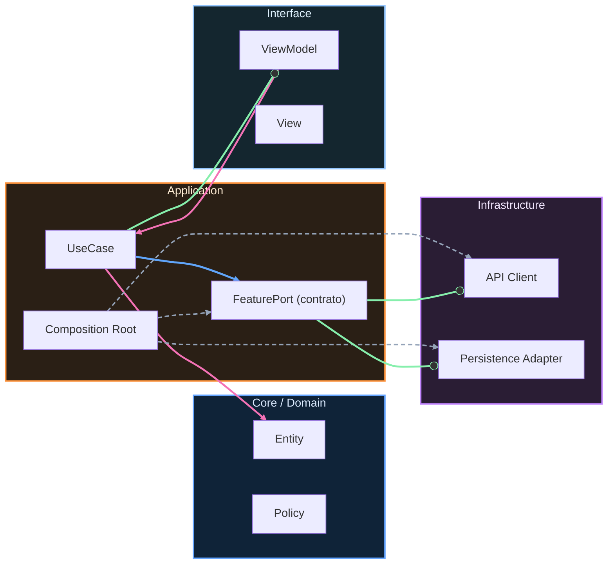

# Nivel Cero · 10 · Inputs y validación

En esta lección vas a dar un paso muy importante para que tu app deje de ser estática y empiece a reaccionar a lo que escribe una persona. Ese paso es trabajar con inputs, que son entradas de usuario. Cuando alguien escribe su nombre, selecciona una opción o pulsa un botón, está enviando datos a la app. Si la app no sabe leer esos datos y validarlos, se vuelve frágil.

Vamos a definir primero dos palabras clave. Un input es cualquier dato que entra en la app desde fuera. Puede ser texto, un número o una pulsación. Validar significa comprobar que ese dato cumple una regla antes de usarlo. Por ejemplo, si pides un nombre, no quieres aceptar un nombre vacío. Si pides edad, no quieres letras.

Ahora vamos a construir una pantalla simple con Compose para que el usuario escriba su nombre y, al pulsar un botón, la app responda solo si el texto es válido. Te mostraré el código y después lo explicaremos línea por línea.

```kotlin
import androidx.compose.foundation.layout.Column
import androidx.compose.foundation.layout.fillMaxSize
import androidx.compose.foundation.layout.padding
import androidx.compose.material3.Button
import androidx.compose.material3.MaterialTheme
import androidx.compose.material3.OutlinedTextField
import androidx.compose.material3.Text
import androidx.compose.runtime.Composable
import androidx.compose.runtime.getValue
import androidx.compose.runtime.mutableStateOf
import androidx.compose.runtime.remember
import androidx.compose.runtime.setValue
import androidx.compose.ui.Modifier
import androidx.compose.ui.unit.dp

@Composable
fun PantallaNombre() {
    var nombre by remember { mutableStateOf("") }
    var mensaje by remember { mutableStateOf("") }

    Column(
        modifier = Modifier
            .fillMaxSize()
            .padding(24.dp)
    ) {
        Text(text = "Escribe tu nombre", style = MaterialTheme.typography.titleMedium)

        OutlinedTextField(
            value = nombre,
            onValueChange = { nombre = it },
            label = { Text("Nombre") }
        )

        Button(onClick = {
            if (nombre.isBlank()) {
                mensaje = "El nombre no puede estar vacío"
            } else {
                mensaje = "Hola, $nombre"
            }
        }) {
            Text("Validar")
        }

        Text(text = mensaje)
    }
}
```

Empezamos por la parte de estado. La línea `var nombre by remember { mutableStateOf("") }` crea una variable que guarda el texto que escribe el usuario. La palabra `remember` sirve para conservar ese valor mientras la pantalla siga activa. La línea de `mensaje` hace lo mismo para el texto de respuesta.

Después llega `Column`, que coloca los elementos uno debajo de otro. Con `fillMaxSize()` ocupamos toda la pantalla y con `padding(24.dp)` dejamos margen para que no se vea pegado al borde.

El bloque `OutlinedTextField` es el campo de texto. `value = nombre` significa que el contenido visible del campo viene de la variable `nombre`. `onValueChange = { nombre = it }` significa que, cada vez que la persona escribe, actualizamos la variable con el nuevo contenido.

En el botón ocurre la validación. Si `nombre.isBlank()` es verdadero, significa que el campo está vacío o solo tiene espacios, así que mostramos un error comprensible. Si no está vacío, mostramos un saludo personalizado.

El último `Text` pinta en pantalla el contenido de `mensaje`. Eso permite ver inmediatamente el resultado de la validación.

Una duda típica en este punto es por qué no usar directamente el texto del campo sin validar. La respuesta es que una app real no debe asumir que el dato siempre llega bien. Validar evita errores y mejora la experiencia del usuario.

Tu mini reto de hoy consiste en ampliar esta pantalla con una segunda validación. Si el nombre tiene menos de 3 caracteres, en vez de saludar, muestra “El nombre es demasiado corto”. Si tiene 3 o más, muestra el saludo normal. Cuando termines, prueba al menos tres casos y anota los resultados.


<!-- auto-gapfix:layered-mermaid -->
## Diagrama de arquitectura por capas



La lectura del diagrama sigue esta semantica:
1. `-->` dependencia directa en runtime.
2. `-.->` wiring o configuracion.
3. `==>` contrato o abstraccion.
4. `--o` salida o propagacion de resultado.
