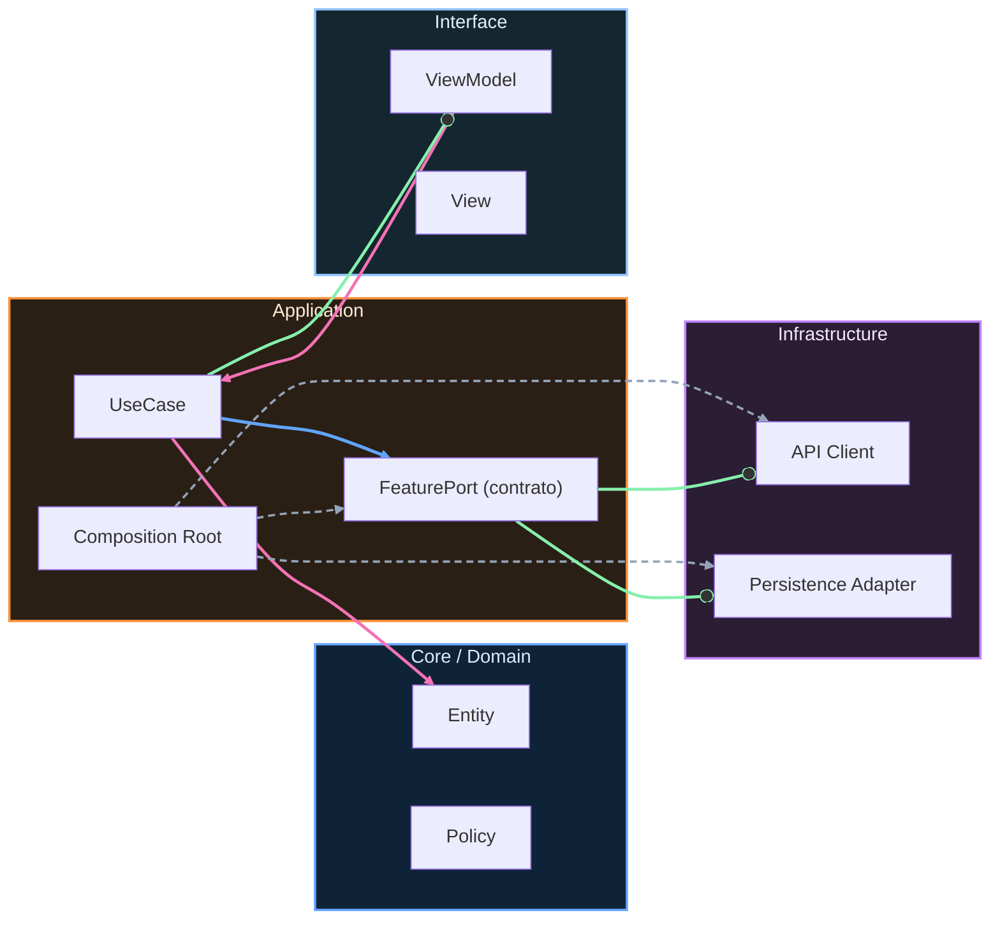

# Nivel Cero · 11 · Navegación simple

En esta lección vas a aprender cómo pasar de una pantalla a otra dentro de una app. Este tema se llama navegación. Hasta ahora has trabajado pantallas aisladas. A partir de aquí vamos a conectar pantallas para que la app se sienta viva.

Vamos a empezar con una idea clara. Navegar es cambiar de vista según una acción del usuario. Si una persona pulsa “Siguiente”, la app debe abrir otra pantalla. Si pulsa “Volver”, debe regresar a la anterior. Esto parece simple, pero es una base esencial para cualquier producto real.

En Android con Compose usamos una librería llamada Navigation Compose para organizar estos cambios. En lugar de abrir pantallas “a mano”, definimos rutas con nombres y dejamos que el sistema gestione la transición.

Ahora veremos un ejemplo mínimo con dos pantallas. Antes de leerlo, piensa qué esperamos. Queremos una pantalla inicial con un botón. Al pulsar ese botón, debe abrirse una segunda pantalla de detalle.

```kotlin
import androidx.compose.material3.Button
import androidx.compose.material3.Text
import androidx.compose.runtime.Composable
import androidx.navigation.compose.NavHost
import androidx.navigation.compose.composable
import androidx.navigation.compose.rememberNavController

@Composable
fun AppNavegacion() {
    val navController = rememberNavController()

    NavHost(navController = navController, startDestination = "inicio") {
        composable("inicio") {
            PantallaInicio(onIrDetalle = { navController.navigate("detalle") })
        }
        composable("detalle") {
            PantallaDetalle()
        }
    }
}

@Composable
fun PantallaInicio(onIrDetalle: () -> Unit) {
    Button(onClick = onIrDetalle) {
        Text("Ir a detalle")
    }
}

@Composable
fun PantallaDetalle() {
    Text("Esta es la pantalla detalle")
}
```

Vamos línea por línea. Primero importamos piezas de Compose y navegación. Luego, en `AppNavegacion`, creamos `navController`, que es el objeto que controla hacia dónde moverse. Después usamos `NavHost` para declarar el mapa de rutas de la app. `startDestination = "inicio"` significa que la primera pantalla será “inicio”.

Dentro de `NavHost` definimos dos rutas con `composable`. La ruta `inicio` dibuja `PantallaInicio`. Le pasamos una acción llamada `onIrDetalle`. Esa acción ejecuta `navController.navigate("detalle")`, que ordena abrir la ruta detalle. La ruta `detalle` simplemente dibuja `PantallaDetalle`.

La función `PantallaInicio` recibe la acción como parámetro y la ejecuta cuando se pulsa el botón. Esa separación ayuda a mantener el código claro. `PantallaDetalle` muestra un texto simple para confirmar que la navegación ocurrió.

El resultado esperado es este flujo. La app abre en inicio. Al pulsar “Ir a detalle”, aparece la pantalla detalle. Si eso ocurre, tu navegación básica funciona correctamente.

Una duda típica aquí es por qué usar rutas con texto como `"inicio"` y `"detalle"`. La razón es que, en este nivel, es la forma más simple de entender el concepto. Más adelante aprenderás rutas tipadas y navegación más robusta.

Tu mini reto de hoy consiste en añadir una tercera pantalla llamada “resumen” y un botón en detalle para llegar a esa nueva pantalla. Cuando termines, anota en una frase qué hace `NavHost` y en otra frase qué hace `navController.navigate`.


<!-- auto-gapfix:layered-mermaid -->
## Diagrama de arquitectura por capas



La lectura del diagrama sigue esta semantica:
1. `-->` dependencia directa en runtime.
2. `-.->` wiring o configuracion.
3. `==>` contrato o abstraccion.
4. `--o` salida o propagacion de resultado.
