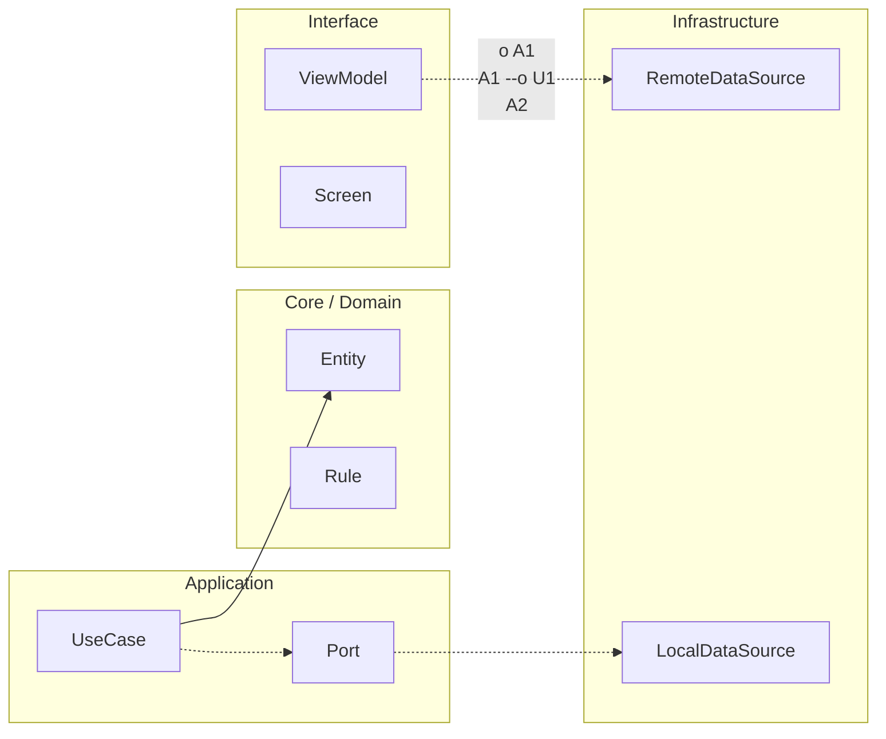

# Nivel Cero · 12 · Proyecto integrador: Rutina Diaria

Hoy vas a cerrar Nivel Cero con tu primer proyecto integrador. Un proyecto integrador significa que vas a unir en una sola práctica todo lo que aprendiste en las lecciones anteriores. Este punto es importante porque no buscamos solo completar ejercicios sueltos. Buscamos comprobar que ya sabes conectar conceptos para crear algo útil.

El proyecto se llama “Rutina Diaria”. La idea es construir una app pequeña que permita registrar una rutina de estudio o de hábitos, mostrar un mensaje de validación y navegar entre pantallas básicas. No vamos a buscar complejidad técnica todavía. Vamos a buscar claridad, orden y comprensión real.

Primero definimos el comportamiento esperado. La pantalla inicial debe mostrar un título claro y un botón para comenzar. La segunda pantalla debe permitir escribir el nombre de una rutina. La app debe validar que ese nombre no esté vacío. Si está vacío, debe mostrar un mensaje de error comprensible. Si no está vacío, debe mostrar un mensaje positivo. Después, debe permitir navegar a una pantalla final de resumen.

Ahora vamos a dividir el proyecto en pasos, porque así trabajan los equipos profesionales. En el paso uno, crea la estructura de navegación con tres rutas: inicio, rutina y resumen. En el paso dos, diseña la interfaz de inicio con título y botón. En el paso tres, construye la pantalla de rutina con un campo de texto y un botón validar. En el paso cuatro, añade la lógica condicional de validación. En el paso cinco, crea la pantalla resumen y conéctala con navegación.

Observa que este proyecto reutiliza exactamente lo aprendido. Estás usando variables para guardar datos. Estás usando condicionales para validar. Estás usando funciones composables para dibujar interfaz. Estás usando navegación para conectar pantallas. Ese es el objetivo del integrador: demostrar que no aprendiste piezas aisladas, sino un flujo completo.

Vamos a dejar una referencia de arquitectura mínima para que no te pierdas. Imagina que tu app tiene tres funciones composables principales, una por pantalla. Cada pantalla tiene una responsabilidad clara. Inicio presenta y dirige. Rutina captura y valida datos. Resumen confirma resultado. Esa separación hace que el proyecto sea más fácil de entender y mantener.

Aquí aparece una duda típica de este momento. Algunas personas preguntan si su proyecto está “demasiado simple”. La respuesta correcta es que, en Nivel Cero, la simplicidad es una ventaja. Lo importante no es meter diez pantallas. Lo importante es que cada decisión tenga sentido, que el flujo funcione y que puedas explicar con tus palabras por qué tu app se comporta así.

Tu entrega final de este proyecto debe incluir evidencia técnica y evidencia de comprensión. La evidencia técnica será el código funcionando y capturas de las tres pantallas. La evidencia de comprensión será una explicación escrita donde cuentes qué hace cada pantalla, cómo validas el input y cómo se mueve la navegación.

Para ayudarte a autoevaluarte, usa esta idea de cierre. Si puedes abrir tu app, escribir una rutina, ver que se valida correctamente y llegar a la pantalla resumen, entonces has superado el integrador funcional. Si además puedes explicar el porqué de cada parte, entonces has superado el integrador con comprensión.

Cuando completes este proyecto, estarás listo para pasar de Nivel Cero a Junior, porque ya no solo entiendes conceptos por separado. Ya puedes construir un flujo básico completo con intención técnica y pedagógica.


<!-- auto-gapfix:layered-mermaid -->
## Diagrama de arquitectura por capas



La lectura del diagrama sigue esta semantica:
1. `-->` dependencia directa en runtime.
2. `-.->` contrato o abstraccion.
3. `-.o` wiring o composicion.
4. `--o` salida o propagacion de resultado.

<!-- auto-gapfix:layered-snippet -->
## Snippet de referencia por capas

```kotlin
interface FeaturePort {
    suspend fun fetch(): List<String>
}

class FeatureUseCase(
    private val port: FeaturePort
) {
    suspend operator fun invoke(): List<String> = port.fetch()
}

class FeatureViewModel(
    private val useCase: FeatureUseCase
) : ViewModel() {

    private val _items = MutableStateFlow<List<String>>(emptyList())
    val items: StateFlow<List<String>> = _items

    fun load() {
        viewModelScope.launch {
            _items.value = runCatching { useCase() }.getOrDefault(emptyList())
        }
    }
}
```
