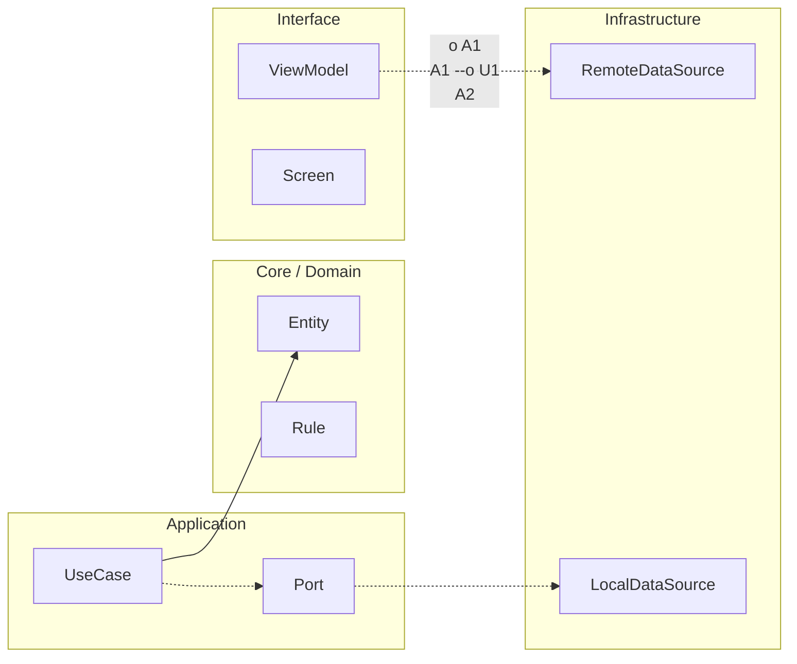

# Entregables de Nivel Cero

Has llegado al cierre de Nivel Cero. Este documento existe para que compruebes si realmente estás preparado para pasar al siguiente nivel. Aquí no medimos memorización. Medimos comprensión aplicada.

El primer entregable obligatorio es tu proyecto “Rutina Diaria” funcionando con flujo completo. Eso significa que debe existir una pantalla de inicio, una pantalla de entrada de rutina y una pantalla de resumen. También significa que la validación del input debe responder correctamente cuando el texto está vacío y cuando el texto es válido.

El segundo entregable obligatorio es la evidencia visual de ejecución. Debes guardar capturas de cada pantalla en funcionamiento y, si puedes, un pequeño vídeo de menos de un minuto mostrando el flujo completo desde inicio hasta resumen.

El tercer entregable obligatorio es la evidencia de comprensión escrita. Debes redactar una explicación corta donde cuentes qué aprendiste sobre variables, condicionales, funciones y navegación, y cómo se conectan entre sí dentro de tu app.

El cuarto entregable obligatorio es la autoevaluación de errores. Debes identificar al menos tres errores que hayas cometido durante Nivel Cero, explicar por qué ocurrieron y describir cómo los corregiste. Esta parte es muy importante porque demuestra que sabes aprender de tus fallos.

Para considerar Nivel Cero como completado, el equipo docente debe poder verificar que tu app funciona, que tu lógica es coherente y que tu explicación demuestra comprensión real. Si falta alguna de estas piezas, no pasa nada, simplemente se corrige y se vuelve a intentar con guía.

Cuando cumplas estos entregables, tendrás una base sólida para entrar a Junior con confianza y sin saltos bruscos de dificultad.


<!-- auto-gapfix:layered-mermaid -->
## Diagrama de arquitectura por capas



La lectura del diagrama sigue esta semantica:
1. `-->` dependencia directa en runtime.
2. `-.->` contrato o abstraccion.
3. `-.o` wiring o composicion.
4. `--o` salida o propagacion de resultado.

<!-- auto-gapfix:layered-snippet -->
## Snippet de referencia por capas

```kotlin
interface FeaturePort {
    suspend fun fetch(): List<String>
}

class FeatureUseCase(
    private val port: FeaturePort
) {
    suspend operator fun invoke(): List<String> = port.fetch()
}

class FeatureViewModel(
    private val useCase: FeatureUseCase
) : ViewModel() {

    private val _items = MutableStateFlow<List<String>>(emptyList())
    val items: StateFlow<List<String>> = _items

    fun load() {
        viewModelScope.launch {
            _items.value = runCatching { useCase() }.getOrDefault(emptyList())
        }
    }
}
```
