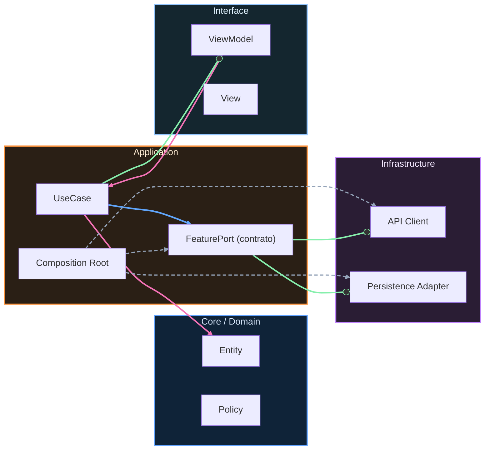

# Nivel Junior · 00 · De Nivel Cero a desarrollo Android real

> **Estado actual de FieldOps:** v1.0 — Auth (mock), tasks (list + detail), navegación con sealed routes, Hilt DI, DataStore, Room, Retrofit/OkHttp (con fallback), WorkManager (SyncWorker), 9 unit tests + 3 integration tests.
>
> **Objetivo de versión:** v1.0 (Junior) — App funcional con arquitectura limpia inicial, UDF, persistencia local, capa de red y tests unitarios.
>
> **Comandos de verificación:**
> ```bash
> cd proyecto-android
> ./gradlew :app:assembleDebug        # Compila la app
> ./gradlew testDebugUnitTest          # Ejecuta tests unitarios
> ./gradlew lintDebug                  # Análisis estático
> ```
>
> **Proyecto:** ver [Brief FieldOps](../05-proyecto-final/00-brief-ruralgo-fieldops.md) · [Rúbrica](../05-proyecto-final/01-rubrica-empleabilidad.md) · [Evidencias obligatorias](../05-proyecto-final/02-evidencias-obligatorias.md)

Si has completado Nivel Cero, ya tienes algo muy valioso: no le tienes miedo al código. Eso parece pequeño, pero en realidad es enorme. Muchas personas se quedan bloqueadas porque ven Android como algo misterioso. Tú ya no estás en ese punto. Tú ya sabes abrir Android Studio, escribir Kotlin básico, crear pantallas simples y moverte entre ellas. Ahora empieza una nueva etapa.

En Junior vamos a pasar de ejercicios guiados a desarrollo con criterio profesional inicial. Eso significa que no solo vas a escribir código que “funciona”. Vas a aprender a escribir código que también sea claro, mantenible y preparado para crecer.

Para entender bien el cambio de nivel, imagina esta comparación. En Nivel Cero aprendiste a conducir en una calle tranquila, con buena visibilidad y poca velocidad. En Junior vamos a entrar a la ciudad real. Habrá más señales, más decisiones y más responsabilidad. No vamos a correr. Vamos a avanzar con método.

Tu nuevo objetivo es construir una app Android siguiendo prácticas que sí se usan en equipos reales: capas bien definidas, manejo de estado con intención, navegación organizada, persistencia local, inyección de dependencias y pruebas básicas de calidad. No vas a memorizar herramientas sueltas. Vas a entender para qué existe cada una y cuándo conviene usarla.

Durante este nivel vas a encontrarte con nombres nuevos como ViewModel, repositorio, UDF, Room, DataStore o Hilt. Si ahora mismo te suenan grandes, está perfecto. No se espera que los domines hoy. Se espera que entres con mentalidad correcta: primero entender el problema, luego elegir la pieza técnica adecuada.

Vamos a trabajar con una regla pedagógica simple y muy importante. Cada vez que aparezca una decisión técnica, no solo diremos “haz esto”. También explicaremos “por qué” y “qué problema evita”. Ese hábito te convierte en desarrollador, no en repetidor de tutoriales.

Hay otra diferencia fundamental con Nivel Cero. A partir de ahora, vamos a cuidar más la estructura del proyecto. En un proyecto pequeño todo parece fácil aunque esté desordenado. Pero cuando el proyecto crece, el desorden cuesta tiempo, dinero y errores. Por eso vamos a aprender estructura desde temprano, sin complicar de más.

Este nivel también marca el inicio de tu relación con calidad técnica. Calidad no significa perfección. Calidad significa que puedes confiar en el comportamiento del sistema y que otro compañero puede entender tu trabajo sin adivinar intenciones.

Para entrar bien en Junior, tu mentalidad de arranque debe ser esta. Mantener la curiosidad de Nivel Cero, pero agregar disciplina de ingeniería. Seguir preguntando “¿qué hace esto?”, y además empezar a preguntar “¿dónde debería vivir este código?” y “¿cómo lo voy a probar?”

En el siguiente módulo vamos a preparar el entorno Junior de forma profesional, con versiones, herramientas y decisiones explícitas. El objetivo no será solo ejecutar la app. El objetivo será que entiendas qué piezas sostienen el proyecto y por qué están elegidas así.


<!-- auto-gapfix:layered-mermaid -->
## Diagrama de arquitectura por capas



La lectura del diagrama sigue esta semantica:
1. `-->` dependencia directa en runtime.
2. `-.->` wiring o configuracion.
3. `==>` contrato o abstraccion.
4. `--o` salida o propagacion de resultado.
