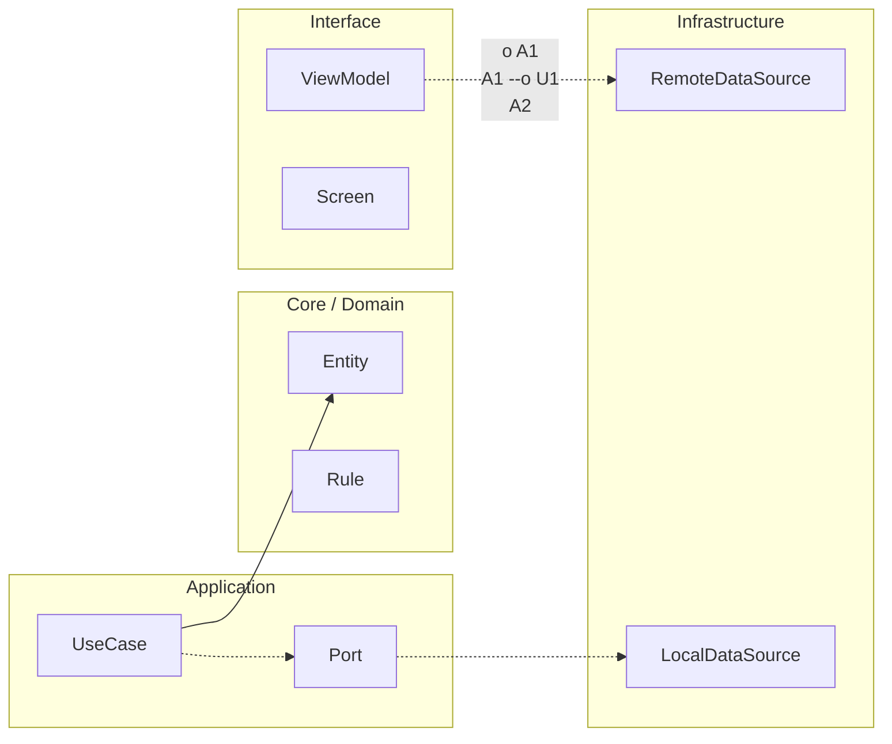

# Nivel Junior · 00-setup · Entorno profesional Android paso a paso

En este módulo vamos a preparar el entorno de trabajo como lo hace un equipo profesional. En Nivel Cero aprendiste a arrancar Android Studio y a ejecutar una app básica. Ahora vamos a dar un paso más. Vamos a construir un entorno estable, reproducible y fácil de mantener.

La palabra clave aquí es reproducible. Reproducible significa que si otra persona abre tu proyecto en otro ordenador, debería poder compilarlo sin pelearse con versiones rotas o diferencias raras. Cuando no cuidas este punto, aparecen errores difíciles de diagnosticar y el equipo pierde tiempo.

Vamos a trabajar con esta base técnica: JDK 17, Kotlin 2.3.10, Android Gradle Plugin 9.0.0, Gradle 9.1.0, compileSdk 36 y targetSdk 36. También vamos a preparar el terreno para Compose, Navigation Compose, Coroutines, Flow, Hilt, Room, DataStore y WorkManager, que se usarán en módulos siguientes.

Antes de tocar archivos, entiende este principio. En Android, las versiones no se eligen al azar. Se eligen por compatibilidad. Si una pieza avanza y otra no, el proyecto puede romper en sincronización, compilación o ejecución. Por eso definimos una matriz estable y la respetamos.

Ahora sí, vamos con el proyecto. Crea un proyecto Android nuevo en Android Studio con plantilla vacía de Compose. Ponle un nombre claro, por ejemplo `StackMyArchitectureAndroid`. Marca Kotlin como lenguaje y confirma que la configuración inicial quede orientada a Compose.

Cuando el proyecto abra, lo primero es revisar la versión de Java que usará Gradle. En macOS puedes comprobarlo en terminal con el comando `java -version`. Si ves una versión distinta a 17, no entres en pánico. Lo importante es que Gradle use 17 para compilar. Eso se controla en configuración de Gradle JDK dentro de Android Studio.

El siguiente paso es fijar Gradle Wrapper. Busca el archivo `gradle/wrapper/gradle-wrapper.properties` y asegúrate de que el `distributionUrl` apunte a Gradle 9.1.0. Esto evita que cada máquina use una versión diferente del motor de build.

Después revisa la versión del plugin de Android y de Kotlin en el catálogo de versiones del proyecto. En proyectos modernos suele estar en `gradle/libs.versions.toml`. Allí declaras versiones una sola vez y luego las reutilizas en todos los módulos. Esto reduce errores de copia y facilita actualizaciones.

Tu catálogo debe expresar la intención técnica con claridad. Kotlin en 2.3.10, AGP en 9.0.0 y Compose BOM en versión estable. La ventaja del BOM es que alinea internamente múltiples librerías Compose sin obligarte a fijar versión individual de cada una.

Ahora vamos a revisar configuración Android del módulo app. En `app/build.gradle.kts`, verifica `compileSdk = 36`. En `defaultConfig`, fija `targetSdk = 36`. También define un `minSdk` razonable para el alcance del curso. Si no hay restricción explícita, podemos trabajar con un mínimo moderno que permita APIs actuales sin excluir demasiados dispositivos.

En el mismo archivo activa Compose con la opción de build features correspondiente y asegúrate de incluir dependencias base de Compose usando el BOM. En esta etapa no buscamos cantidad de dependencias. Buscamos un arranque limpio y bien entendido.

Ahora añade piezas de arquitectura que usaremos en Junior. Incluye Navigation Compose para moverte entre pantallas. Incluye lifecycle-runtime-compose y lifecycle-viewmodel-compose para integrar estado de pantalla de forma segura con el ciclo de vida. Incluye Coroutines y Flow para concurrencia y streams de datos. Incluye Hilt para inyección de dependencias. Incluye Room para persistencia local. Incluye DataStore para preferencias. Incluye WorkManager para tareas persistentes en segundo plano.

Es importante entender por qué las añadimos ahora aunque todavía no las dominemos. Porque el entorno profesional no se improvisa en mitad de la construcción. Se prepara desde el principio para que el crecimiento del proyecto no sea doloroso.

Cuando termines de configurar versiones y dependencias, sincroniza Gradle. Si Android Studio muestra advertencias, léelas una por una. No ignores advertencias sin entenderlas. Cada advertencia es una conversación técnica del sistema contigo.

Después ejecuta una compilación limpia del proyecto. Si compila sin errores, ya tienes una base profesional mínima. Si falla, no lo veas como derrota. Ve el mensaje, identifica archivo y línea, y corrige de forma incremental.

Ahora vamos a dejar una checklist de validación final, pero explicada de forma humana. Debes poder confirmar que Gradle usa 9.1.0, que AGP está en 9.0.0, que Kotlin está en 2.3.10, que compileSdk y targetSdk están en 36, que Compose compila y que el proyecto ejecuta en emulador sin cierre inesperado al arrancar.

Cuando cumplas esa validación, habrás terminado el setup Junior correctamente. En el siguiente módulo ya no hablaremos solo de “que funcione”. Empezaremos a hablar de “cómo diseñarlo para que escale”, introduciendo la arquitectura Android recomendada con capas UI y Data, dominio opcional, UDF y ViewModel por pantalla.


<!-- auto-gapfix:layered-mermaid -->
## Diagrama de arquitectura por capas



La lectura del diagrama sigue esta semantica:
1. `-->` dependencia directa en runtime.
2. `-.->` contrato o abstraccion.
3. `-.o` wiring o composicion.
4. `--o` salida o propagacion de resultado.

<!-- auto-gapfix:layered-snippet -->
## Snippet de referencia por capas

```kotlin
interface FeaturePort {
    suspend fun fetch(): List<String>
}

class FeatureUseCase(
    private val port: FeaturePort
) {
    suspend operator fun invoke(): List<String> = port.fetch()
}

class FeatureViewModel(
    private val useCase: FeatureUseCase
) : ViewModel() {

    private val _items = MutableStateFlow<List<String>>(emptyList())
    val items: StateFlow<List<String>> = _items

    fun load() {
        viewModelScope.launch {
            _items.value = runCatching { useCase() }.getOrDefault(emptyList())
        }
    }
}
```
