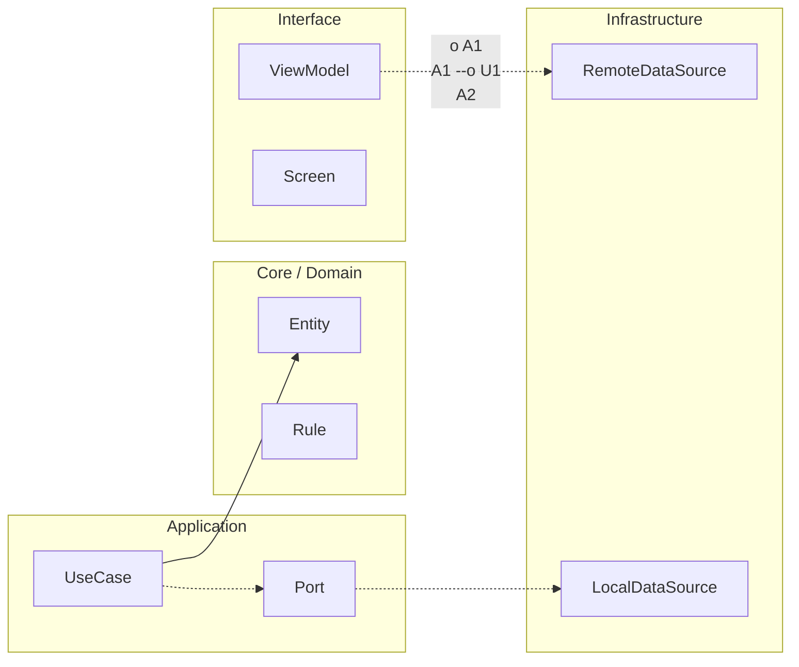

# Nivel Junior · 01 · Arquitectura Android recomendada sin complicarte la vida

En este módulo vas a aprender una de las decisiones más importantes del desarrollo Android profesional: cómo organizar el proyecto para que crezca sin romperse. Esta frase parece grande, pero la idea es sencilla. Si el código está desordenado, cada cambio se vuelve más difícil. Si el código está ordenado, cada cambio cuesta menos.

Vamos a usar la arquitectura recomendada por Android con dos capas obligatorias y una capa opcional. Las capas obligatorias son UI y Data. La capa opcional es Domain. El motivo de esta decisión es práctico. No todos los proyectos necesitan Domain desde el día uno, pero todos los proyectos necesitan una UI clara y una fuente de datos organizada.

Piensa en la app como una pequeña empresa. La capa UI es la recepción: recibe acciones del usuario y muestra resultados. La capa Data es operaciones: sabe de red, base de datos y almacenamiento local. La capa Domain, cuando existe, es el manual de negocio: concentra reglas y casos de uso para que no se mezclen con detalles técnicos.

Ahora aterrizamos esta idea en Android moderno. En UI vas a trabajar con Jetpack Compose, ViewModel por pantalla y estado unidireccional, que también se llama UDF. UDF significa que los datos bajan hacia la interfaz y los eventos suben hacia la lógica. Esta dirección única reduce confusión porque siempre sabes de dónde viene un cambio.

En Data vas a tener repositorios. Un repositorio es una pieza que decide de dónde obtener los datos en cada momento. Puede leer desde red, desde Room o desde DataStore. La pantalla no debe conocer esos detalles. La pantalla solo pide información y reacciona.

Vamos a escribir una regla muy útil para no perdernos. Una pantalla no debe hablar directamente con Retrofit, ni con Room, ni con DataStore. La pantalla habla con su ViewModel. El ViewModel habla con repositorios o casos de uso. Esa separación te da testabilidad y orden.

Para que lo visualices mejor, imagina un flujo simple. El usuario abre Catálogo. La UI manda un evento `OnScreenStarted`. El ViewModel recibe el evento y solicita datos al repositorio. El repositorio decide si devuelve caché local primero y luego refresca desde red. El resultado vuelve al ViewModel. El ViewModel emite nuevo estado y la UI se redibuja.

Ese flujo parece largo, pero evita errores comunes. Evita meter lógica de negocio dentro de composables. Evita duplicar código de red en varias pantallas. Evita que un cambio de backend rompa toda la interfaz.

Ahora vamos a concretar la estructura de carpetas inicial recomendada para Junior. No hace falta hacer micro-módulos todavía. Con una estructura por feature dentro del módulo app ya puedes trabajar de forma profesional inicial.

Una base clara puede verse así.

```text
app/
  src/main/java/com/tuempresa/app/
    core/
      designsystem/
      navigation/
      common/
    feature/
      catalog/
        ui/
        data/
        domain/ (opcional)
      auth/
        ui/
        data/
        domain/ (opcional)
```

Fíjate en algo importante. No estamos separando por tipo global (`viewmodels`, `repositories`, `screens`) para todo el proyecto. Estamos separando por feature. Eso hace que cada funcionalidad tenga sus piezas juntas y sea más fácil de mantener.

Ahora hablamos del ViewModel por pantalla. Esta decisión evita ViewModels gigantes que intentan controlar toda la app. Si tienes pantalla de login, su ViewModel debe manejar login. Si tienes pantalla de catálogo, su ViewModel debe manejar catálogo. Responsabilidad clara, mantenimiento más simple.

En UDF necesitamos dos conceptos mínimos: estado y eventos. El estado representa “cómo está la pantalla ahora”. Los eventos representan “qué hizo el usuario”. Esta separación evita mezclar intención con resultado.

Aquí tienes un ejemplo básico de estado y eventos, pensado para leer con calma.

```kotlin
data class CatalogUiState(
    val isLoading: Boolean = false,
    val items: List<String> = emptyList(),
    val errorMessage: String? = null
)

sealed interface CatalogEvent {
    data object OnScreenStarted : CatalogEvent
    data object OnRetryClicked : CatalogEvent
}
```

Vamos línea por línea para fijar criterio. `CatalogUiState` es una foto de la pantalla. `isLoading` indica si está cargando. `items` guarda la lista visible. `errorMessage` guarda un error opcional. En eventos, `OnScreenStarted` expresa que la pantalla arrancó. `OnRetryClicked` expresa que el usuario quiere reintentar.

Este diseño parece simple, y justamente por eso es robusto. Cuando el equipo crece, todos hablan el mismo idioma: estado y eventos. No hay banderas escondidas en sitios aleatorios.

Ahora observa cómo se conecta con un ViewModel inicial.

```kotlin
class CatalogViewModel(
    private val repository: CatalogRepository
) : ViewModel() {

    private val _uiState = MutableStateFlow(CatalogUiState())
    val uiState: StateFlow<CatalogUiState> = _uiState

    fun onEvent(event: CatalogEvent) {
        when (event) {
            CatalogEvent.OnScreenStarted -> loadCatalog()
            CatalogEvent.OnRetryClicked -> loadCatalog()
        }
    }

    private fun loadCatalog() {
        viewModelScope.launch {
            _uiState.value = _uiState.value.copy(isLoading = true, errorMessage = null)

            runCatching { repository.getCatalog() }
                .onSuccess { items ->
                    _uiState.value = CatalogUiState(isLoading = false, items = items)
                }
                .onFailure { error ->
                    _uiState.value = CatalogUiState(
                        isLoading = false,
                        errorMessage = error.message ?: "Error inesperado"
                    )
                }
        }
    }
}
```

Explicación clara. El ViewModel recibe un repositorio por constructor. Define un estado privado mutable y uno público de solo lectura. `onEvent` actúa como puerta única de entrada para eventos de UI. `loadCatalog` ejecuta trabajo asíncrono con `viewModelScope`. Durante carga, activa `isLoading`. Si va bien, coloca items. Si falla, coloca mensaje de error.

Esto es UDF básico funcionando. Unidireccional, legible y testeable.

Falta una pieza crítica: el repositorio. Aquí debes entender una idea profesional esencial. El repositorio no es una clase “porque sí”. El repositorio existe para desacoplar la fuente real de datos del resto del sistema.

Un contrato mínimo de repositorio puede verse así.

```kotlin
interface CatalogRepository {
    suspend fun getCatalog(): List<String>
}
```

Y una implementación simple de arranque podría devolver datos mockeados de desarrollo, para luego migrar a red y Room.

```kotlin
class CatalogRepositoryImpl : CatalogRepository {
    override suspend fun getCatalog(): List<String> {
        return listOf("Arquitectura", "Kotlin", "Compose")
    }
}
```

En este punto quizá te preguntes: ¿dónde entra la capa Domain opcional? Respuesta simple. Entra cuando empiezas a tener reglas de negocio que se repiten entre pantallas o que necesitan aislarse de detalles técnicos.

Por ejemplo, si varias pantallas necesitan aplicar la misma regla de filtrado o priorización, puedes crear un caso de uso en Domain. Así evitas duplicación y mantienes lógica de negocio en un sitio claro.

Un caso de uso opcional de ejemplo sería este.

```kotlin
class GetCatalogUseCase(
    private val repository: CatalogRepository
) {
    suspend operator fun invoke(): List<String> {
        return repository.getCatalog().sorted()
    }
}
```

No lo añadimos por moda. Lo añadimos cuando aporta valor real.

Ahora vamos a aterrizar buenas prácticas que debes llevarte desde hoy. La primera es mantener composables tontos y ViewModels listos. Composable debe renderizar estado y emitir eventos. ViewModel debe procesar eventos y transformar estado.

La segunda es evitar que errores de infraestructura lleguen crudos a UI. UI no necesita stacktrace. UI necesita mensajes entendibles y estados consistentes.

La tercera es no mezclar navegación con lógica de negocio. Navegación en capa de navegación. Lógica en ViewModel y repositorios.

La cuarta es diseñar para test. Si tu ViewModel depende de una interfaz de repositorio, testear se vuelve directo.

Cerramos con una mini práctica guiada para fijar todo. Crea una feature pequeña llamada `tasks`. Define `TasksUiState` con loading, lista y error. Define `TasksEvent` con iniciar y reintentar. Crea `TasksViewModel` con `onEvent`. Crea contrato `TasksRepository`. Haz implementación simple con lista estática. Conecta desde Compose mostrando loading, lista o error. Si puedes explicar verbalmente el flujo de evento a estado, vas perfecto.

Cuando domines este módulo, tendrás la base correcta para entrar a integración real con Hilt, Room, DataStore y WorkManager sin crear deuda técnica innecesaria.


<!-- auto-gapfix:layered-mermaid -->
## Diagrama de arquitectura por capas



La lectura del diagrama sigue esta semantica:
1. `-->` dependencia directa en runtime.
2. `-.->` contrato o abstraccion.
3. `-.o` wiring o composicion.
4. `--o` salida o propagacion de resultado.
