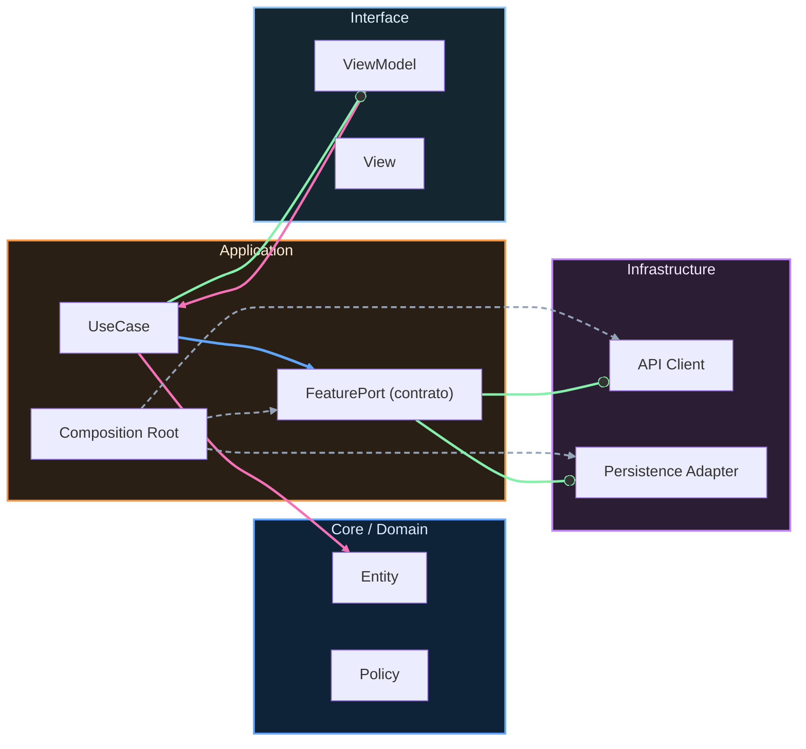

# Nivel Junior · 01 · Arquitectura Android recomendada sin complicarte la vida

En este módulo vas a aprender una de las decisiones más importantes del desarrollo Android profesional: cómo organizar el proyecto para que crezca sin romperse. Esta frase parece grande, pero la idea es sencilla. Si el código está desordenado, cada cambio se vuelve más difícil. Si el código está ordenado, cada cambio cuesta menos.

Vamos a usar la arquitectura recomendada por Android con dos capas obligatorias y una capa opcional. Las capas obligatorias son UI y Data. La capa opcional es Domain. El motivo de esta decisión es práctico. No todos los proyectos necesitan Domain desde el día uno, pero todos los proyectos necesitan una UI clara y una fuente de datos organizada.

Piensa en la app como una pequeña empresa. La capa UI es la recepción: recibe acciones del usuario y muestra resultados. La capa Data es operaciones: sabe de red, base de datos y almacenamiento local. La capa Domain, cuando existe, es el manual de negocio: concentra reglas y casos de uso para que no se mezclen con detalles técnicos.

Ahora aterrizamos esta idea en Android moderno. En UI vas a trabajar con Jetpack Compose, ViewModel por pantalla y estado unidireccional, que también se llama UDF. UDF significa que los datos bajan hacia la interfaz y los eventos suben hacia la lógica. Esta dirección única reduce confusión porque siempre sabes de dónde viene un cambio.

En Data vas a tener repositorios. Un repositorio es una pieza que decide de dónde obtener los datos en cada momento. Puede leer desde red, desde Room o desde DataStore. La pantalla no debe conocer esos detalles. La pantalla solo pide información y reacciona.

Vamos a escribir una regla muy útil para no perdernos. Una pantalla no debe hablar directamente con Retrofit, ni con Room, ni con DataStore. La pantalla habla con su ViewModel. El ViewModel habla con repositorios o casos de uso. Esa separación te da testabilidad y orden.

Para que lo visualices mejor, imagina un flujo simple. El usuario abre Catálogo. La UI manda un evento `OnScreenStarted`. El ViewModel recibe el evento y solicita datos al repositorio. El repositorio decide si devuelve caché local primero y luego refresca desde red. El resultado vuelve al ViewModel. El ViewModel emite nuevo estado y la UI se redibuja.

Ese flujo parece largo, pero evita errores comunes. Evita meter lógica de negocio dentro de composables. Evita duplicar código de red en varias pantallas. Evita que un cambio de backend rompa toda la interfaz.

Ahora vamos a concretar la estructura de carpetas inicial recomendada para Junior. No hace falta hacer micro-módulos todavía. Con una estructura por feature dentro del módulo app ya puedes trabajar de forma profesional inicial.

Una base clara puede verse así.

```text
app/
  src/main/java/com/tuempresa/app/
    core/
      designsystem/
      navigation/
      common/
    feature/
      catalog/
        ui/
        data/
        domain/ (opcional)
      auth/
        ui/
        data/
        domain/ (opcional)
```

Fíjate en algo importante. No estamos separando por tipo global (`viewmodels`, `repositories`, `screens`) para todo el proyecto. Estamos separando por feature. Eso hace que cada funcionalidad tenga sus piezas juntas y sea más fácil de mantener.

Ahora hablamos del ViewModel por pantalla. Esta decisión evita ViewModels gigantes que intentan controlar toda la app. Si tienes pantalla de login, su ViewModel debe manejar login. Si tienes pantalla de catálogo, su ViewModel debe manejar catálogo. Responsabilidad clara, mantenimiento más simple.

En UDF necesitamos dos conceptos mínimos: estado y eventos. El estado representa “cómo está la pantalla ahora”. Los eventos representan “qué hizo el usuario”. Esta separación evita mezclar intención con resultado.

Aquí tienes un ejemplo básico de estado y eventos, pensado para leer con calma.

```kotlin
data class CatalogUiState(
    val isLoading: Boolean = false,
    val items: List<String> = emptyList(),
    val errorMessage: String? = null
)

sealed interface CatalogEvent {
    data object OnScreenStarted : CatalogEvent
    data object OnRetryClicked : CatalogEvent
}
```

Vamos línea por línea para fijar criterio. `CatalogUiState` es una foto de la pantalla. `isLoading` indica si está cargando. `items` guarda la lista visible. `errorMessage` guarda un error opcional. En eventos, `OnScreenStarted` expresa que la pantalla arrancó. `OnRetryClicked` expresa que el usuario quiere reintentar.

Este diseño parece simple, y justamente por eso es robusto. Cuando el equipo crece, todos hablan el mismo idioma: estado y eventos. No hay banderas escondidas en sitios aleatorios.

**Atención: el estado con booleanos sueltos permite combinaciones imposibles.** Con `isLoading`, `items` y `errorMessage` como campos independientes, nada impide que el compilador cree un estado inconsistente:

```kotlin
// ❌ Estado imposible pero compilable — ¿qué muestra la UI?
CatalogUiState(
    isLoading = true,
    items = listOf("Kotlin"),  // ¿Cargando Y con datos?
    errorMessage = "Sin conexión" // ¿Cargando Y con error?
)

// ✅ A medida que la pantalla crece, considera un sealed class para forzar exclusividad:
sealed interface CatalogUiState {
    data object Loading : CatalogUiState
    data class Success(val items: List<String>) : CatalogUiState
    data object Empty : CatalogUiState
    data class Error(val message: String) : CatalogUiState
}
// Con sealed class, el compilador exige manejar cada caso en un `when` exhaustivo.
// Imposible estar en Loading y Error al mismo tiempo.
```

Para Junior es aceptable empezar con el `data class` de booleanos — es más fácil de leer. Migra al `sealed interface` cuando la pantalla tenga 3 o más estados diferenciados y las combinaciones imposibles empiecen a introducir bugs.

Ahora observa cómo se conecta con un ViewModel inicial.

```kotlin
class CatalogViewModel(
    private val repository: CatalogRepository
) : ViewModel() {

    private val _uiState = MutableStateFlow(CatalogUiState())
    val uiState: StateFlow<CatalogUiState> = _uiState

    fun onEvent(event: CatalogEvent) {
        when (event) {
            CatalogEvent.OnScreenStarted -> loadCatalog()
            CatalogEvent.OnRetryClicked -> loadCatalog()
        }
    }

    private fun loadCatalog() {
        viewModelScope.launch {
            _uiState.value = _uiState.value.copy(isLoading = true, errorMessage = null)

            runCatching { repository.getCatalog() }
                .onSuccess { items ->
                    _uiState.value = CatalogUiState(isLoading = false, items = items)
                }
                .onFailure { error ->
                    _uiState.value = CatalogUiState(
                        isLoading = false,
                        errorMessage = error.message ?: "Error inesperado"
                    )
                }
        }
    }
}
```

Explicación clara. El ViewModel recibe un repositorio por constructor. Define un estado privado mutable y uno público de solo lectura. `onEvent` actúa como puerta única de entrada para eventos de UI. `loadCatalog` ejecuta trabajo asíncrono con `viewModelScope`. Durante carga, activa `isLoading`. Si va bien, coloca items. Si falla, coloca mensaje de error.

Esto es UDF básico funcionando. Unidireccional, legible y testeable.

Falta una pieza crítica: el repositorio. Aquí debes entender una idea profesional esencial. El repositorio no es una clase “porque sí”. El repositorio existe para desacoplar la fuente real de datos del resto del sistema.

Un contrato mínimo de repositorio puede verse así.

```kotlin
interface CatalogRepository {
    suspend fun getCatalog(): List<String>
}
```

Y una implementación simple de arranque podría devolver datos mockeados de desarrollo, para luego migrar a red y Room.

```kotlin
class CatalogRepositoryImpl : CatalogRepository {
    override suspend fun getCatalog(): List<String> {
        return listOf("Arquitectura", "Kotlin", "Compose")
    }
}
```

En este punto quizá te preguntes: ¿dónde entra la capa Domain opcional? Respuesta simple. Entra cuando empiezas a tener reglas de negocio que se repiten entre pantallas o que necesitan aislarse de detalles técnicos.

```kotlin
// ❌ Sin Domain: la regla de ordenar/filtrar vive en el ViewModel
// Si dos ViewModels necesitan la misma regla, la duplican
class CatalogViewModel(private val repository: CatalogRepository) : ViewModel() {
    private fun loadCatalog() {
        viewModelScope.launch {
            val items = repository.getCatalog().sorted() // regla duplicada en cada ViewModel
            _uiState.value = CatalogUiState(items = items)
        }
    }
}

class SearchViewModel(private val repository: CatalogRepository) : ViewModel() {
    fun search(query: String) {
        viewModelScope.launch {
            val items = repository.getCatalog()
                .sorted()           // misma regla duplicada
                .filter { it.contains(query, ignoreCase = true) }
            _uiState.value = SearchUiState(results = items)
        }
    }
}

// ✅ Con Domain: la regla vive en un UseCase reutilizable
class GetCatalogUseCase(private val repository: CatalogRepository) {
    suspend operator fun invoke(): List<String> =
        repository.getCatalog().sorted()
    // CatalogViewModel y SearchViewModel usan el mismo UseCase.
    // Si mañana cambia la regla de ordenación, cambias un solo sitio.
}
```

La señal para añadir Domain es concreta: cuando copies y pegues la misma lógica entre dos ViewModels, extráela a un UseCase. No lo añadas antes — la simplicidad tiene valor.

Ahora vamos a aterrizar buenas prácticas que debes llevarte desde hoy. La primera es mantener composables tontos y ViewModels listos. Composable debe renderizar estado y emitir eventos. ViewModel debe procesar eventos y transformar estado.

La segunda es evitar que errores de infraestructura lleguen crudos a UI. UI no necesita stacktrace. UI necesita mensajes entendibles y estados consistentes.

```kotlin
// ❌ Error de red crudo llegando a UI — el usuario ve algo sin sentido
.onFailure { error ->
    _uiState.value = CatalogUiState(errorMessage = error.message)
    // error.message puede ser: "Unable to resolve host 'api.example.com': No address..."
    // o null, o un stacktrace. El usuario no sabe qué hacer con eso.
}

// ✅ El repositorio traduce el error técnico a semántica de negocio
class CatalogRepositoryImpl : CatalogRepository {
    override suspend fun getCatalog(): List<String> {
        return try {
            api.fetchCatalog()
        } catch (e: IOException) {
            throw CatalogException.NoConnection  // error de negocio, no de red
        } catch (e: HttpException) {
            throw CatalogException.ServiceUnavailable
        }
    }
}

// El ViewModel maneja excepciones de negocio, no técnicas:
.onFailure { error ->
    val message = when (error) {
        is CatalogException.NoConnection -> "Sin conexión. Inténtalo de nuevo."
        is CatalogException.ServiceUnavailable -> "El servicio no está disponible."
        else -> "Error inesperado."
    }
    _uiState.value = CatalogUiState(errorMessage = message)
}
```

La tercera es no mezclar navegación con lógica de negocio. Navegación en capa de navegación. Lógica en ViewModel y repositorios.

La cuarta es diseñar para test. Si tu ViewModel depende de una interfaz de repositorio, testear se vuelve directo.

Cerramos con una mini práctica guiada para fijar todo. Crea una feature pequeña llamada `tasks`. Define `TasksUiState` con loading, lista y error. Define `TasksEvent` con iniciar y reintentar. Crea `TasksViewModel` con `onEvent`. Crea contrato `TasksRepository`. Haz implementación simple con lista estática. Conecta desde Compose mostrando loading, lista o error. Si puedes explicar verbalmente el flujo de evento a estado, vas perfecto.

Cuando domines este módulo, tendrás la base correcta para entrar a integración real con Hilt, Room, DataStore y WorkManager sin crear deuda técnica innecesaria.


---

## Ejercicio guiado

**Objetivo**: Crear un `ProfileUiState` y un `ProfileViewModel` básico que cargue datos de un perfil de usuario siguiendo el patrón UDF.

**Pasos**:
1. Define `ProfileUiState` con campos `isLoading: Boolean`, `username: String` y `errorMessage: String?`.
2. Define `sealed interface ProfileEvent` con los objetos `OnScreenStarted` y `OnRetryClicked`.
3. Crea `ProfileViewModel` que reciba un `ProfileRepository` por constructor, exponga `uiState: StateFlow<ProfileUiState>` y gestione ambos eventos en `onEvent`.
4. Condición de éxito: al llamar `viewModel.onEvent(ProfileEvent.OnScreenStarted)`, el estado pasa de `isLoading = true` a `username = "Ana García"` (o el nombre que devuelva tu repositorio fake), sin error.

<details>
<summary>Solución de referencia</summary>

```kotlin
import androidx.lifecycle.ViewModel
import androidx.lifecycle.viewModelScope
import kotlinx.coroutines.flow.MutableStateFlow
import kotlinx.coroutines.flow.StateFlow
import kotlinx.coroutines.launch

data class ProfileUiState(
    val isLoading: Boolean = false,
    val username: String = "",
    val errorMessage: String? = null
)

sealed interface ProfileEvent {
    data object OnScreenStarted : ProfileEvent
    data object OnRetryClicked : ProfileEvent
}

interface ProfileRepository {
    suspend fun getProfile(): String
}

class ProfileViewModel(
    private val repository: ProfileRepository
) : ViewModel() {

    private val _uiState = MutableStateFlow(ProfileUiState())
    val uiState: StateFlow<ProfileUiState> = _uiState

    fun onEvent(event: ProfileEvent) {
        when (event) {
            ProfileEvent.OnScreenStarted -> loadProfile()
            ProfileEvent.OnRetryClicked  -> loadProfile()
        }
    }

    private fun loadProfile() {
        viewModelScope.launch {
            _uiState.value = _uiState.value.copy(isLoading = true, errorMessage = null)

            runCatching { repository.getProfile() }
                .onSuccess { name ->
                    _uiState.value = ProfileUiState(isLoading = false, username = name)
                }
                .onFailure { error ->
                    _uiState.value = ProfileUiState(
                        isLoading = false,
                        errorMessage = error.message ?: "Error al cargar perfil"
                    )
                }
        }
    }
}
```

**Resultado esperado**: después de `onEvent(ProfileEvent.OnScreenStarted)` y `advanceUntilIdle()` en un test, `uiState.value.username` contiene el nombre devuelto por el repositorio y `uiState.value.isLoading` es `false`.

</details>

<!-- auto-gapfix:layered-mermaid -->
## Diagrama de arquitectura por capas


```mermaid
flowchart LR
  subgraph CORE["Core / Domain"]
    direction TB
    ENT[Entity]
    POL[Policy]
  end

  subgraph APP["Application"]
    direction TB
    BOOT[Composition Root]
    UC[UseCase]
    PORT["FeaturePort (contrato)"]
  end

  subgraph UI["Interface"]
    direction TB
    VM[ViewModel]
    VIEW[View]
  end

  subgraph INFRA["Infrastructure"]
    direction TB
    API[API Client]
    STORE[Persistence Adapter]
  end

  VM --> UC
  UC --> ENT
  UC ==> PORT
  BOOT -.-> PORT
  BOOT -.-> API
  BOOT -.-> STORE
  PORT --o API
  PORT --o STORE
  UC --o VM

  style CORE fill:#0f2338,stroke:#63a4ff,color:#dbeafe,stroke-width:2px
  style APP fill:#2a1f15,stroke:#fb923c,color:#ffedd5,stroke-width:2px
  style UI fill:#14262f,stroke:#93c5fd,color:#e0f2fe,stroke-width:2px
  style INFRA fill:#2a1d34,stroke:#c084fc,color:#f3e8ff,stroke-width:2px

  linkStyle 0 stroke:#f472b6,stroke-width:2.6px
  linkStyle 1 stroke:#f472b6,stroke-width:2.6px
  linkStyle 2 stroke:#60a5fa,stroke-width:2.8px
  linkStyle 3 stroke:#94a3b8,stroke-width:2px,stroke-dasharray:6 4
  linkStyle 4 stroke:#94a3b8,stroke-width:2px,stroke-dasharray:6 4
  linkStyle 5 stroke:#94a3b8,stroke-width:2px,stroke-dasharray:6 4
  linkStyle 6 stroke:#86efac,stroke-width:2.6px
  linkStyle 7 stroke:#86efac,stroke-width:2.6px
  linkStyle 8 stroke:#86efac,stroke-width:2.6px
```

La lectura del diagrama sigue esta semántica:
1. `-->` dependencia directa en runtime.
2. `-.->` wiring o configuración.
3. `==>` contrato o abstracción.
4. `--o` salida o propagación de resultado.
