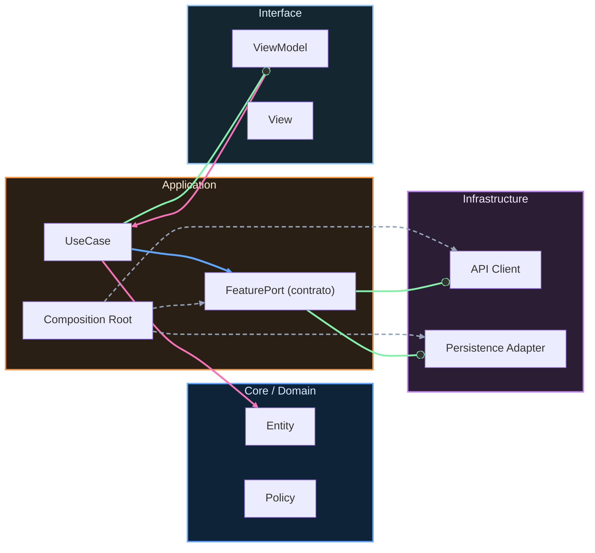

# Nivel Junior · 02 · Primera feature profesional: estado, eventos, ViewModel y repositorio

En este módulo vamos a construir una feature pequeña, pero con estructura profesional real. No será una demo improvisada. Será una implementación guiada para que entiendas cómo se conectan UI, estado, eventos y datos.

La feature se llamará “Tareas”. El usuario podrá ver una lista de tareas de ejemplo. También podrá recargar. Cuando la carga esté en progreso, verá estado de carga. Cuando falle, verá un mensaje de error claro. Con esto ya entrenas el flujo base que luego usarás en casi cualquier pantalla de una app real.

Primero definimos qué problema resolvemos. Queremos evitar dos errores típicos de nivel inicial. El primer error es mezclar toda la lógica dentro del composable. El segundo error es no tener un contrato claro para los datos. Vamos a evitar ambos aplicando UDF y repositorio.

Empezamos por el estado de UI. El estado debe describir la pantalla completa en un momento concreto.

```kotlin
data class TasksUiState(
    val isLoading: Boolean = false,
    val tasks: List<String> = emptyList(),
    val errorMessage: String? = null
)
```

Este `data class` tiene tres piezas muy claras. `isLoading` te dice si la pantalla está esperando datos. `tasks` representa el contenido principal. `errorMessage` representa un error opcional cuando algo falla.

Ahora definimos los eventos. Un evento es algo que ocurre por acción del usuario o del ciclo de vida de la pantalla.

```kotlin
sealed interface TasksEvent {
    data object OnScreenStarted : TasksEvent
    data object OnRetryClicked : TasksEvent
}
```

Aquí solo tenemos dos eventos porque queremos mantener foco pedagógico. `OnScreenStarted` se lanza al abrir la pantalla. `OnRetryClicked` se lanza cuando el usuario pulsa reintentar.

Ahora definimos el contrato de datos. Este contrato permite cambiar implementación sin romper la capa de UI.

```kotlin
interface TasksRepository {
    suspend fun getTasks(): List<String>
}
```

Con este contrato, el ViewModel no necesita saber si los datos vienen de red, base local o caché. Solo pide tareas.

Vamos con una implementación inicial sencilla para arrancar la feature.

```kotlin
class TasksRepositoryImpl : TasksRepository {
    override suspend fun getTasks(): List<String> {
        return listOf(
            "Estudiar Kotlin 30 minutos",
            "Practicar Compose 20 minutos",
            "Repasar arquitectura 15 minutos"
        )
    }
}
```

Esta implementación no usa red todavía, y está bien. En Junior primero buscamos dominar el flujo. Luego sustituiremos la fuente por Room, API o ambas.

Ahora creamos el ViewModel. Este es el corazón de la feature porque transforma eventos en estado.

```kotlin
class TasksViewModel(
    private val repository: TasksRepository
) : ViewModel() {

    private val _uiState = MutableStateFlow(TasksUiState())
    val uiState: StateFlow<TasksUiState> = _uiState

    fun onEvent(event: TasksEvent) {
        when (event) {
            TasksEvent.OnScreenStarted -> loadTasks()
            TasksEvent.OnRetryClicked -> loadTasks()
        }
    }

    private fun loadTasks() {
        viewModelScope.launch {
            _uiState.value = _uiState.value.copy(isLoading = true, errorMessage = null)

            runCatching { repository.getTasks() }
                .onSuccess { tasks ->
                    _uiState.value = TasksUiState(
                        isLoading = false,
                        tasks = tasks,
                        errorMessage = null
                    )
                }
                .onFailure { throwable ->
                    _uiState.value = TasksUiState(
                        isLoading = false,
                        tasks = emptyList(),
                        errorMessage = throwable.message ?: "No se pudieron cargar las tareas"
                    )
                }
        }
    }
}
```

Explicación paso a paso. El ViewModel recibe el repositorio por constructor. Mantiene un estado privado mutable y lo expone como solo lectura. Recibe eventos con `onEvent`. Tanto al iniciar pantalla como al pulsar reintentar ejecuta la misma función `loadTasks`. Durante carga activa `isLoading`. Si todo va bien, publica tareas. Si falla, publica error.

**Atención: `throwable.message` no es un mensaje de usuario.** El campo `.message` de una excepción es texto técnico, puede ser nulo o estar en inglés. Si llega directamente a `errorMessage`, la pantalla mostrará texto que el usuario no entiende.

```kotlin
// ❌ Error técnico llegando crudo a la UI
.onFailure { throwable ->
    _uiState.value = TasksUiState(
        isLoading = false,
        errorMessage = throwable.message ?: "No se pudieron cargar las tareas"
        // throwable.message puede ser: "timeout", null, o un stack técnico.
        // El fallback manual cubre el caso nulo pero no el mensaje técnico.
    )
}

// ✅ El repositorio traduce errores técnicos a semántica de negocio
class TasksRepositoryImpl(private val api: TasksApi) : TasksRepository {
    override suspend fun getTasks(): List<String> {
        return try {
            api.fetchTasks()
        } catch (e: IOException) {
            throw TasksException.NoConnection
        } catch (e: HttpException) {
            throw TasksException.ServiceUnavailable
        }
    }
}

sealed class TasksException : Exception() {
    data object NoConnection      : TasksException()
    data object ServiceUnavailable : TasksException()
}

// El ViewModel maneja tipos de negocio, no excepciones técnicas:
.onFailure { error ->
    val message = when (error) {
        is TasksException.NoConnection       -> "Sin conexión. Comprueba tu red."
        is TasksException.ServiceUnavailable -> "El servicio no está disponible ahora."
        else                                 -> "Error inesperado. Inténtalo de nuevo."
    }
    _uiState.value = TasksUiState(isLoading = false, errorMessage = message)
}
```

En la práctica inicial con `TasksRepositoryImpl` de datos estáticos esto no se aplica porque nunca lanza excepciones. El patrón importa en cuanto conectas a red o base de datos real.

Ahora conectamos la pantalla Compose con ese estado.

```kotlin
@Composable
fun TasksScreen(
    viewModel: TasksViewModel
) {
    val uiState by viewModel.uiState.collectAsState()

    LaunchedEffect(Unit) {
        viewModel.onEvent(TasksEvent.OnScreenStarted)
    }

    when {
        uiState.isLoading -> {
            Box(modifier = Modifier.fillMaxSize(), contentAlignment = Alignment.Center) {
                CircularProgressIndicator()
            }
        }

        uiState.errorMessage != null -> {
            Column(
                modifier = Modifier
                    .fillMaxSize()
                    .padding(24.dp),
                verticalArrangement = Arrangement.Center,
                horizontalAlignment = Alignment.CenterHorizontally
            ) {
                Text(text = uiState.errorMessage)
                Spacer(modifier = Modifier.height(12.dp))
                Button(onClick = { viewModel.onEvent(TasksEvent.OnRetryClicked) }) {
                    Text("Reintentar")
                }
            }
        }

        else -> {
            LazyColumn(modifier = Modifier.fillMaxSize().padding(16.dp)) {
                items(uiState.tasks) { task ->
                    Text(text = task, modifier = Modifier.padding(vertical = 8.dp))
                }
            }
        }
    }
}
```

Observa la clave. El composable no hace lógica de datos. El composable reacciona al estado y emite eventos. Ese patrón te permite escalar sin caos.

Ahora vamos a ordenar archivos en una estructura por feature. Puedes usar algo como esta distribución mínima.

```text
feature/tasks/
  ui/
    TasksScreen.kt
    TasksViewModel.kt
    TasksUiState.kt
    TasksEvent.kt
  data/
    TasksRepository.kt
    TasksRepositoryImpl.kt
```

Si más adelante necesitas Domain, puedes añadir `domain/` sin romper lo anterior.

Para cerrar, vamos con un mini reto. Añade un nuevo evento `OnRefreshPulled` y conecta ese evento a la misma carga. Después, modifica `TasksRepositoryImpl` para devolver lista vacía y comprueba cómo se ve tu UI. Finalmente, añade un texto de estado vacío cuando no haya tareas.

Si completas esta práctica, ya tienes una base junior real: feature separada, estado consistente, eventos explícitos, ViewModel por pantalla y repositorio desacoplado.

---

## Ejercicio guiado

**Objetivo**: Añadir un nuevo evento `OnRefreshPulled` a la `sealed interface TasksEvent` existente y conectarlo al mismo flujo de carga que `OnRetryClicked`.

**Pasos**:
1. Abre la `sealed interface TasksEvent` y añade `data object OnRefreshPulled : TasksEvent`.
2. En `TasksViewModel`, dentro del bloque `when` de `onEvent`, añade el caso `TasksEvent.OnRefreshPulled -> loadTasks()`.
3. En `TasksScreen`, añade un `Button` con el texto "Actualizar" que llame a `viewModel.onEvent(TasksEvent.OnRefreshPulled)`.
4. Condición de éxito: al pulsar "Actualizar", la lista vuelve a mostrarse sin error y `uiState.isLoading` pasa por `true` antes de completarse.

<details>
<summary>Solución de referencia</summary>

```kotlin
import androidx.lifecycle.ViewModel
import androidx.lifecycle.viewModelScope
import kotlinx.coroutines.flow.MutableStateFlow
import kotlinx.coroutines.flow.StateFlow
import kotlinx.coroutines.launch

// 1. Evento nuevo añadido
sealed interface TasksEvent {
    data object OnScreenStarted : TasksEvent
    data object OnRetryClicked  : TasksEvent
    data object OnRefreshPulled : TasksEvent   // <-- nuevo
}

// 2. ViewModel actualizado
class TasksViewModel(
    private val repository: TasksRepository
) : ViewModel() {

    private val _uiState = MutableStateFlow(TasksUiState())
    val uiState: StateFlow<TasksUiState> = _uiState

    fun onEvent(event: TasksEvent) {
        when (event) {
            TasksEvent.OnScreenStarted -> loadTasks()
            TasksEvent.OnRetryClicked  -> loadTasks()
            TasksEvent.OnRefreshPulled -> loadTasks()   // <-- nuevo caso
        }
    }

    private fun loadTasks() {
        viewModelScope.launch {
            _uiState.value = _uiState.value.copy(isLoading = true, errorMessage = null)
            runCatching { repository.getTasks() }
                .onSuccess { tasks ->
                    _uiState.value = TasksUiState(isLoading = false, tasks = tasks)
                }
                .onFailure { throwable ->
                    _uiState.value = TasksUiState(
                        isLoading = false,
                        errorMessage = throwable.message ?: "No se pudieron cargar las tareas"
                    )
                }
        }
    }
}

// 3. Uso en UI (fragmento)
// Button(onClick = { viewModel.onEvent(TasksEvent.OnRefreshPulled) }) {
//     Text("Actualizar")
// }
```

**Resultado esperado**: al pulsar el botón "Actualizar", la pantalla muestra brevemente el indicador de carga y luego presenta la lista de tareas actualizada (o el error si el repositorio falla).

</details>

<!-- auto-gapfix:layered-mermaid -->
## Diagrama de arquitectura por capas



La lectura del diagrama sigue esta semántica:
1. `-->` dependencia directa en runtime.
2. `-.->` wiring o configuración.
3. `==>` contrato o abstracción.
4. `--o` salida o propagación de resultado.
