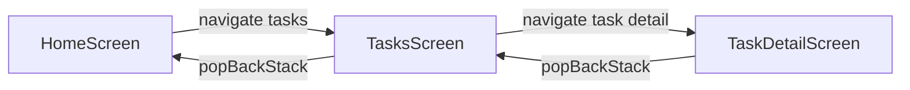
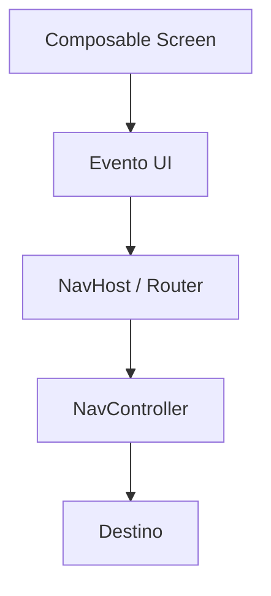

# Nivel Junior · 03 · Navegación moderna con Navigation Compose (explicada sin saltos)

En esta lección vamos a aprender navegación de forma profesional y, sobre todo, comprensible. La navegación en Android no es solamente “abrir una pantalla”. La navegación define cómo se mueve el usuario dentro de la app, cómo viajan algunos datos entre pantallas y cómo se mantiene la coherencia cuando el usuario vuelve atrás.

Si este tema se aprende mal, aparecen errores típicos: rutas duplicadas en muchos archivos, parámetros rotos, pantalla atrás inconsistente o cambios pequeños que rompen varias partes. Si se aprende bien desde ahora, todo el proyecto escala con menos dolor.

Antes de escribir código, definimos tres ideas clave que usaremos durante toda la lección.

La primera idea es **destino**. Un destino es una pantalla navegable. Por ejemplo: Home, Lista de tareas o Detalle de tarea.

La segunda idea es **ruta**. Una ruta es una cadena que identifica un destino. Puede incluir parámetros. Por ejemplo: `tasks` o `tasks/{taskId}`.

La tercera idea es **NavController**. Es el componente que ejecuta la navegación: ir hacia adelante, volver atrás y mantener una pila interna de destinos, que se llama back stack.

Ahora te muestro un diagrama simple para visualizar todo esto antes del código.



Este diagrama te dice algo muy importante: navegar no es lineal, es un flujo con ida y vuelta controlada.

---

## 1) Estructura mental del módulo

Vamos a construir esta lección en cuatro pasos, y cada paso resuelve un problema concreto.

Paso 1: centralizar rutas para no dispersar strings.

Paso 2: declarar el grafo de navegación para que todos los destinos vivan en un sitio único.

Paso 3: conectar pantallas mediante callbacks para no acoplar UI a implementación de navegación.

Paso 4: manejar argumentos de ruta con validación explícita para evitar errores silenciosos.

---

## 2) Definir rutas tipadas (no strings sueltos)

Primero definimos una clase sellada para representar rutas conocidas de la app.

### ¿Qué es una sealed class?

Una `sealed class` en Kotlin es un tipo cerrado: solo permite un conjunto finito de subtipos definidos por ti. Aquí nos sirve para que las rutas válidas estén controladas en compile time.

### Uso correcto e incorrecto

Incorrecto: strings sueltos por todo el código (`"task_detail"`, `"taskDetail"`, `"tasks/detail"`) sin contrato central.

Correcto: un único archivo con todas las rutas definidas y funciones para construir rutas con parámetros.

Código:

```kotlin
sealed class AppRoute(val route: String) {
    data object Home : AppRoute("home")
    data object Tasks : AppRoute("tasks")
    data object TaskDetail : AppRoute("tasks/{taskId}") {
        fun create(taskId: String): String = "tasks/$taskId"
    }
}
```

Ahora explicamos línea por línea:

Línea `sealed class AppRoute(val route: String)` define un tipo base cerrado y obliga a que cada ruta tenga su valor textual.

Línea `data object Home : AppRoute("home")` define un destino sin parámetros llamado Home.

Línea `data object Tasks : AppRoute("tasks")` define otro destino sin parámetros.

Línea `data object TaskDetail : AppRoute("tasks/{taskId}")` define un destino con parámetro de ruta llamado `taskId`.

Línea `fun create(taskId: String): String = "tasks/$taskId"` construye una ruta concreta para navegar al detalle.

Qué problema resuelve: evita concatenar rutas en veinte sitios distintos.

Qué pasaría si lo eliminas: volverías a strings sueltos, más propensos a typos y rutas inconsistentes.

Qué pasaría si lo modificas mal: si cambias `tasks/{taskId}` y no actualizas `create`, el destino podría no resolver parámetros correctamente.

---

## 3) Declarar el NavHost (mapa único de navegación)

### ¿Qué es NavHost?

`NavHost` es el contenedor donde declaras todos los destinos y sus reglas. Es literalmente el mapa de la app.

Uso incorrecto: declarar navegación en cada pantalla de forma independiente sin mapa central.

Uso correcto: un host único que define destinos, argumentos y transiciones lógicas.

Código:

```kotlin
@Composable
fun AppNavHost(
    navController: NavHostController,
    startDestination: String = AppRoute.Home.route
) {
    NavHost(
        navController = navController,
        startDestination = startDestination
    ) {
        composable(AppRoute.Home.route) {
            HomeScreen(
                onGoToTasks = { navController.navigate(AppRoute.Tasks.route) }
            )
        }

        composable(AppRoute.Tasks.route) {
            TasksScreen(
                onBack = { navController.popBackStack() },
                onTaskClicked = { taskId ->
                    navController.navigate(AppRoute.TaskDetail.create(taskId))
                }
            )
        }

        composable(
            route = AppRoute.TaskDetail.route,
            arguments = listOf(
                navArgument("taskId") { type = NavType.StringType }
            )
        ) { backStackEntry ->
            val taskId = backStackEntry.arguments?.getString("taskId").orEmpty()

            TaskDetailScreen(
                taskId = taskId,
                onBack = { navController.popBackStack() }
            )
        }
    }
}
```

Explicación línea por línea (por bloques):

Bloque de firma `fun AppNavHost(...)`: define una función composable que recibe el controlador y destino inicial.

Línea `startDestination: String = AppRoute.Home.route`: por defecto arranca en Home.

Bloque `NavHost(...)`: crea el mapa de destinos conectado al `navController`.

Bloque `composable(AppRoute.Home.route)`: registra Home como destino navegable.

Línea `onGoToTasks = { navController.navigate(...) }`: cuando UI emite intención, aquí ejecutamos la navegación real.

Bloque `composable(AppRoute.Tasks.route)`: registra pantalla de lista.

Línea `onBack = { navController.popBackStack() }`: define comportamiento del botón volver.

Línea `onTaskClicked = { taskId -> ... }`: cuando se pulsa una tarea, navegamos al detalle con ruta construida.

Bloque `composable(route = AppRoute.TaskDetail.route, arguments = ...)`: registra destino con argumento obligatorio.

Línea `navArgument("taskId") { type = NavType.StringType }`: define contrato de tipo del argumento.

Línea `val taskId = ...orEmpty()`: lee argumento con fallback seguro.

Bloque `TaskDetailScreen(...)`: renderiza detalle con argumento recibido.

Qué problema resuelve: visibilidad centralizada de toda la navegación.

Qué pasaría si se elimina `arguments`: podrías recibir parámetros no tipados o fallos en runtime al resolver ruta.

Qué pasaría si se modifica `NavType`: si cambias a tipo incorrecto, parseo del argumento puede fallar.

---

## 4) Crear NavController en la raíz

### ¿Por qué en la raíz?

Porque el controlador debe vivir lo suficiente para manejar toda la sesión de navegación dentro del árbol UI principal.

Código:

```kotlin
@Composable
fun AppRoot() {
    val navController = rememberNavController()
    AppNavHost(navController = navController)
}
```

Línea `rememberNavController()` crea y recuerda el controlador en recomposiciones normales.

Línea `AppNavHost(...)` inyecta ese controlador al mapa de rutas.

Qué problema resuelve: evita crear controladores múltiples y estados de navegación inconsistentes.

Qué pasaría si lo creas en cada pantalla: navegación fragmentada y comportamientos inesperados.

---

## 5) Separar intención UI de ejecución de navegación

Aquí aparece un principio de arquitectura muy importante: una pantalla debe exponer intenciones, no conocer detalles del router.

Incorrecto: dentro de `TasksScreen` llamar directamente `navController.navigate(...)` en cada botón.

Correcto: `TasksScreen` recibe callbacks como `onTaskClicked` y `onBack`; el `NavHost` decide cómo navegar.

Ejemplo correcto:

```kotlin
@Composable
fun TasksScreen(
    onBack: () -> Unit,
    onTaskClicked: (String) -> Unit
) {
    Column {
        Button(onClick = onBack) {
            Text("Volver")
        }

        Button(onClick = { onTaskClicked("task-1") }) {
            Text("Abrir tarea 1")
        }
    }
}
```

Explicación línea por línea:

Firma `onBack` y `onTaskClicked`: declara intenciones de usuario que la pantalla puede emitir.

Línea `Button(onClick = onBack)`: botón de volver delega acción.

Línea `Button(onClick = { onTaskClicked("task-1") })`: botón de abrir detalle emite id seleccionado.

Qué problema resuelve: desacopla UI de infraestructura de navegación.

Qué pasaría si lo cambias y acoplas al NavController: más difícil testear UI y más acoplamiento entre capas.

---

## 6) Diagrama de responsabilidades (quién hace qué)



Interpretación: la pantalla emite evento, el host decide, el controller ejecuta.

---

## 7) Qué pasa si algo sale mal

Caso 1: ruta no coincide con argumentos esperados.

Síntoma: no abre detalle o llega argumento vacío.

Corrección: revisar contrato `TaskDetail.route`, función `create` y `navArgument`.

Caso 2: botón atrás lleva a sitio extraño.

Síntoma: saltos inesperados.

Corrección: revisar si se usa `navigate` en cadena sin controlar back stack.

Caso 3: duplicación de rutas en strings.

Síntoma: inconsistencias difíciles de rastrear.

Corrección: centralizar en `AppRoute` y eliminar literals sueltos.

---

## 8) Ejemplo mínimo incorrecto y correcto

Incorrecto:

```kotlin
// En muchos archivos
navController.navigate("detail/" + id)
navController.navigate("details/$id")
navController.navigate("task-detail/$id")
```

Por qué está mal: no hay contrato único; cada string puede divergir.

Correcto:

```kotlin
navController.navigate(AppRoute.TaskDetail.create(id))
```

Por qué está bien: una sola fuente de verdad para construir rutas.

---

## 9) Checklist de comprensión real

Si puedes explicar con tus palabras estas tres preguntas, dominaste la base de navegación.

Pregunta 1: por qué el `NavHost` es el mapa único y no cada pantalla.

Pregunta 2: por qué `AppRoute` reduce errores frente a strings sueltos.

Pregunta 3: por qué separar callbacks de navegación mejora testabilidad.

---

## 10) Mini reto guiado (obligatorio)

Añade una pantalla `Settings` con ruta tipada, botón de entrada desde Home y botón volver.

Después añade un destino con parámetro `profile/{userId}` y navega con `create(userId)`.

Finalmente rompe voluntariamente una ruta para observar el error y vuelve a corregirla. Esta práctica te enseña más que copiar ejemplos perfectos.

Cuando termines este reto, ya tendrás una base de navegación moderna que podrás usar en todo el curso sin deuda técnica innecesaria.

<!-- semantica-flechas:auto -->
## Semantica de flechas aplicada a esta arquitectura

```mermaid
flowchart LR
    subgraph APP["App module"]
        APPROOT["AppRoot + Hilt"]
        DI["Dependency graph"]
    end

    subgraph FEATURE["Feature module"]
        UI["FeatureScreen"]
        VM["FeatureViewModel"]
        PORT["FeaturePort (interface)"]
    end

    subgraph DATA["Data/Infra module"]
        IMPL["FeatureAdapterImpl"]
        LOCAL["LocalDataSource"]
    end

    APPROOT -.-> DI
    DI -.-> IMPL
    UI --> VM
    VM ==> PORT
    IMPL --o PORT
    IMPL --> LOCAL
```text

Lectura semantica minima de este diagrama:

1. `-->` dependencia directa en runtime.
2. `-.->` wiring y configuracion de ensamblado.
3. `==>` dependencia contra contrato/abstraccion.
4. `--o` salida/propagacion desde implementacion concreta.

