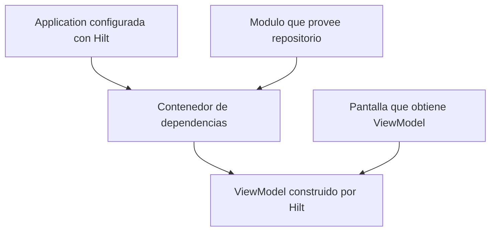
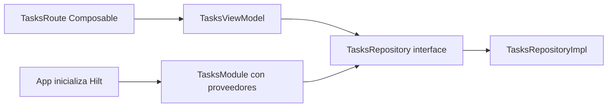

# Nivel Junior · 04 · Hilt desde cero, sin magia y con contexto real

En esta lección vamos a aprender inyección de dependencias con Hilt de forma estrictamente didáctica. Si este tema se aprende con frases vagas, se vuelve confuso y parece “magia”. Aquí lo vamos a desmontar paso a paso.

Primero, el problema real que queremos resolver.

Imagina que tienes una pantalla de tareas y dentro del ViewModel creas manualmente el repositorio con `TasksRepositoryImpl()`. Al principio parece cómodo. Pero cuando el proyecto crece, ese enfoque rompe tres cosas.

La primera cosa que rompe es el mantenimiento. Si cambias implementación, debes editar muchos archivos.

La segunda cosa que rompe es el test. Si el ViewModel crea su dependencia por sí mismo, inyectar un fake en pruebas es más difícil.

La tercera cosa que rompe es la arquitectura. La creación de objetos queda dispersa y pierdes un punto central de control.

Para resolver eso, usamos inyección de dependencias.

---

## 1) Definición clara de términos antes de código

Antes de escribir cualquier anotación, definimos términos en lenguaje humano.

**Dependencia**: objeto que otro objeto necesita para trabajar. Por ejemplo, un ViewModel necesita un repositorio.

**Inyección de dependencias**: técnica para entregar esas dependencias desde fuera, en lugar de crearlas dentro de la clase consumidora.

**Contenedor DI**: sistema que sabe construir y entregar dependencias.

**Hilt**: implementación oficial recomendada por Android para DI sobre Dagger, con integración nativa en componentes Android.

Uso correcto:

- ViewModel declara lo que necesita por constructor.
- Un módulo Hilt define cómo construir cada dependencia.

Uso incorrecto:

- ViewModel instancia dependencias internas (`val repo = TasksRepositoryImpl()`).
- Cada pantalla crea objetos por su cuenta.

---

## 2) Diagrama de flujo de dependencias

Antes de código, mira el flujo para tener un mapa mental.



Lectura del diagrama: la app arranca Hilt, el módulo registra proveedores, el contenedor construye ViewModel con dependencias, y la pantalla obtiene el ViewModel.

---

## 3) Paso 1 · Preparar la clase Application

### Qué hace este paso

Le dice a Hilt dónde iniciar su contenedor raíz.

Código:

```kotlin
@HiltAndroidApp
class App : Application()
```

Explicación línea por línea:

Línea `@HiltAndroidApp`: activa generación de componentes base de Hilt para la app.

Línea `class App : Application()`: define clase Application propia del proyecto.

Qué problema resuelve: arranque central del contenedor DI.

Qué pasa si lo eliminas: Hilt no puede inicializarse correctamente y la inyección fallará.

Qué pasa si lo modificas mal: si no extiende `Application`, pierdes el punto de arranque esperado por Android.

Ahora debes registrar esa clase en `AndroidManifest.xml`.

```xml
<application
    android:name=".App"
    ...>
</application>
```

Línea `android:name=".App"`: le dice al sistema que use tu clase Application personalizada.

Si se elimina esta línea, Android no usará tu `App`, y Hilt no arrancará como esperas.

---

## 4) Paso 2 · Definir el contrato e implementación de repositorio

Hilt no reemplaza arquitectura. Hilt solo inyecta. Por eso seguimos con interfaz y clase concreta.

Código de contrato:

```kotlin
interface TasksRepository {
    suspend fun getTasks(): List<String>
}
```

Explicación línea por línea:

Línea `interface TasksRepository`: define un contrato estable de comportamiento.

Línea `suspend fun getTasks()`: operación asíncrona para obtener tareas.

Qué problema resuelve: desacopla consumidor de implementación.

Si se elimina la interfaz y usas clase concreta en todos lados, tu flexibilidad y testabilidad disminuyen.

Código de implementación:

```kotlin
class TasksRepositoryImpl : TasksRepository {
    override suspend fun getTasks(): List<String> {
        return listOf("Estudiar", "Practicar", "Revisar")
    }
}
```

Línea `class TasksRepositoryImpl : TasksRepository`: implementación concreta del contrato.

Línea `override suspend fun getTasks()`: cumple método de interfaz.

Línea `return listOf(...)`: devuelve datos de ejemplo.

Si cambias esta implementación por red o Room más tarde, el consumidor no debería romperse si respetas interfaz.

---

## 5) Paso 3 · Crear módulo Hilt

### Qué es un módulo Hilt

Un módulo es una clase donde defines cómo construir dependencias para el contenedor.

Código:

```kotlin
@Module
@InstallIn(SingletonComponent::class)
object TasksModule {

    @Provides
    fun provideTasksRepository(): TasksRepository {
        return TasksRepositoryImpl()
    }
}
```

Explicación línea por línea:

Línea `@Module`: marca esta clase como módulo DI.

Línea `@InstallIn(SingletonComponent::class)`: instala proveedores en el componente de vida global de la app.

Línea `object TasksModule`: objeto singleton del módulo.

Línea `@Provides`: marca función proveedora de dependencia.

Línea `fun provideTasksRepository(): TasksRepository`: contrato de salida que consumirá el resto del sistema.

Línea `return TasksRepositoryImpl()`: implementación concreta entregada.

Qué problema resuelve: centraliza construcción de dependencias.

Qué pasa si se elimina: Hilt no sabrá cómo construir `TasksRepository`.

Qué pasa si cambias retorno por tipo incorrecto: fallará resolución de dependencia.

---

## 6) Paso 4 · Inyectar en ViewModel

Código:

```kotlin
@HiltViewModel
class TasksViewModel @Inject constructor(
    private val repository: TasksRepository
) : ViewModel() {

    private val _state = MutableStateFlow<List<String>>(emptyList())
    val state: StateFlow<List<String>> = _state

    fun load() {
        viewModelScope.launch {
            _state.value = repository.getTasks()
        }
    }
}
```

Explicación línea por línea:

Línea `@HiltViewModel`: registra esta clase como ViewModel gestionado por Hilt.

Línea `@Inject constructor(...)`: indica que Hilt debe usar este constructor e inyectar argumentos.

Línea `private val repository: TasksRepository`: dependencia requerida por el ViewModel.

Línea `private val _state ...`: estado mutable interno.

Línea `val state ...`: estado de solo lectura para UI.

Línea `fun load()`: acción pública para cargar datos.

Línea `viewModelScope.launch`: corrutina atada al ciclo de vida del ViewModel.

Línea `_state.value = repository.getTasks()`: consume dependencia inyectada y actualiza estado.

Qué problema resuelve: ViewModel no crea dependencias; las recibe.

Si eliminas `@HiltViewModel`, no podrás obtenerlo con `hiltViewModel()` de forma esperada.

Si eliminas `@Inject`, Hilt no sabrá usar ese constructor.

---

## 7) Paso 5 · Obtener ViewModel desde Compose

Código:

```kotlin
@Composable
fun TasksRoute(
    viewModel: TasksViewModel = hiltViewModel()
) {
    val tasks by viewModel.state.collectAsStateWithLifecycle()

    LaunchedEffect(Unit) {
        viewModel.load()
    }

    LazyColumn {
        items(tasks) { task ->
            Text(task)
        }
    }
}
```

Explicación línea por línea:

Línea `viewModel: TasksViewModel = hiltViewModel()`: obtiene instancia inyectada del ViewModel.

Línea `collectAsStateWithLifecycle()`: recoge estado respetando ciclo de vida.

Línea `LaunchedEffect(Unit)`: ejecuta carga inicial una vez al entrar.

Líneas de `LazyColumn`: renderizan lista de tareas.

Qué problema resuelve: integración limpia entre Compose y DI.

Si reemplazas `hiltViewModel()` por creación manual, pierdes beneficios de DI y consistencia de ciclo de vida.

---

## 8) Correcto vs incorrecto en un vistazo

Incorrecto:

```kotlin
class TasksViewModel : ViewModel() {
    private val repository = TasksRepositoryImpl()
}
```

Problema: acoplamiento fuerte, test difícil, creación dispersa.

Correcto:

```kotlin
@HiltViewModel
class TasksViewModel @Inject constructor(
    private val repository: TasksRepository
) : ViewModel()
```

Ventaja: dependencia explícita, testable, controlada por contenedor.

---

## 9) Errores frecuentes y diagnóstico

Error 1: falta `@HiltAndroidApp`.

Síntoma: fallos de inicialización/inyección al arrancar.

Error 2: no registrar `android:name=".App"` en Manifest.

Síntoma: parece que Hilt está configurado, pero no inyecta correctamente.

Error 3: falta módulo `@Provides` para interfaz.

Síntoma: error de compilación indicando que no existe binding para ese tipo.

Error 4: usar Activity/Fragment sin `@AndroidEntryPoint` cuando aplica.

Síntoma: dependencias no disponibles en componente Android.

---

## 10) Diagrama de dependencias (responsabilidad)



Interpretación: UI depende del ViewModel. ViewModel depende de interfaz. Módulo decide implementación concreta.

---

## 11) Mini reto obligatorio

Crea una segunda implementación `TasksRepositoryErrorImpl` que lance excepción. Cambia el módulo para usarla y verifica que tu UI entra en estado de error. Luego vuelve a `TasksRepositoryImpl`.

Qué aprendes con este reto: cambiar comportamiento global sin tocar ViewModel ni pantalla.

Si puedes explicar por qué eso es posible, entendiste DI de verdad.
