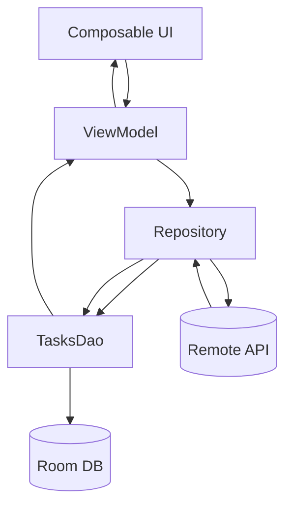
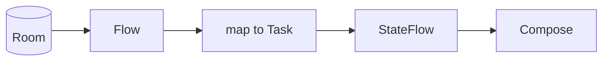

# Nivel Junior · 05 · Room offline-first explicado desde la base

En esta lección vamos a construir persistencia local con Room de forma realmente formativa. No vamos a memorizar anotaciones sueltas. Vamos a entender qué problema resuelve cada pieza, cómo se conecta con el resto de la arquitectura y qué errores aparecen si la usas mal.

Primero, el problema real.

Si una app depende solo de internet para mostrar datos, en cuanto la red falla la experiencia se rompe. El usuario ve pantallas vacías, errores constantes o tiempos de espera largos. Un enfoque offline-first intenta evitar eso: la app prioriza una fuente local confiable y sincroniza con red cuando puede.

En términos simples: el usuario siempre ve algo útil, incluso sin conexión.

---

## 1) Definiciones obligatorias antes de escribir código

Antes de introducir keywords nuevas, las definimos con contexto práctico.

**Room**: librería de persistencia sobre SQLite que te permite trabajar con Kotlin de forma más segura y expresiva.

**Entidad (`@Entity`)**: representación de una tabla.

**DAO (`@Dao`)**: interfaz con operaciones de lectura/escritura sobre tablas.

**Database (`RoomDatabase`)**: contenedor que reúne entidades y DAOs.

**Repositorio**: capa que decide cómo obtener y guardar datos para el resto del sistema.

Uso correcto:

- UI habla con ViewModel.
- ViewModel habla con repositorio.
- Repositorio habla con DAO.

Uso incorrecto:

- UI consulta Room directamente.
- ViewModel ejecuta SQL o conoce detalles de tablas.

---

## 2) Diagrama de flujo de datos offline-first



Lectura del diagrama: la UI no depende de red. La UI depende del estado, y el estado llega desde local. La red sincroniza, pero no controla directamente el render de pantalla.

---

## 3) Paso 1 · Crear la entidad

Código:

```kotlin
@Entity(tableName = "tasks")
data class TaskEntity(
    @PrimaryKey val id: String,
    val title: String,
    val isDone: Boolean,
    val updatedAt: Long
)
```

Explicación línea por línea:

Línea `@Entity(tableName = "tasks")`: declara que este modelo representa una tabla llamada `tasks`.

Línea `data class TaskEntity(`: define una estructura inmutable de fila.

Línea `@PrimaryKey val id: String,`: marca clave primaria única por fila.

Línea `val title: String,`: almacena texto de tarea.

Línea `val isDone: Boolean,`: almacena estado completado o no.

Línea `val updatedAt: Long`: timestamp útil para ordenar y sincronizar.

Qué problema resuelve: estructura estable y explícita de almacenamiento.

Qué pasa si eliminas `@PrimaryKey`: Room no puede gestionar identidad de filas correctamente.

Qué pasa si eliminas `updatedAt`: pierdes una señal útil para orden y estrategias de sync.

---

## 4) Paso 2 · Crear el DAO

Código:

```kotlin
@Dao
interface TasksDao {

    @Query("SELECT * FROM tasks ORDER BY updatedAt DESC")
    fun observeTasks(): Flow<List<TaskEntity>>

    @Insert(onConflict = OnConflictStrategy.REPLACE)
    suspend fun upsertAll(tasks: List<TaskEntity>)

    @Query("DELETE FROM tasks")
    suspend fun clearAll()
}
```

Explicación línea por línea:

Línea `@Dao`: indica a Room que esta interfaz define acceso a datos.

Línea `@Query("SELECT * FROM tasks ORDER BY updatedAt DESC")`: SQL para leer tareas ordenadas por actualización.

Línea `fun observeTasks(): Flow<List<TaskEntity>>`: devuelve flujo reactivo; cada cambio en tabla puede emitirse.

Línea `@Insert(onConflict = OnConflictStrategy.REPLACE)`: inserta y, si la clave existe, reemplaza.

Línea `suspend fun upsertAll(...)`: operación asíncrona de guardado en lote.

Línea `@Query("DELETE FROM tasks")`: SQL para limpiar tabla.

Línea `suspend fun clearAll()`: limpieza asíncrona.

Qué problema resuelve: encapsula operaciones SQL en interfaz clara y testeable.

Qué pasa si cambias `Flow` por lista directa: pierdes reactividad automática en UI.

Qué pasa si cambias `REPLACE` por estrategia incorrecta: puedes fallar con conflictos de clave.

---

## 5) Paso 3 · Crear la base Room

Código:

```kotlin
@Database(
    entities = [TaskEntity::class],
    version = 1,
    exportSchema = true
)
abstract class AppDatabase : RoomDatabase() {
    abstract fun tasksDao(): TasksDao
}
```

Explicación línea por línea:

Línea `@Database(...)`: define metadatos globales de la base.

Línea `entities = [TaskEntity::class]`: lista de tablas incluidas.

Línea `version = 1`: versión actual del esquema.

Línea `exportSchema = true`: exporta esquema para control de cambios/migraciones.

Línea `abstract class AppDatabase : RoomDatabase()`: base abstracta de Room.

Línea `abstract fun tasksDao(): TasksDao`: expone DAO para acceso.

Qué problema resuelve: punto único de acceso estructurado a tablas.

Qué pasa si subes `version` sin migración: riesgo de crash al actualizar app.

---

## 6) Paso 4 · Separar modelo de dominio y modelo de almacenamiento

No queremos que UI dependa de `TaskEntity`. UI debe trabajar con un modelo más limpio de negocio/presentación.

Código de modelo de dominio:

```kotlin
data class Task(
    val id: String,
    val title: String,
    val isDone: Boolean
)
```

Ahora creamos mapeadores.

```kotlin
fun TaskEntity.toDomain(): Task {
    return Task(
        id = id,
        title = title,
        isDone = isDone
    )
}

fun Task.toEntity(now: Long): TaskEntity {
    return TaskEntity(
        id = id,
        title = title,
        isDone = isDone,
        updatedAt = now
    )
}
```

Explicación línea por línea (bloque 1):

`fun TaskEntity.toDomain()`: convierte almacenamiento a modelo consumible.

`return Task(...)`: copia campos relevantes sin exponer `updatedAt` a UI.

Explicación línea por línea (bloque 2):

`fun Task.toEntity(now: Long)`: convierte dominio a entidad.

`updatedAt = now`: añade metadata de persistencia/sync.

Qué problema resuelve: desacople entre capa de datos y capa superior.

Qué pasa si eliminas mapeo: UI se acopla a detalles de DB y cuesta evolucionar modelo.

---

## 7) Paso 5 · Repositorio local-first

Primero, contrato:

```kotlin
interface TasksRepository {
    fun observeTasks(): Flow<List<Task>>
    suspend fun replaceTasks(tasks: List<Task>)
}
```

Ahora implementación con Room:

```kotlin
class TasksRepositoryRoom(
    private val dao: TasksDao,
    private val clockMillis: () -> Long = { System.currentTimeMillis() }
) : TasksRepository {

    override fun observeTasks(): Flow<List<Task>> {
        return dao.observeTasks().map { entities ->
            entities.map { it.toDomain() }
        }
    }

    override suspend fun replaceTasks(tasks: List<Task>) {
        dao.clearAll()
        dao.upsertAll(tasks.map { it.toEntity(clockMillis()) })
    }
}
```

Explicación línea por línea:

Firma `class TasksRepositoryRoom(...)`: recibe DAO y reloj inyectable (útil para test).

`override fun observeTasks()`: API de observación para capa superior.

`dao.observeTasks().map { ... }`: transforma entidades en dominio.

`override suspend fun replaceTasks(...)`: reemplaza contenido local.

`dao.clearAll()`: limpia estado anterior.

`dao.upsertAll(...)`: guarda nuevo snapshot con timestamp.

Qué problema resuelve: UI observa una fuente estable local.

Qué pasa si eliminas `map`: capa superior recibiría entidades de DB y se acoplaría.

Qué pasa si eliminas `clearAll` en estrategia de reemplazo total: podrías dejar basura local según caso.

---

## 8) Integración con ViewModel y UI

ViewModel debe exponer `StateFlow` y la UI debe colectar lifecycle-aware.

Diagrama breve:



Si esta cadena se respeta, una actualización local se refleja en pantalla de forma natural.

---

## 9) Correcto vs incorrecto

Incorrecto:

```kotlin
@Composable
fun TasksScreen() {
    // Query directa a Room aquí
}
```

Por qué está mal: UI se acopla a infraestructura y rompe separación de responsabilidades.

Correcto:

```kotlin
@Composable
fun TasksScreen(viewModel: TasksViewModel) {
    val state by viewModel.uiState.collectAsStateWithLifecycle()
    // Render de estado
}
```

Por qué está bien: UI renderiza estado, no consulta almacenamiento.

---

## 10) Qué puede fallar y cómo diagnosticar

Fallo 1: app crashea al cambiar versión de DB.

Causa probable: migración ausente o mal definida.

Fallo 2: UI no se actualiza al cambiar datos.

Causa probable: estás devolviendo lista directa, no `Flow`, o no colectas correctamente.

Fallo 3: tests inestables por tiempo.

Causa probable: lógica depende de `System.currentTimeMillis()` sin abstracción.

Corrección: inyectar reloj (`clockMillis`) como hicimos en repositorio.

---

## 11) Mini reto obligatorio

Añade en `TasksDao` un método para cambiar `isDone` por `id`.

Crea método correspondiente en repositorio.

En UI, agrega botón “Completar” para cada tarea y valida que el cambio se vea al instante.

Después explica en 5 líneas por qué ese cambio se reflejó sin recargar manualmente.

Si puedes responder eso, entendiste el corazón de Room offline-first.

<!-- semantica-flechas:auto -->
## Semantica de flechas aplicada a esta arquitectura

```mermaid
flowchart LR
    subgraph APP["App module"]
        APPROOT["AppRoot + Hilt"]
        DI["Dependency graph"]
    end

    subgraph FEATURE["Feature module"]
        UI["FeatureScreen"]
        VM["FeatureViewModel"]
        PORT["FeaturePort (interface)"]
    end

    subgraph DATA["Data/Infra module"]
        IMPL["FeatureAdapterImpl"]
        LOCAL["LocalDataSource"]
    end

    APPROOT -.-> DI
    DI -.-> IMPL
    UI --> VM
    VM ==> PORT
    IMPL --o PORT
    IMPL --> LOCAL
```text

Lectura semantica minima de este diagrama:

1. `-->` dependencia directa en runtime.
2. `-.->` wiring y configuracion de ensamblado.
3. `==>` dependencia contra contrato/abstraccion.
4. `--o` salida/propagacion desde implementacion concreta.

