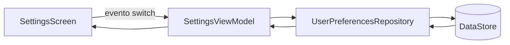

# Nivel Junior · 06 · DataStore explicado de verdad: preferencias y estado ligero

En la lección anterior aprendiste Room para datos estructurados. Ahora vamos a cubrir otra necesidad distinta: guardar datos pequeños de configuración del usuario, por ejemplo modo oscuro, idioma preferido o flags de comportamiento.

Aquí aparece una decisión de arquitectura que debes dominar desde junior.

No todo dato se guarda en Room.

Si el dato es relacional, voluminoso o requiere consultas más complejas, Room es buena opción.

Si el dato es pequeño, clave-valor y de configuración, DataStore es la opción recomendada moderna.

Vamos a aprender DataStore sin atajos ni frases ambiguas.

---

## 1) Definiciones obligatorias antes de código

**DataStore**: sistema de persistencia asíncrona para datos pequeños, pensado como reemplazo moderno de SharedPreferences.

**Preferences DataStore**: variante basada en pares clave-valor (booleans, strings, ints, etc.).

**Clave de preferencia**: identificador tipado del valor guardado.

**Repositorio de preferencias**: capa que abstrae DataStore para que UI/ViewModel no conozcan detalles de almacenamiento.

Uso correcto:

- ViewModel consume repositorio.
- Repositorio encapsula DataStore.

Uso incorrecto:

- Composable leyendo/escribiendo DataStore directamente.

---

## 2) Problema real que resolvemos

Queremos guardar si el usuario tiene modo oscuro activo y que ese valor sobreviva entre sesiones.

Además, queremos que cuando cambie esa preferencia, la UI reaccione automáticamente sin lógica manual frágil.

Diagrama de flujo:



Lectura del diagrama: UI emite evento, repositorio guarda, DataStore emite nuevo valor, ViewModel recalcula estado, UI se actualiza.

---

## 3) Paso 1 · Definir clave de preferencia

Código:

```kotlin
private val DARK_MODE_KEY = booleanPreferencesKey("dark_mode")
```

Explicación línea por línea:

Línea `booleanPreferencesKey("dark_mode")`: crea clave tipada booleana llamada `dark_mode`.

Qué problema resuelve: evita usar strings y casts manuales inseguros.

Qué pasa si cambias el nombre de clave sin migración: el valor previo deja de encontrarse.

Qué pasa si eliges tipo incorrecto (por ejemplo string para boolean): tendrás incoherencias y errores de lectura.

---

## 4) Paso 2 · Crear DataStore sobre Context

Código:

```kotlin
val Context.userPreferencesDataStore: DataStore<Preferences> by preferencesDataStore(
    name = "user_preferences"
)
```

Explicación línea por línea:

Línea `val Context.userPreferencesDataStore`: define propiedad de extensión sobre `Context`.

Línea `DataStore<Preferences>`: declara tipo de almacenamiento basado en preferencias.

Línea `by preferencesDataStore(name = "user_preferences")`: crea delegado que gestiona instancia segura.

Qué problema resuelve: evita crear múltiples instancias manuales en distintos puntos.

Qué pasa si lo duplicas con nombres distintos sin criterio: fragmentas configuración del usuario.

---

## 5) Paso 3 · Definir contrato de repositorio

Código:

```kotlin
interface UserPreferencesRepository {
    val isDarkModeEnabled: Flow<Boolean>
    suspend fun setDarkMode(enabled: Boolean)
}
```

Explicación línea por línea:

Línea `interface UserPreferencesRepository`: contrato estable para capa superior.

Línea `val isDarkModeEnabled: Flow<Boolean>`: flujo reactivo del valor guardado.

Línea `suspend fun setDarkMode(...)`: operación asíncrona de escritura.

Qué problema resuelve: desacopla ViewModel de API concreta de DataStore.

Qué pasa si eliminas interfaz y usas implementación directa en ViewModel: menor testabilidad y mayor acoplamiento.

---

## 6) Paso 4 · Implementar repositorio con DataStore

Código:

```kotlin
class UserPreferencesRepositoryImpl(
    private val dataStore: DataStore<Preferences>
) : UserPreferencesRepository {

    override val isDarkModeEnabled: Flow<Boolean> =
        dataStore.data.map { preferences ->
            preferences[DARK_MODE_KEY] ?: false
        }

    override suspend fun setDarkMode(enabled: Boolean) {
        dataStore.edit { preferences ->
            preferences[DARK_MODE_KEY] = enabled
        }
    }
}
```

Explicación línea por línea:

Firma `class UserPreferencesRepositoryImpl(...)`: recibe DataStore por constructor.

Línea `override val isDarkModeEnabled ...`: expone flujo público.

Línea `dataStore.data.map { ... }`: transforma stream de preferencias en boolean.

Línea `preferences[DARK_MODE_KEY] ?: false`: lee clave o usa fallback seguro.

Línea `override suspend fun setDarkMode(...)`: método de escritura.

Línea `dataStore.edit { ... }`: bloque transaccional de edición.

Línea `preferences[DARK_MODE_KEY] = enabled`: persiste nuevo valor.

Qué problema resuelve: lectura/escritura consistente y centralizada.

Qué pasa si quitas fallback `?: false`: podrías propagar nullabilidad innecesaria a UI.

Qué pasa si escribes desde varios puntos sin repositorio: duplicas reglas y elevas riesgo de incoherencia.

---

## 7) Paso 5 · Integración con Hilt

Ahora conectamos DI para que el repositorio llegue al ViewModel sin creaciones manuales.

Código:

```kotlin
@Module
@InstallIn(SingletonComponent::class)
object PreferencesModule {

    @Provides
    fun provideUserPreferencesDataStore(
        @ApplicationContext context: Context
    ): DataStore<Preferences> = context.userPreferencesDataStore

    @Provides
    fun provideUserPreferencesRepository(
        dataStore: DataStore<Preferences>
    ): UserPreferencesRepository = UserPreferencesRepositoryImpl(dataStore)
}
```

Explicación línea por línea:

Línea `@Module`: marca módulo Hilt.

Línea `@InstallIn(SingletonComponent::class)`: disponibilidad global en app.

Línea `@Provides fun provideUserPreferencesDataStore(...)`: define cómo obtener DataStore.

Línea `@ApplicationContext context: Context`: usa contexto de aplicación, no de pantalla.

Línea `= context.userPreferencesDataStore`: reutiliza extensión definida.

Línea `@Provides fun provideUserPreferencesRepository(...)`: define repositorio construido con DataStore.

Qué problema resuelve: wiring único y explícito.

Qué pasa si usas contexto incorrecto (actividad): riesgo de ciclo de vida inadecuado.

---

## 8) Paso 6 · ViewModel con estado derivado

Código:

```kotlin
data class SettingsUiState(
    val isDarkModeEnabled: Boolean = false
)

@HiltViewModel
class SettingsViewModel @Inject constructor(
    private val preferencesRepository: UserPreferencesRepository
) : ViewModel() {

    val uiState: StateFlow<SettingsUiState> =
        preferencesRepository.isDarkModeEnabled
            .map { enabled -> SettingsUiState(isDarkModeEnabled = enabled) }
            .stateIn(
                scope = viewModelScope,
                started = SharingStarted.WhileSubscribed(5_000),
                initialValue = SettingsUiState()
            )

    fun onDarkModeChanged(enabled: Boolean) {
        viewModelScope.launch {
            preferencesRepository.setDarkMode(enabled)
        }
    }
}
```

Explicación línea por línea:

Bloque `data class SettingsUiState`: snapshot de UI.

`@HiltViewModel` y `@Inject constructor`: DI del ViewModel.

Línea `preferencesRepository.isDarkModeEnabled`: fuente reactiva principal.

Línea `.map { ... }`: convierte boolean en `SettingsUiState`.

Línea `.stateIn(...)`: convierte flow en `StateFlow` apto para UI.

`scope = viewModelScope`: ciclo de vida del estado ligado al ViewModel.

`started = SharingStarted.WhileSubscribed(5_000)`: estrategia de sharing optimizada.

`initialValue = SettingsUiState()`: estado inicial seguro.

Método `onDarkModeChanged`: maneja evento UI y persiste valor.

Qué problema resuelve: estado derivado, reactivo y consistente.

Qué pasa si no usas `stateIn`: UI podría requerir colecciones manuales menos robustas.

---

## 9) Paso 7 · UI Compose lifecycle-aware

Código:

```kotlin
@Composable
fun SettingsScreen(
    viewModel: SettingsViewModel = hiltViewModel()
) {
    val uiState by viewModel.uiState.collectAsStateWithLifecycle()

    Row(
        modifier = Modifier
            .fillMaxWidth()
            .padding(16.dp),
        horizontalArrangement = Arrangement.SpaceBetween,
        verticalAlignment = Alignment.CenterVertically
    ) {
        Text("Modo oscuro")
        Switch(
            checked = uiState.isDarkModeEnabled,
            onCheckedChange = viewModel::onDarkModeChanged
        )
    }
}
```

Explicación línea por línea:

Línea `viewModel: SettingsViewModel = hiltViewModel()`: obtiene ViewModel inyectado.

Línea `collectAsStateWithLifecycle()`: colecciona estado respetando ciclo de vida de pantalla.

Bloque `Row(...)`: layout horizontal para etiqueta + switch.

Línea `Switch(checked = ...)`: refleja estado actual.

Línea `onCheckedChange = viewModel::onDarkModeChanged`: emite evento al ViewModel.

Qué problema resuelve: UI declarativa que reacciona al estado real.

Qué pasa si escribes en DataStore directamente desde UI: rompes separación de responsabilidades y testabilidad.

---

## 10) Correcto vs incorrecto

Incorrecto:

```kotlin
@Composable
fun SettingsScreen() {
    // lectura/escritura directa a DataStore aquí
}
```

Por qué está mal: la UI conoce infraestructura de persistencia.

Correcto:

```kotlin
@Composable
fun SettingsScreen(viewModel: SettingsViewModel = hiltViewModel()) {
    val uiState by viewModel.uiState.collectAsStateWithLifecycle()
}
```

Por qué está bien: UI renderiza estado y emite eventos.

---

## 11) Errores frecuentes y diagnóstico

Error 1: cambiar nombre de clave sin estrategia.

Síntoma: parece que preferencias “se borraron”.

Error 2: usar `collectAsState` sin enfoque lifecycle-aware en contextos complejos.

Síntoma: comportamiento inesperado al volver de background.

Error 3: duplicar DataStore con nombres distintos.

Síntoma: configuraciones inconsistentes en diferentes pantallas.

---

## 12) Mini reto obligatorio

Añade clave `notifications_enabled` con el mismo patrón completo.

Actualiza `SettingsUiState` para incluir ambos valores.

Añade segundo `Switch` en UI.

Cierra y abre la app; verifica persistencia de ambos.

Finalmente, explica en 6 líneas por qué esta solución usa DataStore y no Room.

Si puedes responder sin dudar, entendiste DataStore con criterio arquitectónico.

<!-- semantica-flechas:auto -->
## Semantica de flechas aplicada a esta arquitectura

```mermaid
flowchart LR
    subgraph APP["App module"]
        APPROOT["AppRoot + Hilt"]
        DI["Dependency graph"]
    end

    subgraph FEATURE["Feature module"]
        UI["FeatureScreen"]
        VM["FeatureViewModel"]
        PORT["FeaturePort (interface)"]
    end

    subgraph DATA["Data/Infra module"]
        IMPL["FeatureAdapterImpl"]
        LOCAL["LocalDataSource"]
    end

    APPROOT -.-> DI
    DI -.-> IMPL
    UI --> VM
    VM -.o PORT
    IMPL --o PORT
    IMPL --> LOCAL
```text

Lectura semantica minima de este diagrama:

1. `-->` dependencia directa en runtime.
2. `-.->` wiring y configuracion de ensamblado.
3. `-.o` dependencia contra contrato/abstraccion.
4. `--o` salida/propagacion desde implementacion concreta.

