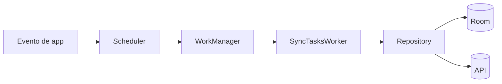
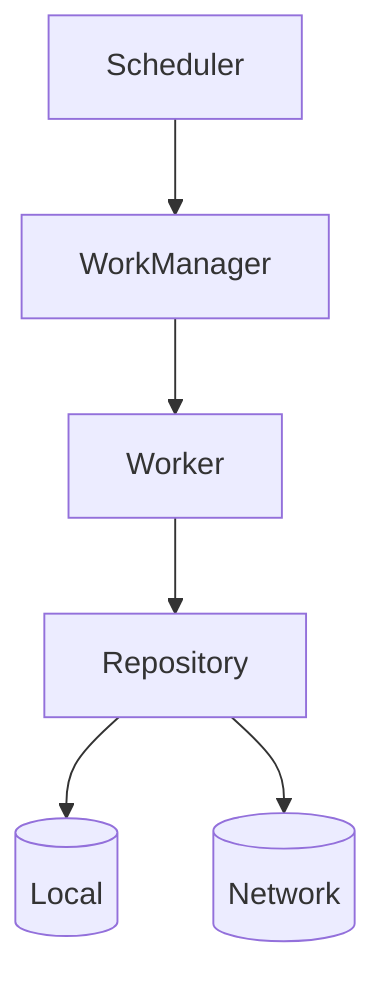

# Nivel Junior · 07 · WorkManager explicado sin lagunas: tareas persistentes en segundo plano

En esta lección vamos a aprender cuándo y cómo usar WorkManager de forma correcta. Este tema suele explicarse rápido y confundir a quien empieza. Aquí lo vamos a hacer con contexto, definiciones claras, código explicado línea por línea y decisiones justificadas.

Primero, el problema real.

Hay tareas que no deben depender de que una pantalla esté abierta. Por ejemplo, sincronizar cambios pendientes con el servidor, subir registros cuando vuelve la conexión o ejecutar limpieza periódica de datos locales.

Si intentas hacer eso con una corrutina lanzada desde ViewModel, esa corrutina muere cuando la pantalla desaparece o la app se cierra. Para trabajo persistente, ese enfoque no es fiable.

Ahí entra WorkManager.

---

## 1) Definiciones obligatorias antes de código

**WorkManager**: API de Android para programar trabajo en background de forma garantizada, respetando condiciones del dispositivo.

**Worker**: clase que encapsula el trabajo a ejecutar.

**Constraints**: condiciones para ejecutar trabajo (por ejemplo, red disponible, batería no baja).

**OneTimeWorkRequest**: trabajo único.

**PeriodicWorkRequest**: trabajo periódico.

**enqueueUniqueWork / enqueueUniquePeriodicWork**: encolar trabajo con nombre único para evitar duplicados.

Uso correcto:

- Trabajo diferible, persistente y confiable.

Uso incorrecto:

- Trabajo inmediato de UI (mejor corrutinas de ViewModel).

---

## 2) ¿Cuándo NO usar WorkManager?

No uses WorkManager para animaciones, validaciones instantáneas de formulario o acciones que el usuario espera ver en milisegundos mientras está en una pantalla concreta.

Para eso, usa lógica normal de UI/ViewModel.

WorkManager está para trabajo que debe sobrevivir a cierres, reinicios o cambios de estado del sistema.

---

## 3) Diagrama de flujo de ejecución



Lectura: el usuario o la app dispara programación, WorkManager decide cuándo ejecutar según constraints, worker orquesta y repositorio hace trabajo real.

---

## 4) Paso 1 · Definir contrato de negocio del trabajo

Antes de Worker, declaramos la operación en repositorio para no meter lógica de dominio en infraestructura.

Código:

```kotlin
interface TasksRepository {
    suspend fun syncPendingTasks()
}
```

Explicación línea por línea:

Línea `interface TasksRepository`: contrato de datos/negocio.

Línea `suspend fun syncPendingTasks()`: operación que sincroniza pendientes.

Qué problema resuelve: Worker orquesta; repositorio ejecuta lógica real.

Si eliminas esta separación: worker se vuelve monolítico y difícil de testear.

---

## 5) Paso 2 · Crear Worker básico

Código:

```kotlin
class SyncTasksWorker(
    appContext: Context,
    workerParams: WorkerParameters,
    private val repository: TasksRepository
) : CoroutineWorker(appContext, workerParams) {

    override suspend fun doWork(): Result {
        return runCatching {
            repository.syncPendingTasks()
        }.fold(
            onSuccess = { Result.success() },
            onFailure = {
                if (runAttemptCount < 3) Result.retry() else Result.failure()
            }
        )
    }
}
```

Explicación línea por línea:

Firma `class SyncTasksWorker(...)`: recibe contexto, parámetros internos y repositorio.

Línea `: CoroutineWorker(...)`: habilita ejecución `suspend`.

Línea `override suspend fun doWork()`: punto de entrada del trabajo.

Línea `runCatching { ... }`: captura éxito/error sin try-catch verboso.

Línea `repository.syncPendingTasks()`: delega trabajo real.

Línea `Result.success()`: marca ejecución exitosa.

Línea `if (runAttemptCount < 3) Result.retry() else Result.failure()`: estrategia simple de reintentos.

Qué problema resuelve: resiliencia mínima ante fallos transitorios.

Qué pasa si cambias `Result.retry()` por `Result.failure()` siempre: reduces tolerancia a fallos temporales de red.

---

## 6) Paso 3 · Integrar Worker con Hilt

Ahora definimos la versión con DI real para que el worker reciba dependencias del contenedor.

Código:

```kotlin
@HiltWorker
class SyncTasksWorker @AssistedInject constructor(
    @Assisted appContext: Context,
    @Assisted workerParams: WorkerParameters,
    private val repository: TasksRepository
) : CoroutineWorker(appContext, workerParams) {

    override suspend fun doWork(): Result {
        return runCatching { repository.syncPendingTasks() }
            .fold(
                onSuccess = { Result.success() },
                onFailure = {
                    if (runAttemptCount < 3) Result.retry() else Result.failure()
                }
            )
    }
}
```

Explicación línea por línea:

Línea `@HiltWorker`: registra worker para integración Hilt.

Línea `@AssistedInject constructor(...)`: constructor mixto para parámetros que provee WorkManager y dependencias que provee Hilt.

Líneas `@Assisted appContext` y `@Assisted workerParams`: estos dos llegan desde WorkManager.

Línea `private val repository: TasksRepository`: esta dependencia llega desde Hilt.

Qué problema resuelve: DI limpia también en background.

Si eliminas anotaciones assisted: WorkManager no sabrá crear worker con esa firma.

---

## 7) Paso 4 · Configurar Application para WorkerFactory

Código:

```kotlin
@HiltAndroidApp
class App : Application(), Configuration.Provider {

    @Inject lateinit var workerFactory: HiltWorkerFactory

    override val workManagerConfiguration: Configuration
        get() = Configuration.Builder()
            .setWorkerFactory(workerFactory)
            .build()
}
```

Explicación línea por línea:

Línea `class App : Application(), Configuration.Provider`: app implementa proveedor de configuración de WorkManager.

Línea `@Inject lateinit var workerFactory`: inyección de factoría Hilt para workers.

Bloque `workManagerConfiguration`: retorna configuración de WorkManager.

Línea `.setWorkerFactory(workerFactory)`: conecta WorkManager con factoría DI.

Qué problema resuelve: permite instanciar workers con dependencias inyectadas.

Si eliminas `.setWorkerFactory(...)`: worker con DI puede fallar en creación.

---

## 8) Paso 5 · Programar trabajo periódico con constraints

Código:

```kotlin
class SyncScheduler(
    private val workManager: WorkManager
) {

    fun schedulePeriodicSync() {
        val request = PeriodicWorkRequestBuilder<SyncTasksWorker>(
            repeatInterval = 6,
            repeatIntervalTimeUnit = TimeUnit.HOURS
        )
            .setConstraints(
                Constraints.Builder()
                    .setRequiredNetworkType(NetworkType.CONNECTED)
                    .setRequiresBatteryNotLow(true)
                    .build()
            )
            .build()

        workManager.enqueueUniquePeriodicWork(
            "sync_tasks_periodic",
            ExistingPeriodicWorkPolicy.UPDATE,
            request
        )
    }
}
```

Explicación línea por línea:

Firma `class SyncScheduler(...)`: encapsula programación de sync.

Línea `PeriodicWorkRequestBuilder<SyncTasksWorker>(...)`: crea trabajo periódico del worker.

Línea `repeatInterval = 6 HOURS`: intervalo de ejecución base.

Bloque `setConstraints(...)`: define condiciones para ejecutar.

Línea `NetworkType.CONNECTED`: solo ejecuta con red.

Línea `setRequiresBatteryNotLow(true)`: evita ejecución con batería crítica.

Bloque `enqueueUniquePeriodicWork(...)`: encola trabajo con nombre único.

Línea `"sync_tasks_periodic"`: identificador estable del trabajo.

Línea `ExistingPeriodicWorkPolicy.UPDATE`: actualiza configuración de trabajo existente.

Qué problema resuelve: evita duplicados y respeta recursos del dispositivo.

Qué pasa si usas `enqueue` sin unique name: puedes acumular trabajos duplicados.

---

## 9) One-time vs periodic (uso correcto e incorrecto)

Correcto:

- One-time para “subir esta acción pendiente” puntual.
- Periodic para “sincronizar cada X horas”.

Incorrecto:

- Periodic para acciones inmediatas tras click.
- One-time repetido manualmente en cada arranque sin control de duplicados.

---

## 10) Observabilidad básica del trabajo

Para depurar, consulta estado del trabajo único.

```kotlin
workManager.getWorkInfosForUniqueWorkLiveData("sync_tasks_periodic")
```

Esto te permite ver estados como `ENQUEUED`, `RUNNING`, `SUCCEEDED` o `FAILED`.

Qué problema resuelve: saber si el trabajo realmente se ejecuta.

Si no observas estado en debug, puedes pensar que “no funciona” sin evidencia.

---

## 11) Diagrama de responsabilidades



Interpretación: scheduler programa, worker orquesta, repositorio ejecuta negocio.

---

## 12) Errores frecuentes y qué los causa

Error 1: trabajo duplicado.

Causa: no usar encolado único.

Error 2: worker no recibe dependencias.

Causa: faltan anotaciones Hilt o WorkerFactory en Application.

Error 3: consumo excesivo de recursos.

Causa: falta de constraints adecuadas.

Error 4: comportamiento inconsistente en reintentos.

Causa: no definir política de retry/failure.

---

## 13) Mini reto obligatorio

Implementa un `OneTimeWorkRequest` para subir una tarea recién creada.

Añade `BackoffPolicy.EXPONENTIAL`.

Usa nombre único por id de tarea para evitar duplicación.

Luego explica qué diferencia de responsabilidad existe entre ese one-time y el periodic sync global.

Si puedes explicarlo con claridad, entendiste WorkManager con criterio y no por copia.

