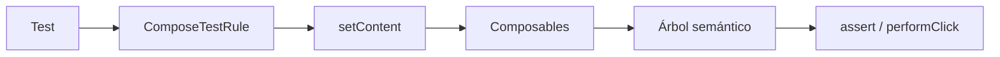
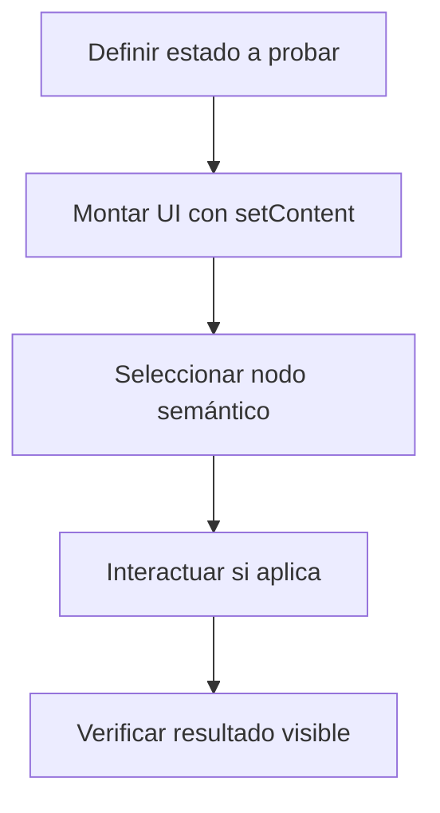

# Nivel Junior · 08 · Compose UI Testing sin atajos: prueba lo que ve el usuario

En este módulo vamos a trabajar una habilidad que cambia por completo la calidad del proyecto: validar interfaz de usuario de forma automática, repetible y confiable.

Cuando empiezas, es normal pensar que “probar a mano” es suficiente. El problema es que, en cuanto la app crece, esa forma de validar deja huecos: se olvidan pasos, se rompen flujos antiguos y se invierte mucho tiempo en comprobar lo mismo una y otra vez.

Compose UI Testing resuelve ese problema porque te deja describir, en código, qué espera ver y hacer una persona usuaria en cada estado de pantalla.

Antes de tocar código, fijamos vocabulario mínimo para evitar confusión.

**Test instrumentado** significa que la prueba corre en dispositivo o emulador Android.

**Nodo semántico** es un elemento de UI identificable por texto, tag, rol u otras propiedades de accesibilidad.

**Regla de Compose Test** es el entorno que monta y controla la UI durante la prueba.

Ahora sí, entramos al flujo completo.

---

## 1) Qué vamos a validar exactamente

En esta lección vamos a validar tres tipos de comportamiento:

Primero, que la UI renderiza el estado correcto.

Segundo, que la interacción de usuario dispara la acción esperada.

Tercero, que el test sigue siendo estable aunque cambien textos visibles por traducción o copy.

Ese orden no es casual. Primero comprobamos presencia visual, luego interacción, luego robustez.

---

## 2) Diagrama mental del test de UI en Compose



Lectura del diagrama: el test crea una regla, la regla monta UI, esa UI expone nodos semánticos, y sobre esos nodos hacemos acciones y aserciones.

---

## 3) Configuración mínima en Gradle (explicada línea por línea)

```kotlin
android {
    defaultConfig {
        testInstrumentationRunner = "androidx.test.runner.AndroidJUnitRunner"
    }
}

dependencies {
    androidTestImplementation(platform(libs.androidx.compose.bom))
    androidTestImplementation("androidx.compose.ui:ui-test-junit4")
    debugImplementation("androidx.compose.ui:ui-test-manifest")
}
```

Explicación línea por línea:

Línea `android {`: abre configuración Android del módulo.

Línea `defaultConfig {`: abre configuración base común para build types.

Línea `testInstrumentationRunner = "androidx.test.runner.AndroidJUnitRunner"`: define el runner que ejecuta tests instrumentados en Android.

Línea `dependencies {`: abre bloque de dependencias.

Línea `androidTestImplementation(platform(libs.androidx.compose.bom))`: fija versiones coherentes de artefactos Compose en tests usando el BOM.

Línea `androidTestImplementation("androidx.compose.ui:ui-test-junit4")`: añade el framework de test para escribir pruebas Compose con JUnit4.

Línea `debugImplementation("androidx.compose.ui:ui-test-manifest")`: añade soporte de manifiesto de test en debug local.

Qué problema resuelve: evita inconsistencias de versión y habilita ejecución de pruebas de UI reales.

Qué ocurre si falta `ui-test-junit4`: no podrás usar API de Compose Test.

Qué ocurre si falta `testInstrumentationRunner`: el entorno de pruebas instrumentadas no arranca correctamente.

---

## 4) Primera prueba: validar estado de error renderizado

Vamos a crear una prueba pequeña pero completa. Queremos verificar que, cuando la UI está en error, aparecen mensaje y botón de reintento.

```kotlin
@RunWith(AndroidJUnit4::class)
class TasksScreenTest {

    @get:Rule
    val composeTestRule = createAndroidComposeRule<ComponentActivity>()

    @Test
    fun whenError_thenShowsRetryButton() {
        composeTestRule.setContent {
            TasksErrorContent(
                message = "Error de red",
                onRetry = {}
            )
        }

        composeTestRule.onNodeWithText("Error de red").assertExists()
        composeTestRule.onNodeWithText("Reintentar").assertIsDisplayed()
    }
}
```

Explicación línea por línea:

Línea `@RunWith(AndroidJUnit4::class)`: indica que esta clase usa runner Android JUnit4.

Línea `class TasksScreenTest {`: define suite de pruebas de esta pantalla.

Línea `@get:Rule`: marca la regla que prepara entorno de prueba.

Línea `createAndroidComposeRule<ComponentActivity>()`: crea actividad host para montar composables en test instrumentado.

Línea `@Test`: marca función de prueba ejecutable.

Línea `fun whenError_thenShowsRetryButton()`: nombre describe condición y resultado esperado.

Bloque `setContent { ... }`: monta exactamente la UI que quieres validar.

Línea `message = "Error de red"`: inyecta estado que debería verse en pantalla.

Línea `onRetry = {}`: pasa callback vacío porque en este test solo queremos validar render.

Línea `onNodeWithText("Error de red").assertExists()`: busca nodo con ese texto y verifica que existe en el árbol semántico.

Línea `onNodeWithText("Reintentar").assertIsDisplayed()`: verifica que botón de reintento no solo existe, también está visible.

Qué problema resuelve: garantiza que estado de error se representa correctamente.

Si cambias esta prueba para mirar métodos internos de ViewModel: dejas de probar UI real y empiezas a acoplar el test a implementación.

---

## 5) Segunda prueba: validar interacción de usuario

Ahora no nos basta con “se ve el botón”. Queremos asegurar que, al hacer click, se dispara la acción.

```kotlin
@Test
fun whenRetryClicked_thenCallbackIsInvoked() {
    var retryClicked = false

    composeTestRule.setContent {
        TasksErrorContent(
            message = "Error de red",
            onRetry = { retryClicked = true }
        )
    }

    composeTestRule.onNodeWithText("Reintentar").performClick()

    assertTrue(retryClicked)
}
```

Explicación línea por línea:

Línea `var retryClicked = false`: bandera inicial para observar si callback se ejecuta.

Bloque `setContent { ... }`: monta la UI de prueba.

Línea `onRetry = { retryClicked = true }`: define efecto observable cuando usuario pulsa botón.

Línea `onNodeWithText("Reintentar").performClick()`: simula click real de usuario sobre el nodo.

Línea `assertTrue(retryClicked)`: confirma que la acción se disparó.

Qué problema resuelve: valida comportamiento, no solo pintura de pantalla.

Si eliminas `performClick()`: test no prueba interacción, solo estado inicial.

---

## 6) Robustez frente a i18n: usar testTag

Los textos cambian con traducción. Si tu test depende del texto, puede romperse sin que haya bug funcional.

Por eso, para nodos críticos de interacción, usa `testTag`.

Código en UI:

```kotlin
Button(
    modifier = Modifier.testTag("tasks_retry_button"),
    onClick = onRetry
) {
    Text("Reintentar")
}
```

Explicación línea por línea:

Línea `Button(`: crea botón interactivo accesible.

Línea `modifier = Modifier.testTag("tasks_retry_button")`: añade identificador semántico estable para testing.

Línea `onClick = onRetry`: conecta acción.

Línea `Text("Reintentar")`: etiqueta visible para usuario.

Código en test:

```kotlin
composeTestRule.onNodeWithTag("tasks_retry_button").performClick()
```

Explicación línea por línea:

Línea `onNodeWithTag("tasks_retry_button")`: localiza nodo por id estable, independiente de idioma.

Línea `performClick()`: ejecuta interacción.

Qué problema resuelve: tests más estables y menos frágiles ante cambios de copy.

---

## 7) Flujo profesional para testear estados de pantalla



Este flujo evita una trampa común: empezar por detalles internos en vez de comportamiento observable.

---

## 8) Buenas prácticas mínimas que sí debes aplicar

Un test debe validar un comportamiento principal. Si metes varios objetivos en la misma prueba, cuando falle perderás tiempo diagnosticando.

Evita `Thread.sleep`. Compose Testing ya sincroniza con su propio ciclo. Dormir hilos añade lentitud e inestabilidad.

Prefiere nombres de test con estructura condición-resultado, como `whenError_thenShowsRetryButton`.

Prueba primero estados puros de UI. Después, integra con ViewModel en pruebas de nivel superior.

---

## 9) Errores típicos y causa real

Error: selector ambiguo por texto repetido.

Causa: varios nodos comparten el mismo texto.

Solución: usa `testTag` o combinaciones semánticas más específicas.

Error: test intermitente (a veces pasa, a veces falla).

Causa: uso de esperas manuales o dependencias externas no controladas.

Solución: aislar estado de UI y usar sincronización de Compose.

Error: test “pasa” pero no cubre interacción real.

Causa: solo hay asserts de existencia y nunca se hace click o input.

Solución: incluir acciones de usuario con `performClick`, `performTextInput`, etc.

---

## 10) Mini reto obligatorio con criterio profesional

Implementa tres pruebas independientes para tu pantalla de tareas.

La primera debe validar que estado loading muestra un indicador.

La segunda debe validar que estado success renderiza lista con al menos un ítem esperado.

La tercera debe validar que estado error muestra botón de reintento y que pulsarlo dispara callback.

Después, cambia los textos visibles de la UI y confirma que tus pruebas críticas siguen pasando gracias a `testTag`.

Si consigues eso, ya no estás “mirando pantallas a ojo”. Estás construyendo calidad verificable.

<!-- semantica-flechas:auto -->
## Semantica de flechas aplicada a esta arquitectura

```mermaid
flowchart LR
    subgraph APP["App module"]
        APPROOT["AppRoot + Hilt"]
        DI["Dependency graph"]
    end

    subgraph FEATURE["Feature module"]
        UI["FeatureScreen"]
        VM["FeatureViewModel"]
        PORT["FeaturePort (interface)"]
    end

    subgraph DATA["Data/Infra module"]
        IMPL["FeatureAdapterImpl"]
        LOCAL["LocalDataSource"]
    end

    APPROOT -.-> DI
    DI -.-> IMPL
    UI --> VM
    VM -.o PORT
    IMPL --o PORT
    IMPL --> LOCAL
```text

Lectura semantica minima de este diagrama:

1. `-->` dependencia directa en runtime.
2. `-.->` wiring y configuracion de ensamblado.
3. `-.o` dependencia contra contrato/abstraccion.
4. `--o` salida/propagacion desde implementacion concreta.

