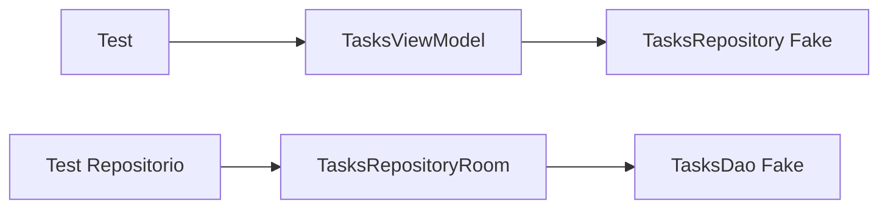
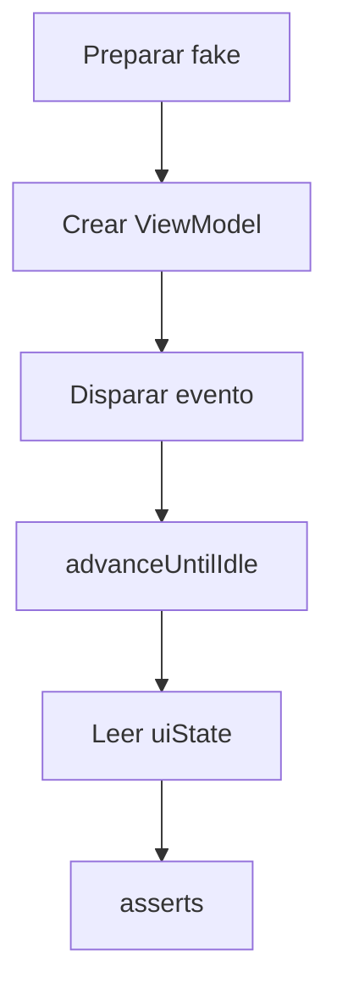

# Nivel Junior · 09 · Pruebas unitarias de ViewModel y repositorio explicadas paso a paso

En este módulo vamos a cerrar el nivel Junior con una habilidad que marca diferencia real en equipos profesionales: validar lógica de forma automática, rápida y confiable, sin depender de interfaz gráfica ni de servicios externos.

Aquí no vamos a “escribir tests por cumplir”. Vamos a aprender a responder preguntas concretas con evidencia ejecutable.

La pregunta clave de una prueba unitaria siempre debe ser una sola, clara y verificable.

Ejemplo correcto de pregunta: “si el repositorio devuelve tareas, ¿el ViewModel publica estado de éxito con esa lista?”

Ejemplo incorrecto: “¿funciona todo?” porque eso no es medible en una sola prueba.

Antes del código, fijamos conceptos básicos.

**Prueba unitaria**: valida una unidad pequeña de comportamiento aislando dependencias externas.

**Fake**: implementación simple de una interfaz que controlas desde el test.

**Dispatcher de test**: scheduler controlado para corrutinas, evita aleatoriedad temporal.

**Aserción**: comprobación que define el resultado esperado.

---

## 1) Qué vamos a probar exactamente

Primero, comportamiento del ViewModel en éxito.

Segundo, comportamiento del ViewModel en error.

Tercero, comportamiento del repositorio cuando persiste y reexpone datos locales.

Este orden es importante porque te entrena a separar responsabilidades.

---

## 2) Diagrama de dependencias para tests unitarios



Lectura: en tests del ViewModel no usamos repositorio real; en tests del repositorio no usamos DB real.

---

## 3) Crear fake de repositorio para pruebas de ViewModel

```kotlin
class FakeTasksRepository : TasksRepository {
    var shouldFail: Boolean = false
    var tasksToReturn: List<Task> = emptyList()

    override fun observeTasks(): Flow<List<Task>> {
        return if (shouldFail) {
            flow { throw IllegalStateException("Error simulado") }
        } else {
            flowOf(tasksToReturn)
        }
    }

    override suspend fun replaceTasks(tasks: List<Task>) {
        tasksToReturn = tasks
    }
}
```

Explicación línea por línea:

Línea `class FakeTasksRepository : TasksRepository`: fake que cumple el contrato real.

Línea `var shouldFail: Boolean = false`: interruptor para simular fallo controlado.

Línea `var tasksToReturn: List<Task> = emptyList()`: datos que el fake devolverá.

Línea `override fun observeTasks(): Flow<List<Task>>`: implementación del stream observado por ViewModel.

Línea `if (shouldFail)`: decide si el escenario es error.

Línea `flow { throw IllegalStateException("Error simulado") }`: emite fallo para validar manejo de errores.

Línea `flowOf(tasksToReturn)`: emite lista en escenario de éxito.

Línea `override suspend fun replaceTasks(...)`: permite mutar contenido del fake desde pruebas.

Línea `tasksToReturn = tasks`: actualiza estado interno.

Qué problema resuelve: controlar entradas del ViewModel sin red ni Room.

Qué pasa si usas repositorio real aquí: pruebas lentas, frágiles y difíciles de aislar.

---

## 4) Regla para controlar Dispatchers.Main en tests

```kotlin
@OptIn(ExperimentalCoroutinesApi::class)
class MainDispatcherRule(
    private val dispatcher: TestDispatcher = StandardTestDispatcher()
) : TestWatcher() {

    override fun starting(description: Description) {
        Dispatchers.setMain(dispatcher)
    }

    override fun finished(description: Description) {
        Dispatchers.resetMain()
    }
}
```

Explicación línea por línea:

Línea `@OptIn(ExperimentalCoroutinesApi::class)`: habilita API experimental de pruebas de corrutinas.

Línea `class MainDispatcherRule(...): TestWatcher()`: regla JUnit para preparar y limpiar entorno.

Línea `TestDispatcher = StandardTestDispatcher()`: dispatcher controlable para ejecutar corrutinas en test.

Línea `override fun starting(...)`: hook que corre antes de cada test.

Línea `Dispatchers.setMain(dispatcher)`: sustituye Main por dispatcher de test.

Línea `override fun finished(...)`: hook al finalizar cada test.

Línea `Dispatchers.resetMain()`: restaura dispatcher real y evita contaminación entre pruebas.

Qué problema resuelve: estabilidad y determinismo temporal en tests de ViewModel.

Si omites esta regla, puedes tener fallos intermitentes difíciles de reproducir.

---

## 5) Test de éxito del ViewModel

```kotlin
@OptIn(ExperimentalCoroutinesApi::class)
class TasksViewModelTest {

    @get:Rule
    val mainDispatcherRule = MainDispatcherRule()

    @Test
    fun whenLoadSucceeds_thenUiStateContainsTasks() = runTest {
        val fakeRepo = FakeTasksRepository().apply {
            tasksToReturn = listOf(
                Task(id = "1", title = "Aprender tests", isDone = false)
            )
            shouldFail = false
        }

        val viewModel = TasksViewModel(repository = fakeRepo)

        viewModel.onEvent(TasksEvent.OnScreenStarted)
        advanceUntilIdle()

        val state = viewModel.uiState.value
        assertFalse(state.isLoading)
        assertEquals(1, state.tasks.size)
        assertNull(state.errorMessage)
    }
}
```

Explicación línea por línea:

Línea `class TasksViewModelTest`: suite de pruebas del ViewModel.

Línea `@get:Rule val mainDispatcherRule`: activa regla de dispatcher controlado.

Línea `fun whenLoadSucceeds_thenUiStateContainsTasks() = runTest`: prueba en contexto coroutine de test.

Bloque `FakeTasksRepository().apply { ... }`: prepara escenario de éxito.

Línea `tasksToReturn = listOf(...)`: define datos esperados.

Línea `shouldFail = false`: garantiza rama de éxito.

Línea `val viewModel = TasksViewModel(repository = fakeRepo)`: inyecta dependencia fake.

Línea `viewModel.onEvent(TasksEvent.OnScreenStarted)`: dispara flujo de carga.

Línea `advanceUntilIdle()`: avanza ejecución hasta que corrutinas pendientes terminan.

Línea `val state = viewModel.uiState.value`: captura estado final observable.

Línea `assertFalse(state.isLoading)`: valida que carga terminó.

Línea `assertEquals(1, state.tasks.size)`: valida contenido esperado.

Línea `assertNull(state.errorMessage)`: valida ausencia de error.

Qué problema resuelve: demuestra que flujo feliz del ViewModel funciona realmente.

---

## 6) Test de error del ViewModel

```kotlin
@Test
fun whenLoadFails_thenUiStateContainsError() = runTest {
    val fakeRepo = FakeTasksRepository().apply {
        shouldFail = true
    }

    val viewModel = TasksViewModel(repository = fakeRepo)

    viewModel.onEvent(TasksEvent.OnScreenStarted)
    advanceUntilIdle()

    val state = viewModel.uiState.value
    assertFalse(state.isLoading)
    assertTrue(state.errorMessage != null)
}
```

Explicación línea por línea:

Línea `shouldFail = true`: activa rama de fallo en fake.

Línea `TasksViewModel(repository = fakeRepo)`: inyección controlada de dependencia.

Línea `onEvent(OnScreenStarted)`: inicia carga.

Línea `advanceUntilIdle()`: espera final de corrutinas.

Línea `assertFalse(state.isLoading)`: asegura que no quedó bloqueado en loading.

Línea `assertTrue(state.errorMessage != null)`: confirma propagación de error al estado de UI.

Qué problema resuelve: valida resiliencia de la presentación ante fallo.

Si este test falla, el usuario puede ver pantalla congelada o sin feedback de error.

---

## 7) Test unitario del repositorio con DAO fake

Primero, fake de DAO.

```kotlin
class FakeTasksDao : TasksDao {
    private var storage: MutableList<TaskEntity> = mutableListOf()

    override fun observeTasks(): Flow<List<TaskEntity>> = flowOf(storage)

    override suspend fun upsertAll(tasks: List<TaskEntity>) {
        storage = tasks.toMutableList()
    }

    override suspend fun clearAll() {
        storage.clear()
    }
}
```

Explicación línea por línea:

Línea `private var storage...`: almacenamiento en memoria para simular tabla local.

Línea `observeTasks(): Flow<List<TaskEntity>> = flowOf(storage)`: stream simple con estado actual.

Línea `upsertAll(...)`: reemplaza contenido para simular persistencia.

Línea `clearAll()`: limpia almacenamiento simulado.

Ahora el test del repositorio.

```kotlin
@Test
fun replaceTasks_replacesLocalStorage() = runTest {
    val fakeDao = FakeTasksDao()
    val repository = TasksRepositoryRoom(fakeDao) { 123L }

    repository.replaceTasks(
        listOf(Task(id = "1", title = "Task A", isDone = false))
    )

    val result = repository.observeTasks().first()
    assertEquals(1, result.size)
    assertEquals("Task A", result.first().title)
}
```

Explicación línea por línea:

Línea `val fakeDao = FakeTasksDao()`: dependencia local controlada.

Línea `TasksRepositoryRoom(fakeDao) { 123L }`: instancia repositorio con clock estable para test.

Línea `repository.replaceTasks(...)`: ejecuta operación que quieres validar.

Línea `observeTasks().first()`: recoge primera emisión para comprobar resultado.

Línea `assertEquals(1, result.size)`: valida cantidad.

Línea `assertEquals("Task A", result.first().title)`: valida contenido.

Qué problema resuelve: comprueba que repositorio transforma/persiste como se espera.

---

## 8) Diagrama de flujo interno de una prueba de ViewModel



Este flujo te evita un error clásico: hacer asserts antes de que termine la ejecución asíncrona.

---

## 9) Errores frecuentes y cómo evitarlos

Error 1: test demasiado grande.

Causa: intentas validar muchos comportamientos en una sola prueba.

Solución: una prueba, un comportamiento principal.

Error 2: intermitencia temporal.

Causa: no controlar dispatcher ni avance de corrutinas.

Solución: `MainDispatcherRule` + `runTest` + `advanceUntilIdle`.

Error 3: unit test lento y frágil.

Causa: usar red o base real.

Solución: usar fakes en memoria.

Regla práctica: si un unit test tarda milisegundos, vas bien. Si tarda segundos y necesita emulador, probablemente no es unitario.

---

## 10) Mini reto final

Implementa un test de recuperación.

Primero ejecuta carga con `shouldFail = true` y valida error.

Después cambia fake a `shouldFail = false`, dispara `OnRetryClicked`, llama `advanceUntilIdle()` y valida que el estado termina con lista y sin error.

Si ese test queda sólido, dominas el ciclo completo: error, reintento y recuperación.

Con eso, cierras Junior con una base profesional real: no solo implementas features, también demuestras con pruebas que se comportan como se espera.

<!-- semantica-flechas:auto -->
## Semantica de flechas aplicada a esta arquitectura

```mermaid
flowchart LR
    subgraph APP["App module"]
        APPROOT["AppRoot + Hilt"]
        DI["Dependency graph"]
    end

    subgraph FEATURE["Feature module"]
        UI["FeatureScreen"]
        VM["FeatureViewModel"]
        PORT["FeaturePort (interface)"]
    end

    subgraph DATA["Data/Infra module"]
        IMPL["FeatureAdapterImpl"]
        LOCAL["LocalDataSource"]
    end

    APPROOT -.-> DI
    DI -.-> IMPL
    UI --> VM
    VM -.o PORT
    IMPL --o PORT
    IMPL --> LOCAL
```text

Lectura semantica minima de este diagrama:

1. `-->` dependencia directa en runtime.
2. `-.->` wiring y configuracion de ensamblado.
3. `-.o` dependencia contra contrato/abstraccion.
4. `--o` salida/propagacion desde implementacion concreta.

