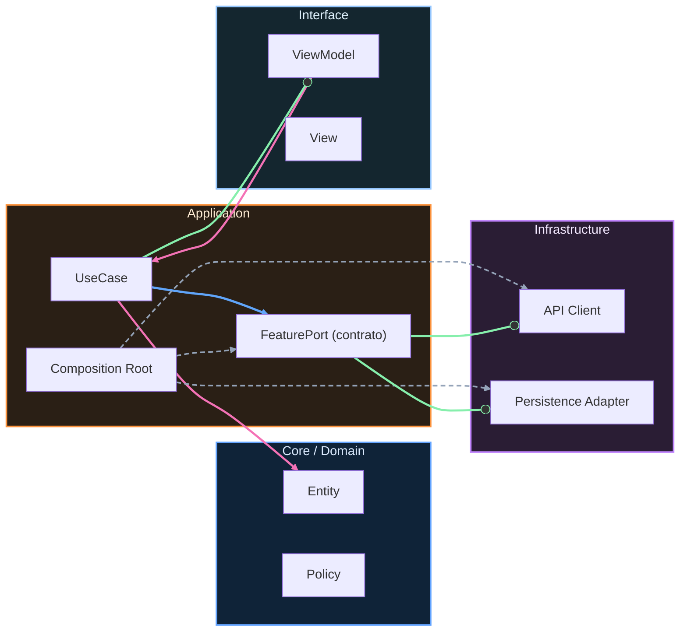

# Entregables de Nivel Junior

Llegaste al cierre de Nivel Junior. Este cierre no existe para “pasar pantalla”, existe para confirmar que ya puedes construir una base Android profesional inicial con criterio.

En este nivel ya trabajaste arquitectura recomendada, UDF, ViewModel por pantalla, repositorios, navegación moderna, inyección de dependencias, persistencia local, estado ligero, tareas en segundo plano y pruebas de UI/unidad. Ahora toca demostrar que no solo lo leíste, sino que realmente lo aplicas.

El primer entregable obligatorio es una feature funcional completa que incluya estado, eventos, ViewModel y repositorio, con navegación entre al menos dos pantallas. Esta feature debe seguir estructura coherente por capas y no mezclar lógica de datos dentro de composables.

El segundo entregable obligatorio es persistencia local combinada. Debes incluir un caso real usando Room para datos estructurados y DataStore para preferencias ligeras. Además, debes explicar con tus palabras por qué cada dato vive en una tecnología y no en la otra.

El tercer entregable obligatorio es integración de WorkManager para una tarea persistente en segundo plano. Debes mostrar configuración de constraints y justificar por qué esa tarea requiere ejecución garantizada.

El cuarto entregable obligatorio es calidad automatizada. Debes entregar al menos tres pruebas UI de Compose y al menos tres pruebas unitarias sobre ViewModel o repositorio. No basta con tener archivos de test vacíos: deben ejecutar y validar comportamiento real.

El quinto entregable obligatorio es evidencia de arquitectura. Debes incluir un diagrama simple del flujo evento → ViewModel → repositorio → fuente de datos → estado UI, y una explicación de dos decisiones técnicas que tomaste para mantener el código limpio.

Para considerar Junior como completado, el sistema debe ser navegable, mantenible y verificable. Navegable significa flujo real entre pantallas. Mantenible significa responsabilidades separadas. Verificable significa pruebas mínimas ejecutables.

Si al revisar te falta alguna parte, no es un fracaso. Es una iteración más. La práctica profesional real se basa en iterar con evidencia, no en “hacer todo perfecto a la primera”.

Cuando cierres estos entregables, estarás listo para Midlevel, donde el foco pasa a integración más profunda, sincronización robusta y calidad/rendimiento a escala mayor.

Desde el refuerzo del curso, este cierre también debe dejar explícitamente la versión v1.0 de RuralGO FieldOps. Eso significa que tu entrega Junior ya no es un conjunto de prácticas separadas, sino un primer producto usable con alcance acotado y evidencia verificable.

Para considerar v1.0 aceptada en Junior, además de los entregables anteriores, debes demostrar autenticación funcional de entrada, navegación entre lista y detalle de tareas, persistencia local mínima para continuidad de uso y una base de pruebas que cubra al menos los flujos críticos de UI y ViewModel.

La evidencia mínima de v1.0 debe incluir un repositorio ejecutable, captura de ejecución navegando el flujo principal, reporte de pruebas pasando y una explicación breve de dos decisiones técnicas que tomaste para mantener el código evolutivo.

<!-- auto-gapfix:layered-mermaid -->
## Diagrama de arquitectura por capas

La lectura del diagrama sigue esta semantica:
1. `-->` dependencia directa en runtime.
2. `-.->` wiring o configuracion.
3. `==>` contrato o abstraccion.
4. `--o` salida o propagacion de resultado.
