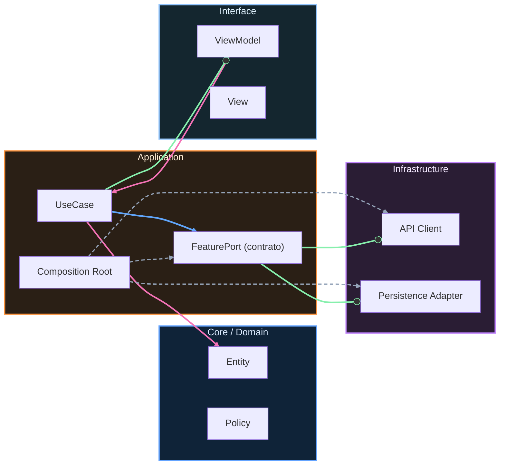

# Nivel Midlevel · 00 · Qué cambia desde Junior y por qué

> **Estado actual de FieldOps:** v1.0 completada con Retrofit/OkHttp integrado, SyncWorker con WorkManager, sealed routes, 9 unit tests + 3 integration tests (MockWebServer). Módulos benchmark y baselineprofile creados.
>
> **Objetivo de versión:** v2.0 (Midlevel) — Sincronización offline-first completa, resolución de conflictos, observabilidad, integration tests e2e, Macrobenchmark ejecutado y Baseline Profiles generados.
>
> **Comandos de verificación:**
> ```bash
> cd proyecto-android
> ./gradlew :app:assembleDebug
> ./gradlew testDebugUnitTest
> ./gradlew lintDebug
> ./gradlew connectedDebugAndroidTest   # requiere emulador
> ./gradlew :benchmark:connectedCheck   # Macrobenchmark (desde este nivel)
> ```
>
> **Proyecto:** ver [Brief FieldOps](../05-proyecto-final/00-brief-ruralgo-fieldops.md) · [Rúbrica](../05-proyecto-final/01-rubrica-empleabilidad.md) · [Evidencias obligatorias](../05-proyecto-final/02-evidencias-obligatorias.md)

Has cerrado Junior con una base sólida. Ya sabes organizar features, manejar estado, navegar, inyectar dependencias, persistir en local y probar lo esencial. Ahora empieza Midlevel, y aquí cambia el tipo de problema.

En Junior el foco principal era construir bien. En Midlevel el foco principal será construir bien bajo condiciones reales: red inestable, latencia, errores de servidor, conflictos de datos, sincronización y observabilidad mínima para entender qué pasa en producción.

Este cambio es importante porque una app no vive en laboratorio. Vive en teléfonos con batería baja, conexiones lentas, permisos denegados y usuarios que esperan que todo funcione igual.

En este nivel aprenderás a diseñar infraestructura más robusta sin perder claridad de arquitectura. Eso incluye clientes HTTP bien configurados, manejo de errores consistente, contratos estables, políticas de reintento, caché más estratégica y calidad operativa básica.

La mentalidad Midlevel no es “meter más tecnología”. Es elegir mejor. Cada decisión técnica debe tener una razón de negocio, una razón de mantenimiento y una razón de calidad.

También vas a empezar a justificar trade-offs. Por ejemplo, cuándo conviene priorizar frescura de datos frente a rapidez de respuesta, o cuándo conviene fallar rápido frente a reintentar en segundo plano.

Para trabajar bien este nivel, vamos a seguir un hilo claro. Primero fortaleceremos red con Retrofit/OkHttp de forma profesional inicial. Después conectaremos red y persistencia local con políticas concretas. Más adelante incorporaremos patrones de resiliencia y validación de calidad.

Si en algún punto te parece más difícil, es normal. Midlevel no consiste en memorizar APIs nuevas. Consiste en mejorar tu criterio para sistemas reales.

En el siguiente módulo empezamos por la base de red robusta, con configuración y decisiones explícitas para que no dependas de suerte cuando llegue la primera incidencia real.


<!-- auto-gapfix:layered-mermaid -->
## Diagrama de arquitectura por capas



La lectura del diagrama sigue esta semantica:
1. `-->` dependencia directa en runtime.
2. `-.->` wiring o configuracion.
3. `==>` contrato o abstraccion.
4. `--o` salida o propagacion de resultado.
