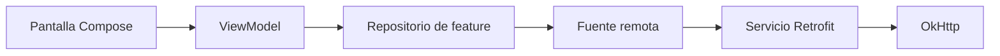

# Nivel Midlevel · 01 · Capa de red robusta con Retrofit y OkHttp, guiada paso a paso

Llegamos a un punto importante del curso. En nivel Junior aprendiste a construir features con estado, persistencia local y pruebas. Eso te da una app funcional. Ahora, en Midlevel, el problema cambia. Ya no basta con “llamar una API y mostrar datos”. Necesitas una capa de red que sea estable cuando la red falla, mantenible cuando el producto crece y coherente con la arquitectura que venimos construyendo.

En esta lección no vamos a introducir conceptos “porque sí”. Vamos a conectar cada pieza con lo aprendido. En [`01-junior/02-feature-base-practica.md`](../01-junior/02-feature-base-practica.md) ya separaste pantalla, ViewModel y repositorio. En [`01-junior/05-room-offline-first.md`](../01-junior/05-room-offline-first.md) separaste modelo de dominio y modelo de persistencia local. Ahora añadimos la pieza remota con la misma lógica de separación: infraestructura de red aislada, dominio limpio, flujo de datos entendible.

Antes de escribir una sola línea, definimos términos en el momento exacto en que los necesitas.

Retrofit es una librería que te permite declarar endpoints HTTP como funciones Kotlin en una interfaz. Eso significa que escribes “qué endpoint llamo” con anotaciones y Retrofit genera la implementación real.

OkHttp es el motor HTTP de bajo nivel. Gestiona sockets, conexiones, timeouts, headers e interceptores. Retrofit, por debajo, usa OkHttp para ejecutar las llamadas.

Un interceptor es una pieza que se coloca en el camino de una request o response para añadir o transformar información de forma centralizada.

Un DTO, que significa Data Transfer Object, es un objeto pensado para transportar datos entre app y backend. No debe mezclarse directamente con el modelo de dominio para no acoplar reglas de negocio a formato de red.

Con este vocabulario claro, ya podemos construir.

---

## 1) Qué queremos conseguir en esta lección

Queremos que cualquier feature pueda consumir API con un único estilo de configuración, con errores traducidos a un contrato común y con una frontera clara entre infraestructura y dominio.

Eso nos prepara para aplicar Clean Architecture y DDD de forma gradual, no como teoría adelantada. Aquí la capa remota vive en infraestructura. El repositorio orquesta. El dominio recibe tipos que entiende.

Diagrama de flujo de responsabilidades, en forma simple y sin símbolos conflictivos para Mermaid:



Lectura del diagrama: UI no habla HTTP. UI habla con ViewModel. ViewModel habla con repositorio. Repositorio decide cuándo leer remoto. Fuente remota encapsula detalles de Retrofit y OkHttp.

---

## 2) Definir contrato HTTP con interfaz de servicio

Empezamos por el contrato de red de tareas.

```kotlin
interface TasksApiService {

    @GET("tasks")
    suspend fun getTasks(): List<TaskDto>

    @POST("tasks/sync")
    suspend fun syncTasks(@Body payload: SyncTasksRequestDto): SyncTasksResponseDto
}
```

Explicación línea por línea:

Línea `interface TasksApiService {` define una interfaz Kotlin. Una interfaz es un contrato: describe qué funciones existen, sin implementar cómo se ejecutan. Aquí el “cómo” lo generará Retrofit.

Línea `@GET("tasks")` usa una anotación. Una anotación es metadato que instruye a una herramienta. En este caso, le dice a Retrofit que esta función ejecuta una request HTTP GET a la ruta `tasks`.

Línea `suspend fun getTasks(): List<TaskDto>` define una función suspendida. `suspend` indica que puede pausarse sin bloquear hilo, lo que encaja con corrutinas. Devuelve una lista de `TaskDto`, no de dominio, porque aquí seguimos en infraestructura.

Línea `@POST("tasks/sync")` indica endpoint POST para sincronización.

Línea `suspend fun syncTasks(@Body payload: SyncTasksRequestDto): SyncTasksResponseDto` define una función que envía cuerpo HTTP. `@Body` marca que `payload` se serializa como body JSON. Devuelve un DTO de respuesta.

Por qué se usa aquí: porque necesitamos un contrato explícito y mantenible de endpoints.

Qué pasaría si no lo usáramos: acabarías construyendo requests manuales repetidas, más propensas a errores y difíciles de testear.

---

## 3) Crear DTOs de red sin contaminar dominio

Ahora definimos los objetos de transferencia.

```kotlin
data class TaskDto(
    val id: String,
    val title: String,
    val done: Boolean
)

data class SyncTasksRequestDto(
    val items: List<TaskDto>
)

data class SyncTasksResponseDto(
    val synced: Int
)
```

Explicación línea por línea:

Línea `data class TaskDto(` declara una data class. Una `data class` en Kotlin es una clase optimizada para transportar datos, con `equals`, `hashCode`, `copy` y `toString` automáticos.

Línea `val id: String` define identificador remoto como texto.

Línea `val title: String` define título remoto.

Línea `val done: Boolean` define estado remoto como verdadero o falso.

Línea `data class SyncTasksRequestDto(` crea tipo del body para sincronizar.

Línea `val items: List<TaskDto>` indica que enviamos una lista de tareas remotas.

Línea `data class SyncTasksResponseDto(` crea tipo de respuesta de sincronización.

Línea `val synced: Int` indica cuántos elementos fueron sincronizados según backend.

Por qué se usa aquí: porque el contrato de red puede cambiar sin romper directamente dominio y UI.

Qué pasaría si no separas DTO de dominio: cada cambio de API obligaría a tocar demasiadas capas, aumentando acoplamiento y deuda técnica.

---

## 4) Configurar OkHttp con decisiones explícitas

Ahora construimos el cliente HTTP base.

```kotlin
fun provideOkHttpClient(
    authInterceptor: Interceptor,
    loggingInterceptor: HttpLoggingInterceptor
): OkHttpClient {
    return OkHttpClient.Builder()
        .connectTimeout(15, TimeUnit.SECONDS)
        .readTimeout(15, TimeUnit.SECONDS)
        .writeTimeout(15, TimeUnit.SECONDS)
        .addInterceptor(authInterceptor)
        .addInterceptor(loggingInterceptor)
        .build()
}
```

Explicación línea por línea:

Línea `fun provideOkHttpClient(` define función proveedora para DI. El nombre comunica intención: construir cliente OkHttp central.

Línea `authInterceptor: Interceptor` recibe interceptor de autenticación por parámetro. `Interceptor` es una interfaz de OkHttp para intervenir requests y responses.

Línea `loggingInterceptor: HttpLoggingInterceptor` recibe interceptor de logs HTTP.

Línea `): OkHttpClient {` define que esta función devuelve una instancia `OkHttpClient`.

Línea `return OkHttpClient.Builder()` inicia patrón builder para configurar cliente paso a paso.

Línea `.connectTimeout(15, TimeUnit.SECONDS)` limita tiempo máximo para abrir conexión. Evita bloqueos largos si servidor no responde.

Línea `.readTimeout(15, TimeUnit.SECONDS)` limita espera de lectura de respuesta.

Línea `.writeTimeout(15, TimeUnit.SECONDS)` limita tiempo de escritura de request.

Línea `.addInterceptor(authInterceptor)` inyecta autenticación centralizada.

Línea `.addInterceptor(loggingInterceptor)` inyecta logging centralizado.

Línea `.build()` crea instancia final inmutable del cliente.

Por qué se usa aquí: un punto único de configuración evita inconsistencias por feature.

Qué pasaría si no defines timeouts: usuarios podrían quedar esperando sin feedback cuando la red se degrada.

---

## 5) Crear interceptor de autenticación

El objetivo de este interceptor es no repetir el header Authorization en cada endpoint.

```kotlin
class AuthInterceptor(
    private val tokenProvider: () -> String?
) : Interceptor {
    override fun intercept(chain: Interceptor.Chain): Response {
        val original = chain.request()
        val token = tokenProvider()

        val request = if (token.isNullOrBlank()) {
            original
        } else {
            original.newBuilder()
                .addHeader("Authorization", "Bearer $token")
                .build()
        }

        return chain.proceed(request)
    }
}
```

Explicación línea por línea:

Línea `class AuthInterceptor(` define clase concreta de interceptor.

Línea `private val tokenProvider: () -> String?` inyecta función que obtiene token actual. `() -> String?` significa “función sin parámetros que devuelve String nullable”.

Línea `) : Interceptor {` indica que la clase implementa interfaz `Interceptor`.

Línea `override fun intercept(chain: Interceptor.Chain): Response {` implementa método obligatorio. `chain` representa la cadena de ejecución HTTP.

Línea `val original = chain.request()` obtiene request original.

Línea `val token = tokenProvider()` pide token al proveedor.

Línea `val request = if (token.isNullOrBlank()) {` decide si hay token válido.

Línea `original` mantiene request intacta si no hay token.

Línea `original.newBuilder()` clona request para modificarla.

Línea `.addHeader("Authorization", "Bearer $token")` añade header estándar Bearer.

Línea `.build()` crea request final modificada.

Línea `return chain.proceed(request)` continúa ejecución HTTP con request elegida.

Por qué se usa aquí: centraliza autenticación y reduce duplicación.

Qué pasaría si no se usara: cada llamada tendría lógica repetida, más riesgo de olvidar cabeceras y romper sesiones.

---

## 6) Construir Retrofit y crear servicio

Con OkHttp listo, montamos Retrofit.

```kotlin
fun provideRetrofit(
    okHttpClient: OkHttpClient,
    baseUrl: String
): Retrofit {
    return Retrofit.Builder()
        .baseUrl(baseUrl)
        .client(okHttpClient)
        .addConverterFactory(MoshiConverterFactory.create())
        .build()
}

fun provideTasksApiService(retrofit: Retrofit): TasksApiService {
    return retrofit.create(TasksApiService::class.java)
}
```

Explicación línea por línea:

Línea `fun provideRetrofit(` abre función proveedora.

Línea `okHttpClient: OkHttpClient` recibe motor HTTP configurado.

Línea `baseUrl: String` recibe URL base del backend por entorno.

Línea `): Retrofit {` define retorno tipo Retrofit.

Línea `Retrofit.Builder()` inicia builder.

Línea `.baseUrl(baseUrl)` fija prefijo común de endpoints.

Línea `.client(okHttpClient)` conecta Retrofit con OkHttp.

Línea `.addConverterFactory(MoshiConverterFactory.create())` registra convertidor JSON usando Moshi. Un convertidor transforma JSON en objetos Kotlin y viceversa.

Línea `.build()` crea instancia final de Retrofit.

Línea `fun provideTasksApiService(retrofit: Retrofit): TasksApiService` define función que crea implementación real del contrato `TasksApiService`.

Línea `retrofit.create(TasksApiService::class.java)` pide a Retrofit generar clase concreta en runtime.

Por qué se usa aquí: separa configuración base y creación de servicio por contrato.

Qué pasaría si no agregas converter: Retrofit no sabría parsear JSON en DTOs.

---

## 7) Unificar manejo de errores con un contrato común

Ahora resolvemos uno de los problemas más costosos en equipos: cada repositorio maneja errores distinto y la app se vuelve incoherente.

Primero creamos un resultado sellado.

```kotlin
sealed interface NetworkResult<out T> {
    data class Success<T>(val data: T) : NetworkResult<T>
    data class HttpError(val code: Int, val message: String?) : NetworkResult<Nothing>
    data class NetworkError(val throwable: Throwable) : NetworkResult<Nothing>
}
```

Explicación línea por línea:

Línea `sealed interface NetworkResult<out T> {` define interfaz sellada genérica. `sealed` significa que todas sus implementaciones quedan controladas en el mismo archivo, lo que permite `when` exhaustivo. `<out T>` indica covarianza para tipo de salida.

Línea `data class Success<T>(val data: T) : NetworkResult<T>` representa caso exitoso con datos.

Línea `data class HttpError(val code: Int, val message: String?) : NetworkResult<Nothing>` representa error HTTP con código y mensaje opcional.

Línea `data class NetworkError(val throwable: Throwable) : NetworkResult<Nothing>` representa error técnico de red, timeout, DNS, etc.

Por qué se usa aquí: normaliza cómo las capas superiores reciben resultados.

Qué pasaría si no se usa: cada data source inventaría su propio formato de error y rompería consistencia.

Ahora envolvemos llamadas con una función segura.

```kotlin
suspend fun <T> safeApiCall(block: suspend () -> T): NetworkResult<T> {
    return try {
        NetworkResult.Success(block())
    } catch (e: HttpException) {
        NetworkResult.HttpError(e.code(), e.message())
    } catch (t: Throwable) {
        NetworkResult.NetworkError(t)
    }
}
```

Explicación línea por línea:

Línea `suspend fun <T> safeApiCall(...)` declara función genérica suspendida reutilizable.

Línea `block: suspend () -> T` recibe una lambda suspendida que ejecutará la llamada real.

Línea `: NetworkResult<T>` indica retorno unificado.

Línea `return try {` inicia captura controlada de errores.

Línea `NetworkResult.Success(block())` ejecuta llamada y encapsula éxito.

Línea `catch (e: HttpException)` captura errores HTTP de Retrofit.

Línea `NetworkResult.HttpError(e.code(), e.message())` traduce excepción a contrato app.

Línea `catch (t: Throwable)` captura fallos restantes.

Línea `NetworkResult.NetworkError(t)` traduce a error técnico común.

Por qué se usa aquí: reduce duplicación de try-catch y homogeneiza contratos.

Qué pasaría si no se usa: repetirías bloques de error en cada método remoto.

---

## 8) Integrar en fuente remota de feature

Ahora conectamos servicio con wrapper seguro.

```kotlin
class TasksRemoteDataSource(
    private val api: TasksApiService
) {
    suspend fun fetchTasks(): NetworkResult<List<TaskDto>> {
        return safeApiCall { api.getTasks() }
    }
}
```

Explicación línea por línea:

Línea `class TasksRemoteDataSource(` define fuente remota específica de feature tareas.

Línea `private val api: TasksApiService` inyecta contrato HTTP ya configurado.

Línea `suspend fun fetchTasks(): NetworkResult<List<TaskDto>>` define caso de uso remoto de lectura.

Línea `return safeApiCall { api.getTasks() }` ejecuta endpoint dentro de wrapper unificado.

Por qué se usa aquí: encapsula infraestructura de red en pieza enfocada.

Qué pasaría si ViewModel llamara `api` directo: romperías separación de capas y mezclarías presentación con infraestructura.

---

## 9) Logging por entorno para seguridad y depuración

Necesitamos trazabilidad en debug y silencio en release.

```kotlin
fun provideLoggingInterceptor(isDebug: Boolean): HttpLoggingInterceptor {
    return HttpLoggingInterceptor().apply {
        level = if (isDebug) HttpLoggingInterceptor.Level.BODY
        else HttpLoggingInterceptor.Level.NONE
    }
}
```

Explicación línea por línea:

Línea `fun provideLoggingInterceptor(isDebug: Boolean)` define función que recibe bandera de entorno.

Línea `: HttpLoggingInterceptor` indica retorno de interceptor de logs.

Línea `HttpLoggingInterceptor().apply {` crea interceptor y configura en bloque `apply`.

Línea `level = if (isDebug) ... else ...` decide nivel de log.

Línea `Level.BODY` imprime request/response completos en debug para diagnosticar.

Línea `Level.NONE` desactiva logs en release para evitar exposición de datos.

Por qué se usa aquí: balance entre observabilidad y seguridad.

Qué pasaría si usas BODY en producción: riesgo de filtrar tokens o datos sensibles en logs.

---

## 10) Conexión con Clean Architecture y DDD, sin adelantar

En este punto del curso ya puedes ver el patrón gradual.

La capa remota, con Retrofit y OkHttp, pertenece a infraestructura porque habla HTTP y DTO.

El repositorio de feature actúa como frontera y decide cómo traducir resultados remotos al lenguaje interno de la app.

El dominio no debería depender de detalles de red. Esa es la razón práctica de separar DTO y resultado de infraestructura.

No estamos metiendo toda la teoría DDD de golpe. Estamos aplicando su principio central aquí: proteger el modelo del negocio de detalles técnicos externos.

---

## 11) Errores reales que debes evitar en Midlevel inicial

Si dejas `baseUrl` fija en código sin estrategia de entorno, tendrás problemas al cambiar entre desarrollo, staging y producción.

Si cada feature maneja errores con contratos distintos, la UI se vuelve inconsistente y difícil de mantener.

Si no defines timeouts, algunos fallos de red degradada se sentirán como “app colgada”.

Si acoplas ViewModel a Retrofit, rompes el progreso de arquitectura que ya construiste desde Junior.

---

## 12) Mini reto guiado de cierre

Implementa un endpoint nuevo de detalle por id en el servicio de tareas y respétalo en la misma arquitectura de esta lección.

Primero añade función en `TasksApiService` para obtener una tarea por identificador.

Después encapsula la llamada en `TasksRemoteDataSource` usando `safeApiCall`.

Luego mapea el DTO a modelo de dominio dentro del repositorio de la feature.

Finalmente, escribe test unitario del repositorio para validar que un error HTTP 404 se traduce al contrato de error esperado por la capa superior.

Si completas ese recorrido sin saltarte capas, ya tienes una base Midlevel real para evolucionar hacia estrategias offline-first más avanzadas en los siguientes módulos.

<!-- semantica-flechas:auto -->
## Semantica de flechas aplicada a esta arquitectura

```mermaid
flowchart LR
    subgraph APP["App module"]
        APPROOT["AppRoot + Hilt"]
        DI["Dependency graph"]
    end

    subgraph FEATURE["Feature module"]
        UI["FeatureScreen"]
        VM["FeatureViewModel"]
        PORT["FeaturePort (interface)"]
    end

    subgraph DATA["Data/Infra module"]
        IMPL["FeatureAdapterImpl"]
        LOCAL["LocalDataSource"]
    end

    APPROOT -.-> DI
    DI -.-> IMPL
    UI --> VM
    VM -.o PORT
    IMPL --o PORT
    IMPL --> LOCAL
```text

Lectura semantica minima de este diagrama:

1. `-->` dependencia directa en runtime.
2. `-.->` wiring y configuracion de ensamblado.
3. `-.o` dependencia contra contrato/abstraccion.
4. `--o` salida/propagacion desde implementacion concreta.

