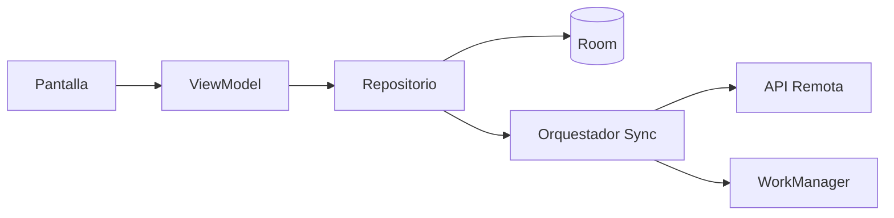

# Nivel Midlevel · 02 · Offline-first y sincronización local/remoto, paso a paso

En este módulo vas a construir la pieza que convierte una app “funcional” en una app robusta para vida real. Hasta ahora ya sabes persistir datos con Room, trabajar estado ligero con DataStore, ejecutar trabajos persistentes con WorkManager y consumir red con una capa más sólida. Ahora toca unir todo con una estrategia offline-first.

Offline-first significa que la experiencia principal de la app no depende de que internet esté disponible en ese instante. La app trabaja primero con datos locales y sincroniza con remoto cuando puede hacerlo de forma segura.

No es solo una técnica de caché. Es una decisión de arquitectura.

---

## 1) Qué problema resolvemos exactamente

Imagina este escenario. Una persona marca una tarea como hecha dentro del metro, sin cobertura. Si tu app depende de red inmediata, esa acción falla o se pierde. En un diseño offline-first correcto, la acción se guarda en local al instante, la UI confirma el cambio y la sincronización se intenta después cuando haya red.

En términos de arquitectura, eso exige separar tres responsabilidades. El almacenamiento local debe ser la fuente que la UI observa siempre. El acceso remoto debe vivir en infraestructura. Y un orquestador debe decidir cómo sincronizar estados sin mezclar todo en el ViewModel.

---

## 2) Definiciones mínimas antes de código

Single source of truth significa una fuente única de verdad para un flujo concreto de datos. En este módulo, para lectura de UI, será Room.

Pending write significa cambio local pendiente de enviarse al backend.

Sync state significa estado de sincronización de cada registro, por ejemplo pendiente, sincronizado o fallido.

Conflict resolution significa regla para decidir qué valor gana cuando local y remoto tienen versiones distintas del mismo dato.

En este módulo usaremos una regla inicial simple y controlada para no adelantar complejidad innecesaria.

---

## 3) Diagrama de flujo de datos



Lectura del diagrama: la UI nunca habla directo con red. La UI observa datos locales. El repositorio coordina. El orquestador se encarga de sincronizar con remoto y reintentos.

---

## 4) Modelo de sincronización en la entidad local

Vamos a extender la entidad local para guardar metadatos de sincronización.

```kotlin
enum class SyncState {
    PENDING,
    SYNCED,
    FAILED
}

@Entity(tableName = "tasks")
data class TaskEntity(
    @PrimaryKey val id: String,
    val title: String,
    val done: Boolean,
    val updatedAtMillis: Long,
    val syncState: SyncState
)
```

Explicación línea por línea:

Línea `enum class SyncState` define un conjunto cerrado de estados posibles. `enum class` en Kotlin sirve para representar opciones fijas.

Líneas `PENDING`, `SYNCED`, `FAILED` representan el ciclo mínimo de sincronización.

Línea `@Entity(tableName = "tasks")` marca la clase como tabla Room.

Línea `data class TaskEntity(` crea estructura de datos persistida.

Línea `@PrimaryKey val id: String` define clave primaria estable.

Línea `val title: String` guarda título.

Línea `val done: Boolean` guarda estado completado.

Línea `val updatedAtMillis: Long` guarda marca temporal local para comparar versiones.

Línea `val syncState: SyncState` guarda estado de sincronización por fila.

Por qué se usa este diseño aquí: permite que cada cambio local tenga trazabilidad de sincronización sin bloquear UI.

Qué pasaría sin `syncState`: no sabrías qué filas hay que subir a remoto.

Qué pasaría sin `updatedAtMillis`: no podrías aplicar reglas de conflicto simples con criterio temporal.

---

## 5) DAO para leer siempre local y obtener pendientes

```kotlin
@Dao
interface TasksDao {

    @Query("SELECT * FROM tasks ORDER BY updatedAtMillis DESC")
    fun observeTasks(): Flow<List<TaskEntity>>

    @Query("SELECT * FROM tasks WHERE syncState = :state")
    suspend fun getBySyncState(state: SyncState): List<TaskEntity>

    @Insert(onConflict = OnConflictStrategy.REPLACE)
    suspend fun upsertAll(items: List<TaskEntity>)

    @Update
    suspend fun update(item: TaskEntity)
}
```

Explicación línea por línea:

Línea `@Dao` marca interfaz de acceso a datos de Room.

Línea `interface TasksDao` define contrato local.

Línea `@Query("SELECT * FROM tasks ORDER BY updatedAtMillis DESC")` define consulta de lectura principal para UI.

Línea `fun observeTasks(): Flow<List<TaskEntity>>` devuelve `Flow`, un stream reactivo que emite cambios automáticos.

Línea `@Query("SELECT * FROM tasks WHERE syncState = :state")` define consulta por estado de sincronización.

Línea `suspend fun getBySyncState(...)` permite obtener pendientes en una corrutina.

Línea `@Insert(onConflict = OnConflictStrategy.REPLACE)` define inserción/reemplazo por id.

Línea `suspend fun upsertAll(...)` guarda lotes.

Línea `@Update` y `suspend fun update(...)` actualizan fila concreta.

Por qué se usa así: separa consultas de UI y consultas de sincronización.

Qué pasaría sin consulta por estado: el orquestador no tendría forma limpia de localizar pendientes.

---

## 6) Repositorio offline-first

El repositorio será la frontera entre presentación y fuentes de datos.

```kotlin
class TasksRepository(
    private val dao: TasksDao,
    private val syncScheduler: SyncScheduler,
    private val clock: () -> Long
) {

    fun observeTasks(): Flow<List<TaskEntity>> {
        return dao.observeTasks()
    }

    suspend fun markTaskDoneOfflineFirst(taskId: String, current: TaskEntity) {
        val updated = current.copy(
            done = true,
            updatedAtMillis = clock(),
            syncState = SyncState.PENDING
        )
        dao.update(updated)
        syncScheduler.scheduleOneTimeSync()
    }
}
```

Explicación línea por línea:

Línea `class TasksRepository(` crea clase de coordinación.

Línea `private val dao: TasksDao` inyecta fuente local.

Línea `private val syncScheduler: SyncScheduler` inyecta pieza que programa sincronización en background.

Línea `private val clock: () -> Long` inyecta reloj para testabilidad y consistencia temporal.

Línea `fun observeTasks(): Flow<List<TaskEntity>>` expone lectura local reactiva.

Línea `return dao.observeTasks()` delega en Room la fuente de verdad de UI.

Línea `suspend fun markTaskDoneOfflineFirst(...)` define escritura local primero.

Línea `val updated = current.copy(...)` crea versión nueva de la tarea.

Línea `done = true` aplica cambio funcional de usuario.

Línea `updatedAtMillis = clock()` registra momento de modificación.

Línea `syncState = SyncState.PENDING` marca que falta sincronizar con remoto.

Línea `dao.update(updated)` persiste de inmediato en local.

Línea `syncScheduler.scheduleOneTimeSync()` programa intento de sync persistente.

Por qué se usa este orden: primero confirmas experiencia de usuario local, luego sincronizas.

Qué pasaría si inviertes el orden y llamas remoto primero: en mala red tendrías latencia alta o error visible antes de reflejar acción local.

---

## 7) Orquestador de sincronización

Separar sincronización en un orquestador evita llenar el repositorio con demasiada lógica técnica.

```kotlin
class TasksSyncOrchestrator(
    private val dao: TasksDao,
    private val remote: TasksRemoteDataSource,
    private val clock: () -> Long
) {

    suspend fun syncPendingTasks() {
        val pending = dao.getBySyncState(SyncState.PENDING)
        if (pending.isEmpty()) return

        val result = remote.pushTasks(pending)

        when (result) {
            is NetworkResult.Success -> {
                val synced = pending.map { item ->
                    item.copy(syncState = SyncState.SYNCED, updatedAtMillis = clock())
                }
                dao.upsertAll(synced)
            }
            is NetworkResult.HttpError,
            is NetworkResult.NetworkError -> {
                val failed = pending.map { it.copy(syncState = SyncState.FAILED) }
                dao.upsertAll(failed)
            }
        }
    }
}
```

Explicación línea por línea:

Línea `class TasksSyncOrchestrator(` define componente especializado en sincronización.

Línea `private val dao: TasksDao` inyecta acceso local.

Línea `private val remote: TasksRemoteDataSource` inyecta capa remota.

Línea `private val clock: () -> Long` inyecta reloj para marcas temporales.

Línea `suspend fun syncPendingTasks()` define operación principal de sync.

Línea `val pending = dao.getBySyncState(SyncState.PENDING)` carga pendientes.

Línea `if (pending.isEmpty()) return` corta temprano si no hay trabajo.

Línea `val result = remote.pushTasks(pending)` intenta sincronizar lote pendiente.

Línea `when (result)` ramifica por resultado unificado.

Bloque `is NetworkResult.Success` maneja éxito.

Línea `pending.map { item -> item.copy(...) }` transforma cada pendiente a sincronizado.

Línea `syncState = SyncState.SYNCED` marca estado final correcto.

Línea `updatedAtMillis = clock()` actualiza marca temporal local.

Línea `dao.upsertAll(synced)` persiste lote sincronizado.

Bloque `HttpError` y `NetworkError` maneja fallo.

Línea `pending.map { it.copy(syncState = SyncState.FAILED) }` marca fallidos para diagnóstico y reintento posterior.

Línea `dao.upsertAll(failed)` persiste estado de fallo.

Por qué se usa así: mantiene comportamiento determinista y observable en local.

Qué pasaría si no marcas `FAILED`: perderías visibilidad del estado real de sincronización.

---

## 8) Programación de sincronización con WorkManager

```kotlin
class SyncScheduler(
    private val workManager: WorkManager
) {
    fun scheduleOneTimeSync() {
        val request = OneTimeWorkRequestBuilder<TasksSyncWorker>()
            .setConstraints(
                Constraints.Builder()
                    .setRequiredNetworkType(NetworkType.CONNECTED)
                    .build()
            )
            .build()

        workManager.enqueueUniqueWork(
            "tasks_sync_once",
            ExistingWorkPolicy.REPLACE,
            request
        )
    }
}
```

Explicación línea por línea:

Línea `class SyncScheduler(` encapsula programación de trabajos.

Línea `private val workManager: WorkManager` inyecta motor de trabajos persistentes.

Línea `fun scheduleOneTimeSync()` define método para disparar sincronización puntual.

Línea `OneTimeWorkRequestBuilder<TasksSyncWorker>()` crea request de ejecución única del worker.

Línea `.setConstraints(...)` define condiciones para ejecutar.

Línea `.setRequiredNetworkType(NetworkType.CONNECTED)` exige red conectada.

Línea `.build()` finaliza request.

Línea `enqueueUniqueWork("tasks_sync_once", ...)` evita duplicar trabajos con mismo nombre lógico.

Línea `ExistingWorkPolicy.REPLACE` reemplaza trabajo previo si existe uno en cola.

Por qué se usa aquí: evita tormenta de jobs en múltiples acciones rápidas.

Qué pasaría si no usas `enqueueUniqueWork`: podrías encolar múltiples sync redundantes.

---

## 9) Regla de conflicto inicial

Para este nivel aplicaremos una regla simple: gana la última actualización por `updatedAtMillis`.

No es la solución definitiva para todos los productos, pero es correcta para aprender una primera estrategia consistente y testable.

Más adelante podrás evolucionar a políticas por campo o resolución por servidor.

---

## 10) Conexión con Clean Architecture, DDD y feature-first

Aquí la aplicación gradual queda así.

La infraestructura contiene Room, WorkManager y red.

El repositorio de la feature actúa como frontera de aplicación y decide orquestación.

El dominio recibe estado coherente sin depender de detalles HTTP o SQL.

El enfoque feature-first se mantiene porque todo este flujo pertenece a la feature de tareas, sin mezclar reglas de otras features.

---

## 11) Errores frecuentes y cómo detectarlos

Si ves tareas que nunca pasan de `PENDING`, revisa que el worker esté encolado y que constraints permitan ejecución.

Si ves estados inconsistentes entre UI y backend, revisa si `updatedAtMillis` se actualiza en cada escritura local y en cada sync exitoso.

Si aparecen muchos jobs repetidos, revisa si estás usando `enqueueUniqueWork` con una clave estable.

Si la UI no refleja cambios, revisa que la pantalla observe `Flow` local y no respuesta remota directa.

---

## 12) Mini reto final del módulo

Implementa este recorrido completo.

Primero marca una tarea como hecha en modo sin red y verifica que pasa a `PENDING` en Room.

Después simula recuperación de red y ejecuta sincronización.

Finalmente verifica que la tarea queda en `SYNCED` y que la UI muestra estado actualizado sin necesidad de recargar manualmente.

Si puedes explicar ese flujo de extremo a extremo, ya dominaste la base offline-first de nivel Midlevel.

