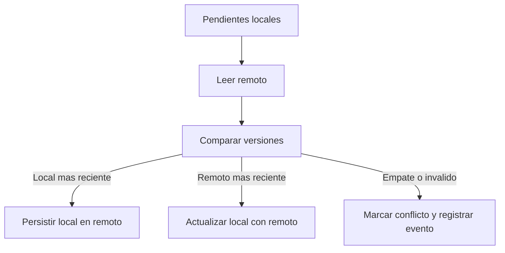

# Nivel Midlevel · 03 · Consistencia y resolución de conflictos sin perder datos

En el módulo anterior construiste una base offline-first real. Eso fue un salto grande, porque ya no dependes de red inmediata para que la app funcione. Ahora vamos a resolver el siguiente problema natural: qué pasa cuando local y remoto tienen versiones distintas del mismo dato.

Este módulo existe porque una app offline-first sin estrategia de consistencia termina generando errores silenciosos. El usuario cree que su cambio quedó guardado, pero al sincronizar puede aparecer otro valor y no entender qué ocurrió. Aquí vamos a evitar eso con una política explícita, observable y testeable.

No vamos a saltar a estrategias avanzadas de golpe. Vamos a construir una solución Midlevel sólida, con progresión gradual y decisiones justificadas.

---

## 1) Problema real que vamos a resolver

Imagina este escenario. Un usuario A edita el título de una tarea en móvil sin conexión. Minutos después, un usuario B edita la misma tarea desde web y sí tiene conexión. Cuando el móvil del usuario A recupera red y sincroniza, existen dos versiones válidas de la misma entidad.

A esto lo llamamos conflicto de escritura.

Si no defines una política, el resultado es impredecible. Si defines una política explícita, el resultado es consistente y auditable.

---

## 2) Definiciones necesarias en el momento en que aparecen

Consistencia significa que el sistema aplica reglas claras para que el estado final sea coherente después de sincronizar.

Conflicto significa que dos cambios compiten sobre el mismo dato y no pueden aplicarse ambos sin decidir un orden o una prioridad.

Política de resolución significa la regla concreta que decide cuál versión gana.

Versionado lógico significa añadir metadatos para comparar versiones, por ejemplo `updatedAtMillis` o `version`.

Merge significa combinar partes de dos versiones en una sola, cuando el dominio lo permite.

Para este nivel usaremos una política simple y explícita: gana la versión más reciente por marca temporal, y se registra la decisión para observabilidad.

---

## 3) Diagrama de flujo de resolución



Lectura del diagrama: no hay magia. Primero detectas candidatos, luego comparas metadatos, después aplicas una única regla por caso y dejas evidencia del camino elegido.

---

## 4) Modelo de metadatos para consistencia

Vamos a definir una estructura de versión mínima, separada y clara.

```kotlin
data class VersionInfo(
    val updatedAtMillis: Long,
    val deviceId: String,
    val revision: Long
)
```

Explicación línea por línea:

Línea `data class VersionInfo(` define una `data class`, que en Kotlin es una clase pensada para transportar datos con utilidades automáticas como `copy` y `equals`.

Línea `val updatedAtMillis: Long` guarda marca temporal de actualización.

Línea `val deviceId: String` guarda identificador del origen del cambio.

Línea `val revision: Long` guarda contador de revisión para desempates o auditoría.

Por qué se usa aquí: porque necesitas comparar versiones de forma determinista.

Qué pasaría sin metadatos de versión: el sistema no tendría criterio técnico para decidir ganador.

---

## 5) Entidad local con versión y estado de conflicto

```kotlin
enum class ConflictState {
    NONE,
    DETECTED,
    RESOLVED
}

data class TaskEntity(
    val id: String,
    val title: String,
    val done: Boolean,
    val updatedAtMillis: Long,
    val revision: Long,
    val syncState: SyncState,
    val conflictState: ConflictState
)
```

Explicación línea por línea:

Línea `enum class ConflictState` define opciones fijas del estado de conflicto.

Línea `NONE` significa que no existe conflicto activo.

Línea `DETECTED` significa que se detectó conflicto y requiere resolución.

Línea `RESOLVED` significa que ya se aplicó una decisión.

Línea `data class TaskEntity(` define modelo persistido local.

Línea `val id: String` identifica tarea de forma única.

Línea `val title: String` guarda título.

Línea `val done: Boolean` guarda estado completado.

Línea `val updatedAtMillis: Long` registra última actualización local.

Línea `val revision: Long` incrementa versión lógica.

Línea `val syncState: SyncState` mantiene estado de sincronización del módulo anterior.

Línea `val conflictState: ConflictState` añade trazabilidad explícita de conflicto.

Por qué se usa aquí: separa claramente sincronización de conflicto, que son problemas relacionados pero distintos.

Qué pasaría si mezclas ambos en un único estado: pierdes precisión diagnóstica y complicas la UI.

---

## 6) Política de resolución encapsulada

Ahora encapsulamos la regla para que no quede dispersa en varios sitios.

```kotlin
sealed interface ConflictResolution {
    data class KeepLocal(val reason: String) : ConflictResolution
    data class KeepRemote(val reason: String) : ConflictResolution
    data class ManualReview(val reason: String) : ConflictResolution
}

class ConflictResolver {
    fun resolve(local: TaskEntity, remote: TaskDto): ConflictResolution {
        return when {
            local.updatedAtMillis > remote.updatedAtMillis -> {
                ConflictResolution.KeepLocal("Local es mas reciente")
            }
            local.updatedAtMillis < remote.updatedAtMillis -> {
                ConflictResolution.KeepRemote("Remoto es mas reciente")
            }
            else -> {
                ConflictResolution.ManualReview("Misma marca temporal")
            }
        }
    }
}
```

Explicación línea por línea:

Línea `sealed interface ConflictResolution` define un conjunto cerrado de resultados de resolución.

Línea `data class KeepLocal...` representa decisión de conservar local.

Línea `data class KeepRemote...` representa decisión de conservar remoto.

Línea `data class ManualReview...` representa caso ambiguo que requiere revisión.

Línea `class ConflictResolver` crea componente dedicado a la decisión.

Línea `fun resolve(local: TaskEntity, remote: TaskDto)` recibe ambas versiones a comparar.

Línea `return when {` inicia evaluación por condiciones.

Línea `local.updatedAtMillis > remote.updatedAtMillis` detecta local más reciente.

Línea `ConflictResolution.KeepLocal(...)` devuelve decisión explícita con razón.

Línea `local.updatedAtMillis < remote.updatedAtMillis` detecta remoto más reciente.

Línea `ConflictResolution.KeepRemote(...)` devuelve decisión correspondiente.

Línea `else` cubre empate de timestamp.

Línea `ConflictResolution.ManualReview(...)` evita decisiones silenciosas en empates.

Por qué se usa aquí: centralizar la política evita incoherencias entre features.

Qué pasaría si esta lógica queda repartida por repositorios: la misma situación podría resolverse distinto según pantalla.

---

## 7) Aplicar resolución dentro del orquestador

```kotlin
class TasksConsistencyOrchestrator(
    private val dao: TasksDao,
    private val remote: TasksRemoteDataSource,
    private val resolver: ConflictResolver,
    private val logger: SyncLogger
) {
    suspend fun syncWithConflictResolution(local: TaskEntity) {
        val remoteTask = remote.getTaskById(local.id) ?: return

        when (val decision = resolver.resolve(local, remoteTask)) {
            is ConflictResolution.KeepLocal -> {
                remote.pushTask(local)
                dao.update(local.copy(conflictState = ConflictState.RESOLVED))
                logger.log(local.id, "KEEP_LOCAL", decision.reason)
            }
            is ConflictResolution.KeepRemote -> {
                val merged = local.copy(
                    title = remoteTask.title,
                    done = remoteTask.done,
                    updatedAtMillis = remoteTask.updatedAtMillis,
                    syncState = SyncState.SYNCED,
                    conflictState = ConflictState.RESOLVED
                )
                dao.update(merged)
                logger.log(local.id, "KEEP_REMOTE", decision.reason)
            }
            is ConflictResolution.ManualReview -> {
                dao.update(local.copy(conflictState = ConflictState.DETECTED))
                logger.log(local.id, "MANUAL_REVIEW", decision.reason)
            }
        }
    }
}
```

Explicación línea por línea:

Línea `class TasksConsistencyOrchestrator(` define orquestador especializado en consistencia.

Línea `private val dao: TasksDao` inyecta acceso local.

Línea `private val remote: TasksRemoteDataSource` inyecta acceso remoto.

Línea `private val resolver: ConflictResolver` inyecta política de resolución.

Línea `private val logger: SyncLogger` inyecta logger de decisiones para observabilidad.

Línea `suspend fun syncWithConflictResolution(local: TaskEntity)` define operación por entidad.

Línea `val remoteTask = remote.getTaskById(local.id) ?: return` intenta leer versión remota y corta si no existe.

Línea `when (val decision = resolver.resolve(local, remoteTask))` ejecuta política y ramifica por resultado.

Bloque `KeepLocal` empuja local a remoto, marca conflicto resuelto y registra evento.

Línea `remote.pushTask(local)` actualiza backend con versión local.

Línea `dao.update(local.copy(conflictState = ConflictState.RESOLVED))` deja trazabilidad local.

Línea `logger.log(... "KEEP_LOCAL" ...)` registra motivo de decisión.

Bloque `KeepRemote` construye versión local actualizada desde remoto.

Línea `val merged = local.copy(...)` crea entidad resultante.

Línea `title = remoteTask.title` aplica valor remoto de título.

Línea `done = remoteTask.done` aplica estado remoto.

Línea `updatedAtMillis = remoteTask.updatedAtMillis` sincroniza marca temporal.

Línea `syncState = SyncState.SYNCED` marca estado de sincronización correcto.

Línea `conflictState = ConflictState.RESOLVED` marca conflicto cerrado.

Línea `dao.update(merged)` persiste resolución.

Línea `logger.log(... "KEEP_REMOTE" ...)` registra decisión.

Bloque `ManualReview` marca conflicto detectado y registra causa.

Línea `dao.update(local.copy(conflictState = ConflictState.DETECTED))` deja estado visible para tratamiento posterior.

Línea `logger.log(... "MANUAL_REVIEW" ...)` deja evidencia de caso ambiguo.

Por qué se usa aquí: convierte una política abstracta en acciones consistentes sobre local y remoto.

Qué pasaría si no registras decisión: perderías trazabilidad y sería difícil depurar incidencias de usuarios.

---

## 8) Exponer estado de conflicto a la UI

La UI no debe interpretar lógica de infraestructura. La UI debe recibir un estado claro de presentación.

```kotlin
data class TaskUiState(
    val id: String,
    val title: String,
    val done: Boolean,
    val isSyncPending: Boolean,
    val hasConflict: Boolean
)

fun TaskEntity.toUiState(): TaskUiState {
    return TaskUiState(
        id = id,
        title = title,
        done = done,
        isSyncPending = syncState == SyncState.PENDING,
        hasConflict = conflictState == ConflictState.DETECTED
    )
}
```

Explicación línea por línea:

Línea `data class TaskUiState(` define modelo específico para pantalla.

Línea `val isSyncPending: Boolean` permite mostrar indicador de sincronización pendiente.

Línea `val hasConflict: Boolean` permite mostrar aviso de conflicto.

Línea `fun TaskEntity.toUiState(): TaskUiState` define mapper de entidad local a estado de UI.

Línea `isSyncPending = syncState == SyncState.PENDING` traduce estado técnico a bandera de presentación.

Línea `hasConflict = conflictState == ConflictState.DETECTED` traduce conflicto a señal visual.

Por qué se usa aquí: protege la UI de detalles internos y mantiene UDF limpia.

Qué pasaría si la UI usa `TaskEntity` directo con toda lógica: aumentaría acoplamiento y complejidad en pantalla.

---

## 9) Pruebas mínimas que deben existir

Primera prueba: cuando local tiene timestamp mayor, resolver devuelve `KeepLocal`.

Segunda prueba: cuando remoto tiene timestamp mayor, resolver devuelve `KeepRemote`.

Tercera prueba: cuando timestamps empatan, resolver devuelve `ManualReview`.

Cuarta prueba: el orquestador actualiza `conflictState` y escribe log de decisión en cada rama.

Estas pruebas son suficientes en este punto porque validan la política y su aplicación operacional.

---

## 10) Conexión gradual con Clean Architecture, DDD y feature-first

La política de consistencia se modela como objeto dedicado (`ConflictResolver`) para evitar reglas dispersas. Eso es una aplicación gradual de diseño orientado a dominio: el comportamiento crítico vive en una pieza explícita y testeable.

El orquestador queda en aplicación/infrastructura de la feature porque coordina IO local y remoto.

La pantalla solo recibe estado traducido y no conoce reglas de resolución. Así mantenemos separación de capas sin adelantar complejidad innecesaria.

---

## 11) Errores frecuentes en consistencia

Error típico uno. Usar `System.currentTimeMillis()` en múltiples puntos sin estrategia de reloj inyectable. Eso rompe testabilidad y puede dificultar reproducir conflictos.

Error típico dos. Resolver conflicto pero no persistir estado de resolución. Eso deja la app en estado ambiguo.

Error típico tres. Aplicar decisiones de conflicto sin registro observable. Después no puedes explicar por qué una versión ganó.

Error típico cuatro. Mezclar resolución en ViewModel. Eso rompe separación arquitectónica y complica mantenimiento.

---

## 12) Mini reto final del módulo

Implementa un caso reproducible con dos versiones de la misma tarea.

Primero crea versión local con `updatedAtMillis` menor que remoto y verifica que el sistema elige remoto.

Después invierte el caso con local más reciente y verifica que el sistema elige local y hace push remoto.

Por último crea empate exacto de timestamp y verifica que el estado pasa a `ConflictState.DETECTED`.

Si puedes ejecutar y explicar esos tres escenarios con evidencia, ya tienes una base Midlevel real de consistencia y resolución de conflictos.

<!-- semantica-flechas:auto -->
## Semantica de flechas aplicada a esta arquitectura

```mermaid
flowchart LR
    subgraph APP["App module"]
        APPROOT["AppRoot + Hilt"]
        DI["Dependency graph"]
    end

    subgraph FEATURE["Feature module"]
        UI["FeatureScreen"]
        VM["FeatureViewModel"]
        PORT["FeaturePort (interface)"]
    end

    subgraph DATA["Data/Infra module"]
        IMPL["FeatureAdapterImpl"]
        LOCAL["LocalDataSource"]
    end

    APPROOT -.-> DI
    DI -.-> IMPL
    UI --> VM
    VM ==> PORT
    IMPL --o PORT
    IMPL --> LOCAL
```text

Lectura semantica minima de este diagrama:

1. `-->` dependencia directa en runtime.
2. `-.->` wiring y configuracion de ensamblado.
3. `==>` dependencia contra contrato/abstraccion.
4. `--o` salida/propagacion desde implementacion concreta.

