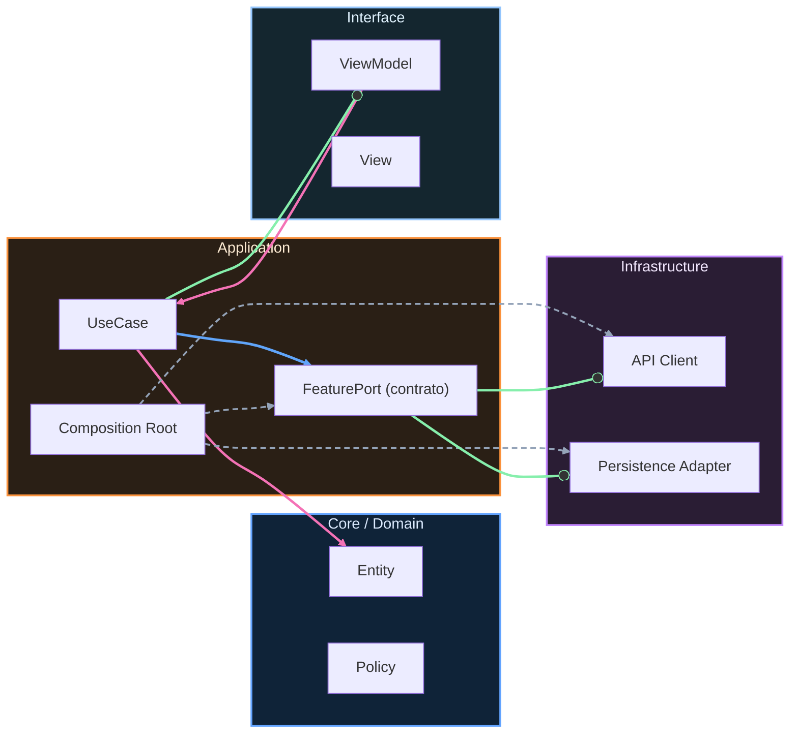

# Nivel Midlevel · 05 · Pruebas de integración para offline-first y sincronización real

Ya construiste una arquitectura offline-first que guarda local, marca estados de sincronización y reintenta cuando vuelve la red. Eso está muy bien, pero todavía no está terminado de verdad. Falta la parte que separa una app “que parece funcionar” de una app profesional: comprobar, de forma automática, que todo el flujo completo funciona como sistema.

Ese es el objetivo de este módulo. Vamos a crear pruebas de integración de Android para el flujo offline-sync completo, desde Room hasta repositorio y orquestador de sincronización, con foco en comportamiento real y diagnóstico útil cuando algo falle.

Aquí no vamos a probar un método aislado. Aquí probamos colaboración entre componentes reales.

---

## 1) Qué problema resolvemos exactamente

En un flujo offline-first hay muchos puntos donde puede romperse la consistencia. Por ejemplo, guardar en Room pero no marcar `PENDING`. O marcar `PENDING` pero no programar WorkManager. O sincronizar en red pero olvidar actualizar `syncState = SYNCED`.

Si solo haces pruebas unitarias, cada pieza puede pasar por separado y aun así romperse el sistema al conectarse.

La prueba de integración existe para eso: verificar que varias piezas juntas mantienen la promesa funcional.

---

## 2) Qué vamos a probar en este módulo

Vamos a cubrir tres escenarios base que te dan mucha seguridad estructural.

Primero, cuando el usuario actualiza una tarea sin red, el repositorio debe persistir local, dejar `syncState = PENDING` y disparar programación de sincronización.

Segundo, cuando la sincronización se ejecuta y el backend responde bien, el orquestador debe subir cambios y marcar los registros como `SYNCED`.

Tercero, cuando la sincronización falla por red o servidor, el sistema no debe perder datos y debe mantener estado pendiente para reintento.

Con esos tres escenarios, validamos la columna vertebral de offline-first.

---

## 3) Preparar dependencias de testing de integración

Primero deja listo el módulo Gradle donde vive esta feature. Supongamos un módulo `:features:tasks`.

```kotlin
dependencies {
    testImplementation("junit:junit:4.13.2")
    testImplementation("org.jetbrains.kotlinx:kotlinx-coroutines-test:1.10.2")
    testImplementation("androidx.arch.core:core-testing:2.2.0")

    testImplementation("androidx.room:room-testing:2.7.2")
    testImplementation("app.cash.turbine:turbine:1.2.0")
}
```

Explicación línea por línea:

Línea `testImplementation("junit:junit:4.13.2")` añade motor de tests unitarios JVM, suficiente para integración local con Room in-memory.

Línea `kotlinx-coroutines-test` permite controlar dispatchers y ejecutar corrutinas de forma determinista.

Línea `core-testing` facilita reglas de arquitectura cuando necesites LiveData o ejecución síncrona de tareas de arquitectura.

Línea `room-testing` habilita base de datos en memoria y utilidades oficiales de Room para pruebas.

Línea `turbine` te permite validar emisiones de `Flow` de forma clara y segura.

Por qué se usa aquí: queremos pruebas reales de integración sin arrancar emulator, rápidas y repetibles en CI.

Qué pasaría si no lo haces: terminarías con pruebas lentas o pruebas incompletas que no cubren colaboración entre capas.

---

## 4) Crear base Room in-memory para integración

Ahora creamos una clase de test que monta Room real en memoria.

```kotlin
@RunWith(AndroidJUnit4::class)
class TasksOfflineSyncIntegrationTest {

    private lateinit var db: AppDatabase
    private lateinit var tasksDao: TasksDao

    @Before
    fun setup() {
        val context = ApplicationProvider.getApplicationContext<Context>()
        db = Room.inMemoryDatabaseBuilder(context, AppDatabase::class.java)
            .allowMainThreadQueries()
            .build()
        tasksDao = db.tasksDao()
    }

    @After
    fun tearDown() {
        db.close()
    }
}
```

Explicación línea por línea:

Línea `@RunWith(AndroidJUnit4::class)` indica runner de pruebas AndroidX.

Línea `class TasksOfflineSyncIntegrationTest` define suite de integración para flujo tasks.

Línea `private lateinit var db` guarda instancia de DB real para cada test.

Línea `private lateinit var tasksDao` prepara DAO real que usará el repositorio.

Línea `@Before fun setup()` inicializa entorno limpio antes de cada caso.

Línea `ApplicationProvider.getApplicationContext<Context>()` obtiene contexto de test sin Activity.

Línea `Room.inMemoryDatabaseBuilder(...)` crea base de datos temporal, rápida y aislada.

Línea `.allowMainThreadQueries()` simplifica test; en producción no se recomienda, en tests ayuda a reducir ruido de configuración.

Línea `.build()` construye DB.

Línea `tasksDao = db.tasksDao()` prepara acceso a entidad.

Línea `@After fun tearDown()` garantiza cierre de recursos.

Línea `db.close()` evita fugas entre casos y mantiene aislamiento.

---

## 5) Definir doubles de integración para componentes externos

En integración offline-sync queremos reales Room + repositorio + orquestador, pero debemos controlar red y scheduler. Para eso usamos fakes explícitos.

```kotlin
class FakeTasksApi : TasksApi {
    var shouldFail = false
    val sentPayloads = mutableListOf<SyncTaskPayload>()

    override suspend fun syncPendingTasks(payload: List<SyncTaskPayload>) {
        if (shouldFail) throw IOException("network down")
        sentPayloads.addAll(payload)
    }
}

class FakeSyncScheduler : SyncScheduler {
    var scheduleCalls = 0

    override fun scheduleOneTimeSync() {
        scheduleCalls++
    }
}
```

Explicación línea por línea:

Línea `class FakeTasksApi : TasksApi` implementa contrato de red real de la feature.

Línea `var shouldFail = false` permite alternar éxito/fallo desde cada prueba.

Línea `val sentPayloads` captura lo enviado para validación posterior.

Línea `override suspend fun syncPendingTasks` replica endpoint de sync.

Línea `if (shouldFail) throw IOException(...)` simula caída de red determinista.

Línea `sentPayloads.addAll(payload)` registra subida efectiva cuando hay éxito.

Línea `class FakeSyncScheduler : SyncScheduler` crea doble de programación WorkManager.

Línea `var scheduleCalls = 0` contabiliza cuántas veces se programó sincronización.

Línea `override fun scheduleOneTimeSync()` implementa comportamiento mínimo.

Línea `scheduleCalls++` deja evidencia objetiva de llamado.

Por qué se usa aquí: en integración queremos aislar solo límites externos (red y scheduler) sin perder realismo interno de persistencia y reglas.

---

## 6) Construir el SUT de integración

SUT significa “System Under Test”. Aquí es el conjunto que queremos verificar.

```kotlin
private fun makeSut(
    api: FakeTasksApi = FakeTasksApi(),
    scheduler: FakeSyncScheduler = FakeSyncScheduler()
): Triple<TasksRepository, TasksSyncOrchestrator, TestDeps> {
    val logger = InMemoryLogger()

    val repository = TasksRepository(
        dao = tasksDao,
        syncScheduler = scheduler,
        logger = logger,
        clock = { 1_700_000_000_000L }
    )

    val orchestrator = TasksSyncOrchestrator(
        dao = tasksDao,
        api = api,
        logger = logger
    )

    return Triple(repository, orchestrator, TestDeps(api, scheduler, logger))
}

data class TestDeps(
    val api: FakeTasksApi,
    val scheduler: FakeSyncScheduler,
    val logger: InMemoryLogger
)
```

Explicación línea por línea:

Línea `private fun makeSut(...)` encapsula construcción para evitar repetición en cada test.

Línea `api: FakeTasksApi = FakeTasksApi()` permite configurar fake por defecto o personalizado.

Línea `scheduler: FakeSyncScheduler = FakeSyncScheduler()` mismo patrón para scheduler.

Línea `val logger = InMemoryLogger()` usa logger de memoria para aserciones diagnósticas.

Bloque `val repository = TasksRepository(...)` monta repositorio real con DAO real.

Línea `clock = { ... }` fija tiempo determinista para resultados estables.

Bloque `val orchestrator = TasksSyncOrchestrator(...)` monta orquestador real.

Línea `return Triple(...)` devuelve piezas necesarias para cada caso.

Línea `data class TestDeps` agrupa dependencias de inspección.

Por qué se usa aquí: mejora legibilidad, reduce ruido y estandariza setup de integración.

---

## 7) Escenario 1: update offline marca PENDING y agenda sync

Ahora escribimos prueba de integración del primer caso crítico.

```kotlin
@Test
fun markDoneOfflineFirst_guardaLocal_ponePending_yAgendaSync() = runTest {
    val (repository, _, deps) = makeSut()

    tasksDao.insert(
        TaskEntity(
            id = "task-1",
            title = "Comprar pan",
            done = false,
            updatedAtMillis = 1000L,
            syncState = SyncState.SYNCED
        )
    )

    val current = tasksDao.findById("task-1") ?: error("task no encontrada")
    repository.markTaskDoneOfflineFirst(taskId = "task-1", current = current)

    val updated = tasksDao.findById("task-1") ?: error("task no encontrada")

    assertThat(updated.done).isTrue()
    assertThat(updated.syncState).isEqualTo(SyncState.PENDING)
    assertThat(deps.scheduler.scheduleCalls).isEqualTo(1)
}
```

Explicación línea por línea:

Línea `@Test` declara caso de prueba.

Línea `runTest` ejecuta corrutinas en entorno de test controlado.

Línea `val (repository, _, deps) = makeSut()` crea sistema bajo prueba.

Bloque `tasksDao.insert(...)` crea estado inicial consistente para el caso.

Línea `done = false` parte de tarea no completada.

Línea `syncState = SyncState.SYNCED` parte de estado sincronizado inicial.

Línea `val current = tasksDao.findById(...)` lee entidad actual para operación.

Línea `repository.markTaskDoneOfflineFirst(...)` ejecuta acción real del usuario.

Línea `val updated = tasksDao.findById(...)` relee desde Room para validar persistencia real.

Línea `assertThat(updated.done).isTrue()` valida cambio de negocio.

Línea `assertThat(updated.syncState).isEqualTo(SyncState.PENDING)` valida contrato offline-first.

Línea `assertThat(deps.scheduler.scheduleCalls).isEqualTo(1)` valida que se pidió sincronización.

---

## 8) Escenario 2: sincronización exitosa marca SYNCED

```kotlin
@Test
fun syncPendingTasks_cuandoApiRespondeOk_marcaRegistrosComoSynced() = runTest {
    val (_, orchestrator, deps) = makeSut()

    tasksDao.insert(
        TaskEntity(
            id = "task-2",
            title = "Estudiar Kotlin",
            done = true,
            updatedAtMillis = 2000L,
            syncState = SyncState.PENDING
        )
    )

    orchestrator.syncPendingTasks()

    val result = tasksDao.findById("task-2") ?: error("task no encontrada")

    assertThat(deps.api.sentPayloads).hasSize(1)
    assertThat(result.syncState).isEqualTo(SyncState.SYNCED)
}
```

Explicación línea por línea:

Línea `val (_, orchestrator, deps) = makeSut()` crea orquestador real y fake API inspeccionable.

Bloque `tasksDao.insert(...)` crea registro pendiente de sincronizar.

Línea `syncState = SyncState.PENDING` define precondición del caso.

Línea `orchestrator.syncPendingTasks()` ejecuta flujo completo de subida.

Línea `val result = tasksDao.findById(...)` verifica estado final en persistencia real.

Línea `assertThat(deps.api.sentPayloads).hasSize(1)` comprueba envío a API.

Línea `assertThat(result.syncState).isEqualTo(SyncState.SYNCED)` comprueba transición correcta tras éxito.

---

## 9) Escenario 3: fallo de red conserva PENDING

```kotlin
@Test
fun syncPendingTasks_cuandoApiFalla_mantienePending_paraReintento() = runTest {
    val api = FakeTasksApi().apply { shouldFail = true }
    val (_, orchestrator, _) = makeSut(api = api)

    tasksDao.insert(
        TaskEntity(
            id = "task-3",
            title = "Enviar informe",
            done = true,
            updatedAtMillis = 3000L,
            syncState = SyncState.PENDING
        )
    )

    try {
        orchestrator.syncPendingTasks()
        fail("Se esperaba excepción de red")
    } catch (_: IOException) {
    }

    val result = tasksDao.findById("task-3") ?: error("task no encontrada")
    assertThat(result.syncState).isEqualTo(SyncState.PENDING)
}
```

Explicación línea por línea:

Línea `val api = FakeTasksApi().apply { shouldFail = true }` configura backend caído de forma explícita.

Línea `makeSut(api = api)` inyecta fake fallido.

Bloque `tasksDao.insert(...)` crea tarea pendiente.

Bloque `try { ... } catch` captura fallo esperado de sincronización.

Línea `fail("Se esperaba excepción de red")` protege contra falsos positivos.

Línea `catch (_: IOException)` confirma tipo de fallo esperado para este caso.

Línea `assertThat(result.syncState).isEqualTo(SyncState.PENDING)` verifica que no se pierde pendiente y habrá reintento.

Por qué se usa aquí: en offline-first, ante fallo externo, la prioridad es no perder cambios del usuario.

---

## 10) Añadir logger en memoria para verificar trazas clave

Además del estado, podemos verificar señales de diagnóstico.

```kotlin
class InMemoryLogger : AppLogger {
    data class Event(val level: String, val tag: String, val message: String, val metadata: Map<String, String>)

    val events = mutableListOf<Event>()

    override fun d(tag: String, message: String, metadata: Map<String, String>) {
        events.add(Event("DEBUG", tag, message, metadata))
    }

    override fun i(tag: String, message: String, metadata: Map<String, String>) {
        events.add(Event("INFO", tag, message, metadata))
    }

    override fun w(tag: String, message: String, metadata: Map<String, String>) {
        events.add(Event("WARN", tag, message, metadata))
    }

    override fun e(tag: String, message: String, throwable: Throwable?, metadata: Map<String, String>) {
        val enriched = metadata + mapOf("throwable" to (throwable?.javaClass?.simpleName ?: "none"))
        events.add(Event("ERROR", tag, message, enriched))
    }
}
```

Con este logger puedes añadir aserciones como: “cuando falla sync, debe existir evento ERROR con tag `TasksSyncOrchestrator` y phase `syncPendingTasks`”. Eso te da diagnósticos verificables en pruebas, no solo en producción.

---

## 11) Ejecutar pruebas desde terminal y desde Android Studio

Para ejecutar solo este suite desde terminal:

```bash
./gradlew :features:tasks:test --tests "*TasksOfflineSyncIntegrationTest"
```

Explicación del comando:

`./gradlew` ejecuta el wrapper de Gradle del proyecto, asegurando versión correcta.

`:features:tasks:test` ejecuta tarea de tests JVM del módulo tasks.

`--tests "*TasksOfflineSyncIntegrationTest"` filtra a esta clase para iterar más rápido.

Desde Android Studio, puedes abrir la clase y pulsar el icono de run junto al nombre de la clase o método.

---

## 12) Qué errores comunes vas a ver y cómo resolverlos

Si ves error de esquema Room en test, revisa que el `AppDatabase` usado en test incluya exactamente las entidades y DAOs actuales.

Si ves tests inestables por tiempo, elimina `System.currentTimeMillis()` en SUT y usa `clock` inyectable como hicimos aquí.

Si ves que `syncState` queda incorrecto, revisa que el orquestador no esté haciendo `markSynced` fuera del bloque de éxito de API.

Si no sube payload en éxito, revisa mapper `TaskEntity -> SyncTaskPayload` y campos obligatorios del endpoint.

---

## 13) Ejercicio guiado

Implementa un cuarto caso de integración: cuando hay dos tareas `PENDING`, la sincronización debe enviar ambas en una misma ejecución y marcar ambas como `SYNCED`.

Hazlo paso a paso. Primero inserta dos entidades. Segundo ejecuta `syncPendingTasks`. Tercero valida `sentPayloads.size == 2`. Cuarto valida estado final de ambas filas en Room.

No pases al siguiente módulo hasta que este caso pase de forma estable tres ejecuciones seguidas.

---

## 14) Solución de referencia del ejercicio

```kotlin
@Test
fun syncPendingTasks_conDosPendientes_sincronizaAmbas() = runTest {
    val (_, orchestrator, deps) = makeSut()

    tasksDao.insert(
        TaskEntity("task-4", "A", done = true, updatedAtMillis = 10L, syncState = SyncState.PENDING)
    )
    tasksDao.insert(
        TaskEntity("task-5", "B", done = true, updatedAtMillis = 20L, syncState = SyncState.PENDING)
    )

    orchestrator.syncPendingTasks()

    val a = tasksDao.findById("task-4") ?: error("task-4 no encontrada")
    val b = tasksDao.findById("task-5") ?: error("task-5 no encontrada")

    assertThat(deps.api.sentPayloads).hasSize(2)
    assertThat(a.syncState).isEqualTo(SyncState.SYNCED)
    assertThat(b.syncState).isEqualTo(SyncState.SYNCED)
}
```

---

## 15) Cierre del módulo

Con este módulo ya no estás “confiando” en que offline-first funciona. Ahora lo estás demostrando con pruebas de integración reales sobre persistencia real, reglas reales y orquestación real.

Ese salto es clave para nivel midlevel. Te permite evolucionar la app con más velocidad y menos miedo, porque cuando toques repositorio o sync tendrás una red de seguridad automática.

En el siguiente módulo continuaremos con endurecimiento de calidad en CI y ejecución automatizada de estos casos en pipeline para que cada pull request valide consistencia offline-sync antes de merge.

<!-- auto-gapfix:layered-mermaid -->
## Diagrama de arquitectura por capas



La lectura del diagrama sigue esta semantica:
1. `-->` dependencia directa en runtime.
2. `-.->` wiring o configuracion.
3. `==>` contrato o abstraccion.
4. `--o` salida o propagacion de resultado.
