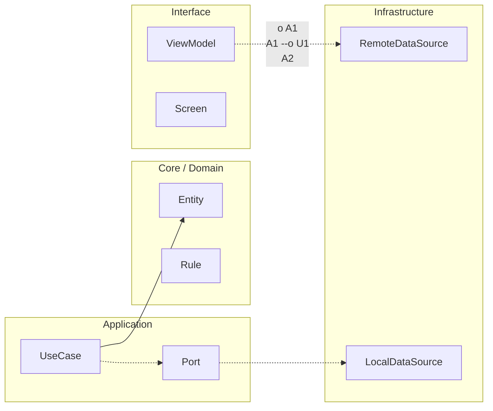

# Nivel Midlevel · 07 · Rendimiento en CI con Macrobenchmark y Baseline Profiles

Cuando una app empieza a crecer, el rendimiento deja de ser un “nice to have”. Si el arranque se vuelve lento o las pantallas tartamudean, el usuario no va a leer tu arquitectura ni tus tests: simplemente se va. Ese es el motivo por el que este módulo llega justo después de quality gates. Ya protegiste comportamiento funcional. Ahora toca proteger experiencia real.

La idea clave es muy sencilla: no esperar a que el equipo de QA o los usuarios te avisen de que “ahora va más lenta”. Vamos a medir rendimiento de forma repetible y vamos a llevar esa medición al pipeline.

---

## Por qué Macrobenchmark y Baseline Profiles juntos tienen sentido

Macrobenchmark te dice cómo se comporta la app en escenarios reales de usuario, por ejemplo cold start o navegación a una pantalla concreta. Baseline Profiles, en cambio, le dicen al compilador qué rutas conviene optimizar antes para que esos flujos críticos arranquen más rápido desde primera instalación.

Separados ya aportan valor. Juntos te dan una estrategia completa: mides, optimizas, y vuelves a medir para comprobar que mejoraste de verdad.

---

## Preparar la estructura de módulos para medir bien

En proyectos Android modernos suele funcionar muy bien tener un módulo de benchmark independiente. Eso evita mezclar dependencias de medición con la app productiva.

Crea un módulo `:benchmarks` y añade en su `build.gradle.kts`:

```kotlin
plugins {
    id("com.android.test")
    id("org.jetbrains.kotlin.android")
}

android {
    namespace = "com.stackmyarchitecture.benchmarks"
    compileSdk = 36

    defaultConfig {
        minSdk = 28
        targetSdk = 36
        testInstrumentationRunner = "androidx.test.runner.AndroidJUnitRunner"
    }

    targetProjectPath = ":app"

    testOptions {
        managedDevices {
            devices {
                maybeCreate<com.android.build.api.dsl.ManagedVirtualDevice>("pixel6Api36").apply {
                    device = "Pixel 6"
                    apiLevel = 36
                    systemImageSource = "aosp"
                }
            }
        }
    }

    buildTypes {
        create("benchmark") {
            isDebuggable = false
            signingConfig = getByName("debug").signingConfig
            matchingFallbacks += listOf("release")
        }
    }
}

dependencies {
    implementation("androidx.benchmark:benchmark-macro-junit4:1.3.3")
    implementation("androidx.test.ext:junit:1.2.1")
    implementation("androidx.test.uiautomator:uiautomator:2.3.0")
}
```

Lo importante de esta configuración no es copiarla de memoria, sino entender qué resuelve. `com.android.test` declara un módulo de pruebas instrumentadas desacoplado del app module. `targetProjectPath = ":app"` conecta el benchmark con la app real que quieres medir. El `ManagedVirtualDevice` permite ejecución consistente en CI, que es exactamente lo que buscas cuando quieres convertir rendimiento en una señal automática y no en una prueba manual de cada desarrollador.

---

## Escribir un macrobenchmark que tenga valor de producto

Ahora crea un test que mida cold start, porque ese es uno de los indicadores con más impacto directo en percepción de calidad.

```kotlin
@RunWith(AndroidJUnit4::class)
class StartupBenchmark {

    @get:Rule
    val benchmarkRule = MacrobenchmarkRule()

    @Test
    fun coldStartup() = benchmarkRule.measureRepeated(
        packageName = "com.stackmyarchitecture.app",
        metrics = listOf(StartupTimingMetric()),
        iterations = 10,
        startupMode = StartupMode.COLD,
        setupBlock = {
            pressHome()
        }
    ) {
        startActivityAndWait()
    }
}
```

Este test parece pequeño, pero está atacando un problema muy concreto. `StartupMode.COLD` fuerza arranque desde cero para que no te engañe el caché de una ejecución previa. `iterations = 10` reduce ruido estadístico. `StartupTimingMetric()` te devuelve métricas comparables entre cambios de código, que es justo lo que necesitas para detectar regresiones antes de merge.

No estás midiendo por medir. Estás vigilando un punto que el usuario siente al instante.

---

## Añadir Baseline Profile para rutas críticas

Ahora vamos a generar profile de referencia para que ART tenga pistas de optimización desde primera ejecución.

Si aún no lo tienes, crea un módulo `:baselineprofile` con plugin oficial y escenario simple de usuario.

```kotlin
plugins {
    id("com.android.test")
    id("org.jetbrains.kotlin.android")
    id("androidx.baselineprofile")
}

baselineProfile {
    managedDevices += "pixel6Api36"
    useConnectedDevices = false
}
```

Y en el test de generación de profile:

```kotlin
@RunWith(AndroidJUnit4::class)
class BaselineProfileGenerator {

    @get:Rule
    val rule = BaselineProfileRule()

    @Test
    fun generate() {
        rule.collect(
            packageName = "com.stackmyarchitecture.app"
        ) {
            pressHome()
            startActivityAndWait()
            device.waitForIdle()

            val tasksButton = device.findObject(By.res("tasks_tab"))
            tasksButton.click()
            device.waitForIdle()
        }
    }
}
```

Aquí no necesitas cubrir toda la app. Necesitas cubrir los flujos más usados y más sensibles a latencia. En este ejemplo se incluye arranque y entrada a la zona de tareas, que en tu curso es un flujo central por todo el trabajo de offline-sync.

La decisión técnica correcta aquí es priorizar rutas de negocio, no “rutas bonitas”.

---

## Llevar la medición al pipeline para que no dependa de voluntad

Ya con `quality gates` funcionales, integra ahora una verificación de rendimiento en CI. No hace falta bloquear por umbrales estrictos en el primer día; empieza publicando resultados y activando alerta por degradación visible.

Extiende tu workflow con algo como esto:

```yaml
- name: Run Macrobenchmark on managed device
  run: ./gradlew :benchmarks:pixel6Api36BenchmarkAndroidTest

- name: Generate Baseline Profile
  run: ./gradlew :baselineprofile:generateBaselineProfile

- name: Upload benchmark reports
  uses: actions/upload-artifact@v4
  with:
    name: benchmark-reports
    path: |
      benchmarks/build/reports
      baselineprofile/build/outputs
```

Este bloque convierte el rendimiento en un output trazable de cada pipeline. Subir artefactos no es un detalle menor: te permite comparar runs cuando alguien diga “desde esta PR empezó a tardar más”. Sin histórico, esa conversación se vuelve opinión. Con artefactos, se vuelve diagnóstico.

---

## Evitar el error más común con rendimiento en CI

El error típico es querer imponer un umbral rígido demasiado pronto y terminar con pipelines rojos por ruido de entorno. Lo más sano es empezar con medición estable y publicación de resultados. Cuando tengas varias semanas de datos, ahí sí defines límites realistas por métrica.

Rendimiento serio no es “poner un número mágico”. Es observar tendencia, detectar saltos y actuar con contexto.

---

## Qué queda protegido después de este módulo

Después de implementar esto, tu proyecto no solo bloquea regresiones funcionales de sincronización. También empieza a vigilar regresiones de experiencia de usuario en arranque y rutas críticas. Eso eleva mucho la madurez del stack.

La combinación que ya tienes al cerrar este tramo midlevel es potente: comportamiento protegido por pruebas de integración, calidad protegida por CI y rendimiento medido de forma repetible.

---

## Cierre del módulo

Con este módulo diste un paso que muchos equipos tardan años en dar bien: pasar de “el rendimiento se siente raro” a “tenemos evidencia automatizada y repetible del rendimiento”.

En el siguiente tramo vamos a entrar en observabilidad de producción más allá de logs locales, conectando métricas técnicas con señales de producto para cerrar el círculo entre desarrollo, operación y decisiones de roadmap.

<!-- auto-gapfix:layered-mermaid -->
## Diagrama de arquitectura por capas



La lectura del diagrama sigue esta semantica:
1. `-->` dependencia directa en runtime.
2. `-.->` contrato o abstraccion.
3. `-.o` wiring o composicion.
4. `--o` salida o propagacion de resultado.
