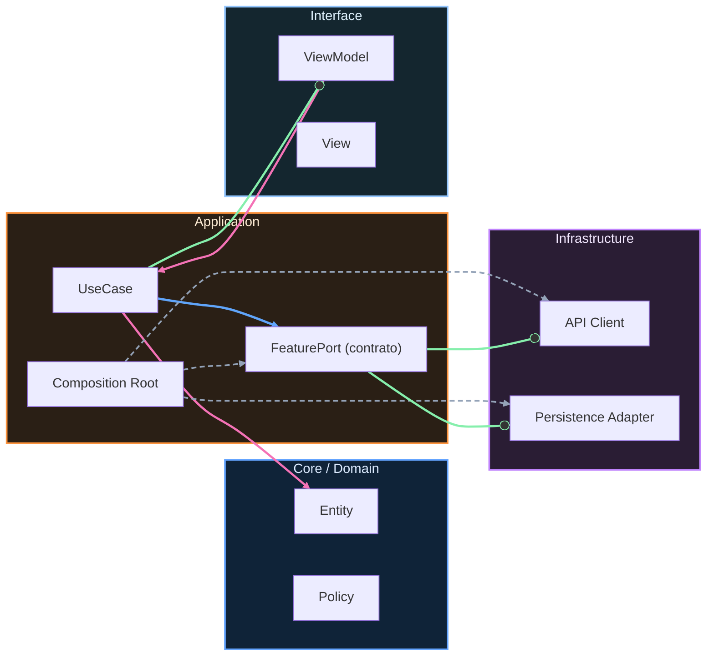

# Nivel Midlevel · 09 · Decidir qué tocar primero usando métricas reales

Hay un momento en todo proyecto Android en el que el problema deja de ser programar una feature y pasa a ser elegir bien. Siempre hay más trabajo que tiempo. Siempre hay deuda técnica pendiente. Siempre hay presión por entregar rápido. Si en ese contexto decides por intuición, el roadmap se vuelve errático. Un sprint persigues rendimiento, otro sprint persigues crashes, y al final no mejoras de forma acumulativa.

Este módulo existe para cortar ese patrón. Ya tienes pruebas de integración, quality gates en CI, benchmarks y observabilidad en producción. Ahora toca convertir todo eso en criterio de priorización técnica. No para hacer más reuniones, sino para decidir mejor y con menos fricción.

---

## El problema real que queremos resolver

Cuando un equipo discute prioridades sin datos, la conversación suele girar alrededor de percepciones. Alguien dice que la app “se siente lenta”. Otra persona dice que “lo urgente es cerrar el bug de sincronización”. Otra insiste en refactorizar porque “el código está feo”. Todos pueden tener parte de razón, pero sin una base común es muy fácil mover el foco cada semana.

Lo que necesitas no es eliminar la conversación, sino anclarla en señales objetivas. Si sube el error rate de sync, esa señal manda. Si cae el tiempo de arranque tras una optimización, esa mejora se consolida y no se revierte por accidente. Si un módulo concentra fallos recurrentes, se convierte en candidato claro para rediseño.

La madurez técnica empieza cuando dejas de elegir por volumen de voz y empiezas a elegir por impacto medible.

---

## Definir un criterio simple de priorización técnica

No hace falta inventar una fórmula académica para comenzar. Con tres dimensiones bien escogidas ya puedes tomar decisiones mejores que la mayoría de equipos.

La primera dimensión es impacto en usuario. Si algo rompe la experiencia principal, pesa más.

La segunda dimensión es frecuencia. Un error raro no tiene la misma prioridad que uno que ocurre miles de veces al día.

La tercera dimensión es coste de corrección. Si dos problemas impactan parecido, suele ser inteligente resolver primero el de menor coste y liberar capacidad.

Cuando combinas esas tres dimensiones, dejas de improvisar. El backlog técnico empieza a tener lógica acumulativa.

---

## Llevar ese criterio a código para no depender de memoria

Puedes representar esa lógica en un modelo pequeño y explícito dentro del proyecto para que todos hablen el mismo idioma.

```kotlin
data class TechIssue(
    val id: String,
    val title: String,
    val userImpact: Int,
    val frequency: Int,
    val fixCost: Int
)

fun TechIssue.priorityScore(): Int {
    val impactWeight = 5
    val frequencyWeight = 3
    val costWeight = 2

    return (userImpact * impactWeight) +
        (frequency * frequencyWeight) -
        (fixCost * costWeight)
}
```

Este código no pretende ser perfecto para siempre. Pretende resolver un problema muy concreto de hoy: que las decisiones sean comparables entre sí. `userImpact` y `frequency` empujan hacia arriba lo importante. `fixCost` resta, para evitar que tareas enormes bloqueen continuamente mejoras de alto retorno.

Al convertir criterio en función explícita, el equipo puede discutir pesos con transparencia. Eso es mucho más sano que decisiones implícitas que cambian según quién esté en la reunión.

---

## Conectar prioridades con señales que ya instrumentaste

Ahora viene lo valioso. Este score no debe alimentarse con opiniones aisladas, sino con señales que ya emites.

Si en observabilidad detectas aumento de `sync_failed`, ese issue entra con `userImpact` alto porque afecta confianza en datos y continuidad de uso. Si Macrobenchmark revela degradación sostenida de arranque, ese issue entra con alta frecuencia potencial, porque prácticamente todos los usuarios abren la app. Si un problema aparece en Crashlytics en una pantalla secundaria y con baja ocurrencia, su score inicial quedará más bajo, y eso está bien.

La clave no es que todo sea automático al milímetro. La clave es que cada prioridad tenga rastro de por qué existe.

---

## Usar esta priorización en el backlog operativo del curso

En este proyecto de curso, la forma más práctica de aplicar esta idea es actualizar el backlog con una regla simple: cada tarea técnica relevante debe incluir la señal que la justifica.

Si abres una mejora de sincronización, debes indicar qué métrica o alerta la dispara. Si propones refactor de performance, debes enlazar evidencia de benchmark. Si planteas endurecer retries, debes enlazar tendencia de error en producción.

Eso obliga a que cada inversión técnica tenga una hipótesis verificable antes de empezar. Y cuando termines, puedas comprobar si realmente mejoró.

---

## Un ejemplo real de decisión bien tomada

Imagina este escenario. Tienes dos tareas candidatas para el próximo sprint. La primera propone refactorizar por completo el módulo de preferencias porque “está viejo”. La segunda propone ajustar la estrategia de reintento en sync porque el error rate subió del 1.2% al 4.8% después de la última release.

Sin métricas, la discusión se eterniza. Con métricas, la decisión se aclara sola. La segunda tarea tiene impacto directo en consistencia de datos y afecta una ruta crítica del producto. Esa entra primero. La primera no desaparece, simplemente baja en prioridad hasta que exista señal que justifique su subida.

Este tipo de decisiones mantiene al equipo enfocado y evita desgaste por trabajos de bajo retorno en momentos de alto riesgo operativo.

---

## Validar que este enfoque está funcionando

Sabes que vas por buen camino cuando tus prioridades dejan de cambiar por ruido y empiezan a cambiar por evidencia nueva. También lo notas cuando en retrospectiva puedes explicar por qué elegiste cada inversión técnica y qué resultado produjo.

Si tras dos o tres iteraciones no ves mejoras en las métricas que motivaron las tareas, no significa que el enfoque falle. Significa que toca ajustar hipótesis o ejecución. Esa es precisamente la ventaja de trabajar con señales: puedes corregir rumbo rápido.

---

## Cierre del módulo

Este módulo marca un cambio importante en la manera de trabajar. Ya no solo sabes construir y proteger calidad. Ahora también sabes elegir con criterio qué mejora técnica debe ir primero para mover realmente la aguja del producto.

En el siguiente tramo vamos a llevar esta misma lógica a arquitectura entre features, para que las decisiones de dependencia y límites de módulo también se tomen con evidencia y no con intuición.
<!-- auto-gapfix:layered-mermaid -->
## Diagrama de arquitectura por capas



La lectura del diagrama sigue esta semantica:
1. `-->` dependencia directa en runtime.
2. `-.->` wiring o configuracion.
3. `==>` contrato o abstraccion.
4. `--o` salida o propagacion de resultado.
