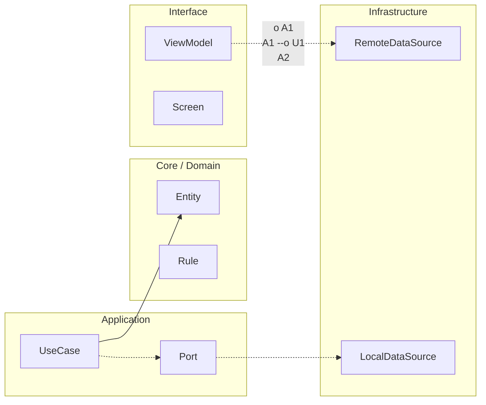

# Nivel Midlevel · 10 · Gobernanza de dependencias entre features sin romper la arquitectura

Hay un tipo de deuda que no se nota al principio, pero cuando explota duele mucho: el acoplamiento entre módulos. Al principio parece práctico importar una clase de una feature a otra “solo esta vez”. Luego aparece otra excepción, luego otra, y cuando te quieres dar cuenta nadie sabe bien quién depende de quién ni qué cambio puede romper medio proyecto.

Este módulo ataca justo ese punto. Ya sabes construir features, ya sabes medir calidad y rendimiento, y ya sabes priorizar con métricas reales. Ahora toca proteger la arquitectura para que el crecimiento no convierta el código en una telaraña frágil.

---

## El problema real detrás de las dependencias cruzadas

Cuando una feature depende directamente de otra, hereda sus tiempos, sus decisiones y sus fallos. Si la feature A necesita tipos internos de la feature B, A deja de ser autónoma. Si B cambia, A cae en cascada. Lo que parecía una dependencia “inofensiva” termina bloqueando releases completas.

En Android multi-módulo esto se vuelve especialmente crítico porque la velocidad del equipo depende de poder tocar una parte sin romper todo. Si cada cambio requiere revisar diez módulos colaterales, el coste operativo se dispara.

La gobernanza de dependencias existe para evitar eso. No para poner burocracia, sino para preservar capacidad de entrega.

---

## Qué regla queremos instalar en el proyecto

La regla base es simple de entender y poderosa en la práctica: una feature no debe depender directamente de otra feature. Si dos features necesitan compartir algo, ese algo vive en un módulo compartido pequeño y explícito, no en una importación lateral improvisada.

Eso obliga a diseñar fronteras claras. También obliga a pensar contratos antes de acoplar implementación, que es justo la disciplina que mantiene estable una arquitectura cuando el producto crece.

---

## Pasar la regla a Gradle para que no quede en discurso

Las reglas de arquitectura solo son útiles de verdad cuando se vuelven ejecutables. Si quedan en documento, con prisa se ignoran. Por eso vamos a llevar esta política al build.

En un proyecto Android típico con `:features:auth`, `:features:catalog` y `:shared:kernel`, queremos que cada feature dependa de `:shared:*` y de módulos de capa base, pero no entre sí.

```kotlin
// features/auth/build.gradle.kts
plugins {
    id("com.android.library")
    id("org.jetbrains.kotlin.android")
}

android {
    namespace = "com.stackmyarchitecture.features.auth"
    compileSdk = 36
}

dependencies {
    implementation(project(":shared:kernel"))
    implementation(project(":shared:designsystem"))

    // Correcto: auth NO importa features/catalog
    // implementation(project(":features:catalog")) // prohibido
}
```

Esta decisión soluciona un problema muy concreto: cortar dependencias laterales antes de que se normalicen. Si alguien intenta meter una importación prohibida, la revisión ya tiene una regla clara para frenarla.

No se trata de rigidez ciega. Se trata de proteger modularidad para que cada feature pueda evolucionar sin arrastrar a las demás.

---

## Añadir una verificación automática de grafo de dependencias

Ahora vamos a dar el paso importante: convertir la regla en chequeo automático de CI. Una forma práctica es usar un script de validación del grafo Gradle y fallar pipeline cuando detecta feature-to-feature.

Puedes crear una tarea en `build.gradle.kts` raíz que inspeccione dependencias declaradas y corte el build en casos no permitidos.

```kotlin
tasks.register("validateFeatureDependencies") {
    doLast {
        val forbidden = mutableListOf<String>()

        val featureProjects = rootProject.subprojects.filter { it.path.startsWith(":features:") }

        featureProjects.forEach { feature ->
            val impl = feature.configurations.findByName("implementation") ?: return@forEach
            impl.dependencies.forEach { dep ->
                val depPath = (dep as? ProjectDependency)?.dependencyProject?.path ?: return@forEach
                if (depPath.startsWith(":features:")) {
                    forbidden += "${feature.path} -> $depPath"
                }
            }
        }

        if (forbidden.isNotEmpty()) {
            throw GradleException(
                "Dependencias entre features no permitidas:\n" + forbidden.joinToString("\n")
            )
        }
    }
}
```

Aquí lo importante no es el script en sí, sino la idea operativa. En lugar de confiar en que cada persona recuerde la política, haces que el build la aplique siempre. Eso reduce discusiones subjetivas en PR y evita regresiones silenciosas de arquitectura.

Además, cuando el equipo crezca, esta verificación se vuelve aún más valiosa porque protege consistencia sin depender de quién revisa cada cambio.

---

## Integrarlo en quality gates para que no se salte

Ya tienes quality gates en CI desde módulos anteriores, así que este chequeo debe entrar ahí, no quedarse como tarea opcional local.

En tu workflow Android añade una ejecución explícita:

```yaml
- name: Validate architecture dependencies
  run: ./gradlew validateFeatureDependencies
```

Con eso, cualquier PR que meta acoplamiento entre features quedará bloqueada antes de merge. Es exactamente el comportamiento que quieres: detectar desviaciones arquitectónicas en minutos, no en retrospectiva de incidente.

---

## Qué hacer cuando dos features “necesitan” compartir algo

Este punto es el que más confusión genera en equipos junior. La respuesta no es romper la regla. La respuesta es identificar qué parte es realmente compartida y moverla a un módulo neutral.

Si auth y catalog comparten tipos de sesión, ese contrato debería vivir en `:shared:kernel` o en un módulo de contrato específico, no dentro de `:features:auth`. Así ambos consumen una frontera estable y ninguno depende internamente del otro.

Este movimiento parece pequeño, pero cambia por completo la salud de largo plazo del proyecto.

---

## Señal de que tu gobernanza está funcionando

Lo notarás cuando tocar una feature no obligue a abrir cinco PRs laterales. También cuando un refactor interno de una feature deje de romper otras por sorpresa. Y sobre todo cuando las conversaciones de arquitectura pasen de “quién metió esta dependencia” a “qué contrato compartido necesitamos diseñar”.

Eso significa que la arquitectura dejó de ser un dibujo y se volvió una práctica diaria protegida por tooling.

---

## Cierre del módulo

Con este módulo acabas de blindar una de las fuentes más comunes de caos en proyectos Android que crecen rápido. Ahora no solo puedes construir bien, medir bien y priorizar bien. También puedes crecer sin perder estructura.

En el siguiente tramo vamos a enlazar esta gobernanza con evolución de APIs internas y versionado de contratos para que las features puedan cambiar sin romper compatibilidad entre equipos.
<!-- auto-gapfix:layered-mermaid -->
## Diagrama de arquitectura por capas



La lectura del diagrama sigue esta semantica:
1. `-->` dependencia directa en runtime.
2. `-.->` contrato o abstraccion.
3. `-.o` wiring o composicion.
4. `--o` salida o propagacion de resultado.
