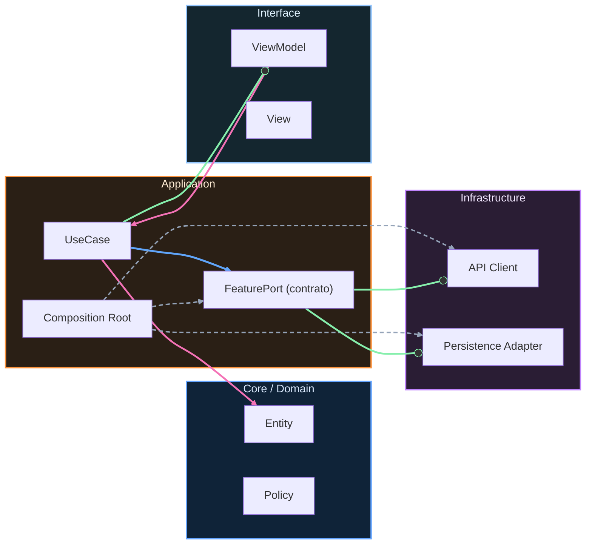

# Nivel Midlevel · 11 · Versionado de contratos internos sin romper a otros equipos

Hay una escena muy común en productos que crecen rápido. Un equipo mejora una feature con toda la buena intención del mundo, cambia un contrato interno y, sin querer, rompe a otro equipo que dependía de ese comportamiento anterior. No hay mala fe, hay falta de estrategia de evolución.

Este módulo entra justo para resolver ese tipo de choque. Ya pusiste reglas de dependencias entre features. Ahora falta el siguiente cierre lógico: cómo permitir cambios sin convertir cada release en una ruleta.

El objetivo no es congelar el sistema. El objetivo es que pueda evolucionar sin romper compatibilidad de forma accidental.

---

## El problema real detrás del versionado interno

Cuando hablamos de contratos internos en Android multi-módulo, hablamos de interfaces, DTOs compartidos, eventos y modelos que una feature expone para que otra trabaje con ellos. Si ese contrato cambia sin gobernanza, el coste aparece en cadena: builds rotos, PRs bloqueadas, hotfixes de urgencia, presión en QA y pérdida de confianza entre equipos.

La solución no es “no tocar nada”. La solución es versionar y deprecar con intención.

Versionar bien significa que una feature puede ofrecer una nueva versión de contrato mientras mantiene la anterior el tiempo suficiente para migración. Deprecar bien significa comunicar que algo saldrá, pero dar una ventana real para adaptarse.

---

## Diseñar contratos pensando en evolución, no en foto del día

Un contrato sano no expone detalles internos que sabes que cambian a menudo. Cuanto más acoplado esté a implementación, más frágil será su vida útil.

Si un módulo de catálogo expone un modelo completo con campos que dependen del backend actual, cualquier ajuste de backend te obliga a recoordinar media app. En cambio, si expones un contrato enfocado en necesidades estables del consumidor, el sistema respira mejor.

Por eso conviene separar internamente “modelo de infraestructura” de “modelo de contrato”. No por academicismo, sino por supervivencia del roadmap.

---

## Llevar esa idea a código con versiones explícitas

Imagina que hoy tienes un contrato de sesión y necesitas evolucionarlo para soportar renovación de token más robusta.

```kotlin
interface SessionContractV1 {
    fun currentUserId(): String?
    fun authToken(): String?
}

interface SessionContractV2 {
    fun currentUserId(): String?
    fun authToken(): String?
    fun refreshToken(): String?
    fun expiresAtEpochSeconds(): Long?
}
```

Aquí hay una decisión importante: no sobrecargar V1 silenciosamente. Crear `SessionContractV2` deja claro que hay una nueva capacidad y evita romper consumidores antiguos que aún no necesitan esa semántica.

No es duplicación gratuita, es control de transición.

---

## Implementación puente para convivir dos versiones

Cuando introduces V2, lo más práctico es tener una implementación que pueda servir ambos contratos mientras dura la migración.

```kotlin
class SessionProvider(
    private val dataStore: SessionDataStore
) : SessionContractV1, SessionContractV2 {

    override fun currentUserId(): String? = dataStore.currentUserId

    override fun authToken(): String? = dataStore.authToken

    override fun refreshToken(): String? = dataStore.refreshToken

    override fun expiresAtEpochSeconds(): Long? = dataStore.expiresAtEpochSeconds
}
```

Esta convivencia resuelve un problema operativo real: que los equipos no tengan que migrar todos el mismo día para que el producto siga compilando. Eso reduce muchísimo fricción en organizaciones donde hay varios streams de trabajo en paralelo.

---

## Deprecar con intención y fecha, no con ambigüedad

Una de las peores cosas que puedes hacer es marcar algo como “deprecated” sin plan. El resultado suele ser que nadie migra porque nunca hay urgencia real.

Cuando toque sacar V1, déjalo explícito en código:

```kotlin
@Deprecated(
    message = "Usa SessionContractV2. V1 se elimina en la release 2026.06",
    replaceWith = ReplaceWith("SessionContractV2")
)
interface SessionContractV1 {
    fun currentUserId(): String?
    fun authToken(): String?
}
```

Esto no solo ayuda a IDE y revisión. También instala una expectativa temporal. El equipo sabe que hay una ventana de migración concreta y puede planificarla en backlog sin improvisar a última hora.

---

## Registrar decisiones de contrato para evitar “tribal knowledge”

Cuando un contrato evoluciona, la decisión debe quedar registrada. Si no, en tres meses nadie recuerda por qué existe V2 ni qué problema resolvía, y vuelve el ciclo de cambios impulsivos.

Aquí conviene usar un ADR corto ligado al módulo, algo como `ADR-CT-001-versionado-session-contract.md`, explicando qué se versiona, por qué y cuándo se retirará la versión previa. Esto evita que la arquitectura dependa de memoria oral.

---

## Validar compatibilidad en CI para no enterarte tarde

Así como validaste dependencias entre features, puedes validar que contratos deprecated siguen presentes mientras su ventana esté abierta. En la práctica, basta con un test de compilación de consumidor o una suite de smoke para módulos dependientes.

La idea es sencilla: si alguien borra V1 antes de tiempo, CI debe fallar de inmediato. Es mejor un rojo temprano en PR que un corte invisible de integración que aparece al final del sprint.

---

## Señales de que el versionado está funcionando

Lo notarás cuando introducir V2 deje de convertirse en migración caótica. Lo notarás cuando puedas desplegar mejoras de contrato sin bloquear a otros equipos. Lo notarás cuando la conversación pase de “¿quién rompió esto?” a “¿en qué release cerramos la migración?”.

Ese cambio parece pequeño, pero en equipos reales marca diferencia entre escalar con orden o escalar con fricción constante.

---

## Cierre del módulo

Con este módulo ya puedes evolucionar contratos internos sin romper relaciones entre features. Acabas de añadir una capa de estabilidad que normalmente se echa de menos justo cuando el producto empieza a crecer de verdad.

En el siguiente tramo vamos a aplicar esto al plano de navegación y deep links, para que la evolución de rutas también tenga compatibilidad y no se convierta en una fuente silenciosa de regresiones.
<!-- auto-gapfix:layered-mermaid -->
## Diagrama de arquitectura por capas



La lectura del diagrama sigue esta semantica:
1. `-->` dependencia directa en runtime.
2. `-.->` wiring o configuracion.
3. `==>` contrato o abstraccion.
4. `--o` salida o propagacion de resultado.
