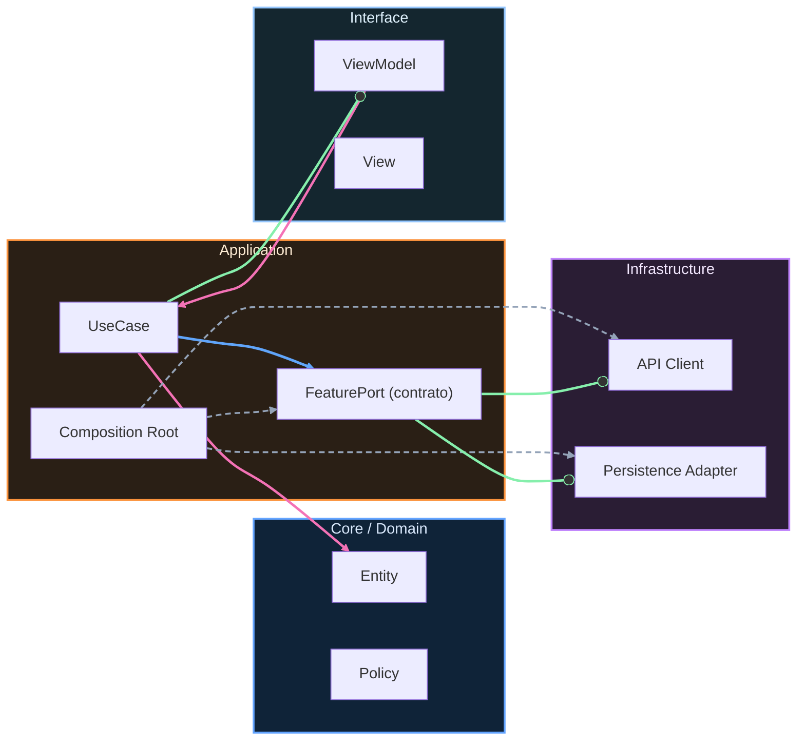

# Nivel Midlevel · 12 · Evolución de navegación y deep links sin romper rutas existentes

Cuando una app madura, la navegación cambia. Aparecen nuevas pantallas, se reorganizan flujos, se renombran rutas y se agregan deep links para campañas, notificaciones o enlaces web. El riesgo no está en cambiar, el riesgo está en cambiar sin estrategia y romper rutas que ya usan usuarios reales.

Este módulo llega justo para cerrar ese frente. Ya trabajaste contratos entre features y reglas de dependencia. Ahora toca aplicar la misma mentalidad de compatibilidad al sistema de navegación, que en Android suele romperse de forma silenciosa si no se gobierna.

---

## El problema real que queremos evitar

Imagina que en una release antigua existía un deep link para abrir detalle de producto con `/catalog/item/{id}` y en la release nueva decides mover todo a `/shop/product/{id}`. Si haces el cambio de golpe, el código queda “limpio” para hoy, pero rompes enlaces que siguen circulando en emails, push antiguas o bookmarks de usuario.

Eso no es un bug menor. Es una regresión de experiencia y, muchas veces, de negocio.

La solución no es mantener para siempre rutas viejas. La solución es evolucionarlas con compatibilidad temporal, telemetría y un plan de retirada claro.

---

## Diseñar rutas con versión y alias de transición

Una forma práctica de hacerlo en Android es declarar rutas canónicas y rutas legacy como alias temporales. La app intenta resolver ambas, redirige a la nueva y registra señal para saber cuándo ya no se usa la antigua.

```kotlin
object Routes {
    const val CatalogItemV2 = "shop/product/{id}"
    const val CatalogItemLegacyV1 = "catalog/item/{id}"
}
```

Aquí la decisión importante es semántica. `CatalogItemV2` no es solo un string nuevo; es la ruta oficial que quieres consolidar. `CatalogItemLegacyV1` no se queda por nostalgia, se queda como puente de compatibilidad mientras migras ecosistema externo.

Nombrar explícitamente `Legacy` evita que dentro de seis meses alguien la confunda con ruta activa.

---

## Resolver deep links legacy sin duplicar lógica de pantalla

En Navigation Compose, lo sano es que ambas rutas terminen en el mismo destino de UI y mismo ViewModel, para que la diferencia de versión viva en el borde de entrada y no se disperse por toda la feature.

```kotlin
fun NavGraphBuilder.catalogGraph(
    telemetry: Telemetry,
    onOpenProduct: (String) -> Unit
) {
    composable(
        route = Routes.CatalogItemV2,
        deepLinks = listOf(navDeepLink { uriPattern = "myapp://shop/product/{id}" })
    ) { backStackEntry ->
        val id = backStackEntry.arguments?.getString("id") ?: return@composable
        onOpenProduct(id)
    }

    composable(
        route = Routes.CatalogItemLegacyV1,
        deepLinks = listOf(navDeepLink { uriPattern = "myapp://catalog/item/{id}" })
    ) { backStackEntry ->
        val id = backStackEntry.arguments?.getString("id") ?: return@composable

        telemetry.trackEvent(
            name = "deeplink_legacy_used",
            attributes = mapOf("route" to "catalog/item/{id}")
        )

        onOpenProduct(id)
    }
}
```

El punto fino aquí es el porqué de cada decisión. Mantener `onOpenProduct(id)` como destino común evita divergencias funcionales entre rutas nuevas y legacy. Instrumentar `deeplink_legacy_used` te da el dato que necesitas para retirar la ruta con seguridad más adelante. Si nadie la usa durante un periodo razonable, ya puedes deprecar sin apostar a ciegas.

Sin esa métrica, retirar una ruta antigua siempre es una lotería.

---

## Compatibilidad también en argumentos, no solo en paths

A veces la ruta no cambia, pero sí cambia cómo se llama un parámetro. Por ejemplo, antes recibías `itemId` y ahora quieres `id`. Ese tipo de detalle también rompe integraciones externas si no lo atiendes.

Puedes resolverlo con una pequeña normalización en el parser de entrada:

```kotlin
fun Bundle.resolveProductId(): String? {
    return getString("id") ?: getString("itemId")
}
```

No parece gran cosa, pero evita romper enlaces emitidos por sistemas que todavía no actualizaron payload. Esta tolerancia de entrada es una técnica muy útil para migraciones graduales en apps que ya viven en producción.

---

## Definir una ventana de retirada de rutas legacy

Compatibilidad no significa cargar deuda eterna. Cada ruta legacy debe tener fecha de retirada y criterio de salida. Sin eso, la deuda se queda para siempre y el grafo de navegación se vuelve cada vez más difícil de mantener.

Aquí entra en juego lo que ya construiste en observabilidad. Si `deeplink_legacy_used` cae a cero de forma sostenida, ese dato justifica retirar la ruta vieja. Si sigue habiendo uso significativo, la mantienes mientras coordinas migración con los sistemas que la consumen.

La diferencia entre caos y evolución controlada está en esa disciplina temporal.

---

## Proteger esta compatibilidad con pruebas

No basta con “parece que funciona”. Conviene dejar tests que verifiquen que la ruta legacy sigue resolviendo al destino correcto mientras esté soportada.

Puedes hacerlo con tests instrumentados de navegación o con pruebas de parser de deep links según tu setup actual. Lo importante es que cuando alguien limpie código y quite una ruta sin querer, el test falle y te avise antes de release.

La regla práctica es la misma que ya aplicaste en otros módulos: todo contrato que importe debe tener una red de seguridad automática.

---

## Qué ganas después de este módulo

Ganas libertad para evolucionar navegación sin miedo a romper integraciones reales. Ganas capacidad de migrar rutas en fases, con evidencia de uso y con fecha de retiro. Ganas una experiencia más estable para usuario, porque un enlace viejo sigue abriendo donde toca mientras haces transición.

Y, sobre todo, mantienes coherencia con la filosofía de todo este bloque midlevel: cambiar sí, romper no.

---

## Cierre del módulo

Con este módulo cierras una parte clave de arquitectura evolutiva en Android: contratos entre features, dependencias gobernadas y navegación compatible en el tiempo. Ese conjunto ya te coloca en un nivel de diseño muy superior al típico “funciona en mi build”.

El siguiente salto natural es pasar al bloque Senior para endurecer operaciones a escala: estrategia de releases, rollback seguro y gestión de incidentes con tiempos de respuesta reales.
<!-- auto-gapfix:layered-mermaid -->
## Diagrama de arquitectura por capas



La lectura del diagrama sigue esta semantica:
1. `-->` dependencia directa en runtime.
2. `-.->` wiring o configuracion.
3. `==>` contrato o abstraccion.
4. `--o` salida o propagacion de resultado.
